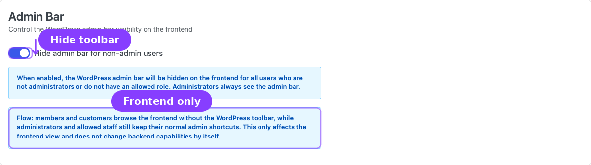
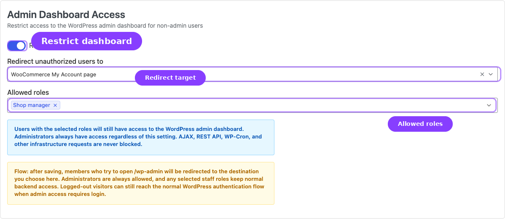
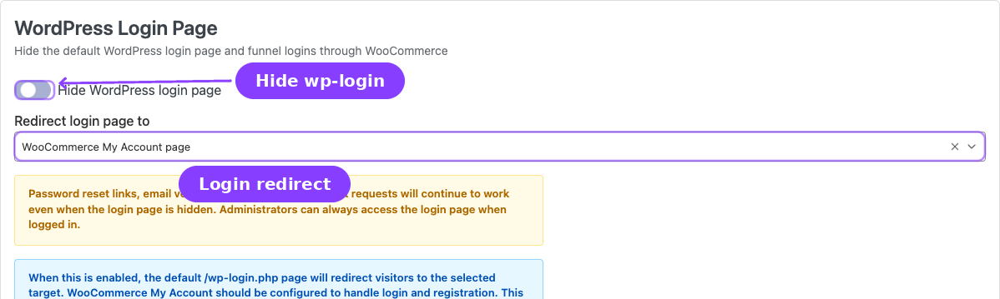
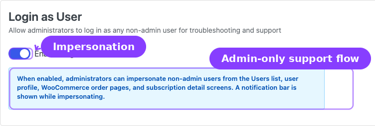

# Info
- Module: Toolkit Settings
- Availability: Shared
- Last updated: 2026-06-27

# Toolkit Settings

> Admin-facing security and convenience tools for controlling the WordPress admin bar, dashboard access, login page visibility, and admin impersonation.

**Availability:** Free

## Page Navigation

- **Current guide:** Toolkit Settings
- **Where to open it:** WordPress Admin → ArraySubs → Settings → Toolkit
- **Direct route:** `/wp-admin/admin.php?page=arraysubs-mainadmin#/settings/toolkit`
- **Section overview:** [Open overview](./README.md)
- **Previous guide:** [README](./README.md)
- **Next guide:** [Admin Bar Visibility](../admin-bar-visibility/README.md)
- **Troubleshooting:** [Audits, Logs, and Troubleshooting](../audits-and-logs/README.md)

## Overview


The Toolkit Settings page is the shared control surface for four dedicated site-access modules. These modules sit outside the subscription engine itself, but they are part of the ArraySubs feature set: they hide backend entry points from customers, restrict dashboard access to authorized roles, route customer login traffic through My Account, and let administrators impersonate users for support.

Navigate to **ArraySubs → Settings → Toolkit** to open the page. Every change takes effect after you click **Save Settings**.

For task-focused guidance, use the dedicated root-level module pages:

- [Admin Bar Visibility](../admin-bar-visibility/README.md)
- [Admin Dashboard Access](../admin-dashboard-access/README.md)
- [WordPress Login Page](../wordpress-login-page/README.md)
- [Login as User](../login-as-user/README.md)
- [Member Access — Login Limit](../member-access/login-limit.md) *(Pro)*

## When to Use This

- You want to hide the WordPress admin bar from customers browsing the frontend.
- You need to prevent non-admin users from accessing the `/wp-admin` dashboard.
- You want to redirect the default WordPress login page to the WooCommerce My Account page for a branded login experience.
- You need administrators to log in as customers for troubleshooting or support.
- You need administrators to impersonate customers without asking for passwords.

## Prerequisites

- ArraySubs installed and activated.
- WooCommerce activated with a **My Account** page configured (required for redirect destinations).
- For session limits and credential-sharing controls: **ArraySubs Pro** and [Member Access -> Login Limit](../member-access/login-limit.md).

## How It Works

Toolkit settings operate at the WordPress level — they intercept page loads, login requests, and session creation before any subscription-specific logic runs. Each setting is independent; enabling one does not require enabling any other. Together, they transform a standard WordPress installation into a clean, customer-facing storefront where backend complexity is hidden from subscribers.

---

## Admin Bar



### Hide Admin Bar for Non-Admin Users

| | |
|---|---|
| **Type:** Toggle (on/off) | **Default:** Off |

When enabled, the WordPress admin bar is hidden on the frontend for all users who are not administrators. Administrators always see the admin bar regardless of this setting.

This is a cosmetic change only — it does not remove any capabilities or prevent authenticated users from accessing `wp-admin` directly. To block dashboard access, use the **Admin Dashboard Access** setting below.

```box class="info-box"
Members and customers browse the frontend without the WordPress toolbar, while administrators and allowed staff still keep their normal admin shortcuts. This only affects the frontend view and does not change backend capabilities by itself.
```

---

## Admin Dashboard Access



### Restrict wp-admin Access

| | |
|---|---|
| **Type:** Toggle (on/off) | **Default:** Off |

When enabled, users without an authorized role are redirected away from the WordPress admin dashboard when they try to visit `/wp-admin` directly. AJAX requests, REST API calls, and WP-Cron are never blocked.

### Redirect Unauthorized Users To

| | |
|---|---|
| **Type:** Dropdown | **Default:** WooCommerce My Account page |
| **Visible when:** Restrict wp-admin access is **on** | |

| Option | Behavior |
|--------|----------|
| **WooCommerce My Account page** | Redirects the user to their My Account page |
| **404 Not Found page** | Returns a 404 error |

### Allowed Roles

| | |
|---|---|
| **Type:** Multi-select | **Default:** None selected |
| **Visible when:** Restrict wp-admin access is **on** | |

Select the WordPress roles that should retain access to the admin dashboard even when the restriction is active. Administrators are **always** allowed — they do not need to be selected.

The role list is loaded from your WordPress installation and excludes the Administrator role (since it is always permitted).

```box class="warning-box"
After saving, members who try to open `/wp-admin` will be redirected to the chosen destination. Administrators are always allowed, and any selected staff roles keep normal backend access. Logged-out visitors can still reach the normal WordPress authentication flow when admin access requires login.
```

---

## WordPress Login Page



### Hide WordPress Login Page

| | |
|---|---|
| **Type:** Toggle (on/off) | **Default:** Off |

When enabled, the default `/wp-login.php` page redirects visitors to the selected target. This funnels all customer logins and registrations through the WooCommerce My Account page, giving your site a more polished, branded frontend experience.

### Redirect Login Page To

| | |
|---|---|
| **Type:** Dropdown | **Default:** WooCommerce My Account page |
| **Visible when:** Hide WordPress login page is **on** | |

| Option | Behavior |
|--------|----------|
| **WooCommerce My Account page** | Redirects to the WooCommerce login/registration page |
| **404 Not Found page** | Returns a 404 error |

```box class="info-box"
Customer-facing login and sign-up links now resolve to the WooCommerce My Account page instead of `wp-login.php`. This includes third-party plugins or themes that call the standard WordPress login or registration URL helpers.
```

```box class="warning-box"
Password reset links, email verification callbacks, and logout requests continue to work even when the login page is hidden. Administrators can always access the login page when logged in.
```

```box class="warning-box"
Before enabling this on a live site, confirm that WooCommerce account registration is configured the way you want and that your My Account page is publicly reachable. If registration is disabled in WooCommerce, visitors will still land on My Account but only the login form will be available.
```

---

## Login as User



### Enable Login as User

| | |
|---|---|
| **Type:** Toggle (on/off) | **Default:** On |

When enabled, administrators can impersonate non-admin users from multiple places in the WordPress admin:

- The **Users** list page
- Individual **user profile** screens
- WooCommerce **order detail** pages
- ArraySubs **subscription detail** pages

While impersonating, a notification bar appears at the top of the page letting the administrator know they are logged in as another user and providing a link to return to their own account.

```box class="info-box"
Only administrators can use this feature. Non-admin users cannot impersonate other accounts. Impersonated sessions do not count toward Multi-Login Prevention limits.
```

---

## Settings Reference

| Setting | Default | Type | Section |
|---------|---------|------|---------|
| Hide admin bar for non-admin users | Off | Toggle | Admin Bar |
| Restrict wp-admin access | Off | Toggle | Admin Dashboard Access |
| Redirect unauthorized users to | My Account page | Dropdown | Admin Dashboard Access |
| Allowed roles | None | Multi-select | Admin Dashboard Access |
| Hide WordPress login page | Off | Toggle | WordPress Login Page |
| Redirect login page to | My Account page | Dropdown | WordPress Login Page |
| Enable Login as User | On | Toggle | Login as User |

---

## Real-Life Use Cases

### Use Case 1: Clean Membership Storefront

A fitness membership site wants customers to see a polished frontend with no WordPress backend artifacts. The merchant enables **Hide admin bar**, **Restrict wp-admin access** (redirecting to My Account), and **Hide WordPress login page**. Customers now interact exclusively with the WooCommerce My Account area while staff roles retain dashboard access.

### Use Case 2: Support Team Impersonation

A SaaS company receives support tickets about subscription issues. The support team uses **Login as User** to impersonate the customer, see exactly what they see in their account, and diagnose the problem — without needing the customer's password.

---

## Edge Cases / Important Notes

- **Hiding the admin bar does not restrict dashboard access.** These are separate settings. A user can still type `/wp-admin` in the browser even if the toolbar is hidden — use **Restrict wp-admin access** to block that.
- **AJAX, REST API, and WP-Cron requests are never blocked** by the wp-admin restriction. Only direct browser visits to admin pages are redirected.
- **Administrators are always exempt** from admin bar hiding and wp-admin restriction.
- **Login as User sessions are never counted** toward the Multi-Login Prevention session limit.
- **Password reset still works** even when the login page is hidden. WordPress core password reset links, email verification callbacks, and logout requests function normally.
- **Allowed Roles is additive.** It does not replace the Administrator exemption — it adds additional roles that can access the dashboard.
- **Session limits live in Member Access.** Multi-Login Prevention and Login Limit rules are configured from **ArraySubs -> Member Access -> Login Limit**.

---

## Troubleshooting

| Problem | Likely Cause | What to Do |
|---------|-------------|------------|
| Customers can still access `/wp-admin` | **Restrict wp-admin access** is off, or the customer's role is in the **Allowed roles** list | Check the setting and the role selections |
| Admin bar is still showing for customers | **Hide admin bar** is off, or the user has an administrator role | Verify the setting and the user's role |
| Login page redirect not working | **Hide WordPress login page** is off, or a caching plugin is serving a cached version | Clear all caches and check the setting |
| Cannot log in after hiding login page | WooCommerce My Account page is not properly configured | Verify that the My Account page exists, is published, and has the `[woocommerce_my_account]` shortcode or WooCommerce block |
| Login as User button does not appear | **Enable Login as User** is off, or you are trying to impersonate an administrator | Re-enable the setting. Note: admin-to-admin impersonation is not supported |

---

## Related Guides

- [General Settings](general-settings.md) — Subscription cart rules, checkout, trials, renewals, grace periods, and customer actions.
- [Admin Bar Visibility](../admin-bar-visibility/README.md) — Hide the WordPress frontend toolbar for customers.
- [Admin Dashboard Access](../admin-dashboard-access/README.md) — Redirect customers away from `/wp-admin`.
- [WordPress Login Page](../wordpress-login-page/README.md) — Route login traffic through WooCommerce My Account.
- [Login as User](../login-as-user/README.md) — Impersonate customers for support.
- [Member Access — Login Limit](../member-access/login-limit.md) *(Pro)* — Limit concurrent sessions per account.
- [Getting Started — Essential Daily Workflows](../getting-started/essential-daily-workflows.md) — Admin menu reference and settings overview.
- [Manage Members](../member-insight/README.md) — The member insight dashboard where Login as Customer is used most often *(Pro)*.

---

## FAQ

### Does hiding the admin bar affect administrators?
No. Administrators always see the admin bar regardless of this setting. Only non-administrator users are affected.

### Can I lock everyone except Shop Managers out of wp-admin?
Yes. Enable **Restrict wp-admin access** and add the **Shop Manager** role to the **Allowed roles** list. Administrators are always allowed automatically.

### Will hiding the login page break password reset emails?
No. Password reset links, email verification callbacks, and logout requests continue to work normally even when the login page is hidden.

### Can I use Login as User to impersonate another administrator?
No. Login as User only works for non-administrator accounts. You cannot impersonate a user who has the Administrator role.

### Do impersonated sessions count toward the session limit?
No. Sessions created through Login as User are never counted toward the Multi-Login Prevention limit.

### Can I set different session limits for different subscription plans?
Yes, but not from this page. Use **Member Access -> Login Limit** to enable Multi-Login Prevention, set the global default, and create per-subscription or per-role session limits.
