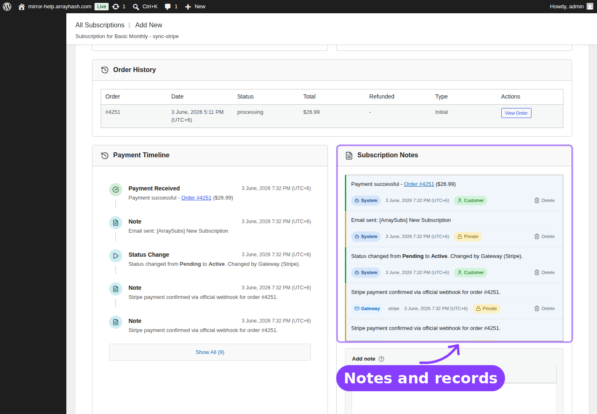

# Info
- Module: Subscription Notes
- Availability: Free
- Last updated: 2026-06-08

# Subscription Notes

> Keep a permanent timeline of subscription changes, renewal events, gateway activity, customer-visible notes, and private admin notes.

**Availability:** Free

## Page Navigation

- **Current guide:** Subscription Notes
- **Where to open it:** WordPress Admin -> ArraySubs -> Subscriptions -> View Details
- **Direct route pattern:** `/wp-admin/admin.php?page=arraysubs-mainadmin#/subscriptions/detail/{subscription_id}`
- **Section overview:** [Open overview](../README.md)
- **Previous guide:** [Subscription Detail Cards](../manage-subscriptions/subscription-detail-cards.md)
- **Next guide:** [Coupons](../coupons/README.md)
- **Troubleshooting:** [Audits, Logs, and Troubleshooting](../audits-and-logs/README.md)

## Visual Guide




## Overview

Subscription Notes is a dedicated record-keeping module in the free core plugin. Every subscription detail screen includes a notes panel that combines system-generated lifecycle events with manual notes from administrators and, when enabled, customer-visible notes.

Use this module when you need to answer "what happened to this subscription?" without checking orders, emails, gateways, and customer messages one by one.

## What Gets Logged Automatically

ArraySubs creates system notes for important subscription events:

| Event Area | Examples |
|---|---|
| Status changes | Pending to Active, Active to On Hold, On Hold to Cancelled |
| Billing events | Renewal invoice created, payment completed, payment failed |
| Trial events | Trial started, trial converted to paid |
| Admin edits | Recurring amount changed, quantity changed, billing date updated |
| Customer actions | Cancelled, undo cancel, skipped renewal, paused, resumed |
| Plan changes | Plan switch requested, applied, cancelled, or failed |
| Coupons | Coupon captured, renewal cycles decremented, coupon expired |
| Gateways | Gateway attached, detached, resynced, or payment method updated |

System notes include enough context to reconstruct the change. For edited fields, notes include the previous value and new value.

## Manual Notes

Admins can add manual notes from the notes panel.

| Note Type | Visibility | Use It For |
|---|---|---|
| Private | Admins only | Internal support context, risk notes, refund reasoning |
| Customer | Admins and the customer | Follow-up instructions or customer-facing service notes |

The editor supports basic formatting such as bold, italic, links, and lists. New notes appear at the top of the timeline.

## Author Badges

Each note identifies who created it:

| Badge | Meaning |
|---|---|
| System | Auto-generated by ArraySubs |
| Admin | Written manually by an administrator |
| Customer | Submitted or exposed through a customer-facing flow |
| Gateway | Generated from payment gateway activity |

## Deleting Notes

Admins can delete notes from the panel. Deleting a note is permanent.

```box class="warning-box"
System notes are part of the audit trail. Only delete them when you are intentionally cleaning test data or correcting an accidental manual note.
```

## Real-Life Use Cases

### Support Dispute Review

A customer says they never requested cancellation. Open the subscription, scroll to Subscription Notes, and review the cancellation event, selected reason, timestamp, and any retention offer interaction.

### Billing Investigation

A renewal order failed and the customer later paid manually. Notes show when the invoice was generated, when payment failed, when the grace state changed, and when payment completed.

### Admin Handoff

One team member adds a private note explaining why a subscription renewal date was extended. The next support agent sees that context before making another change.

## Related Guides

- [Subscription Operations](../manage-subscriptions/subscription-operations.md) — Opening and editing subscription records.
- [Subscription Detail Cards](../manage-subscriptions/subscription-detail-cards.md) — Conditional cards on the same screen.
- [Coupons](../coupons/README.md) — Coupon cycle notes and subscription coupon tracking.
- [Gateway Health](../gateway-health/README.md) — Gateway events that may create or explain notes.

## FAQ

### Do customers see every note?
No. Private notes are admin-only. Customer notes can be shown to the customer, depending on where they are surfaced in the customer portal.

### Are system notes editable?
No. System notes are generated records. You can delete them, but you cannot edit their content.

### Is this a Pro feature?
No. Subscription Notes is part of the free ArraySubs core plugin.
