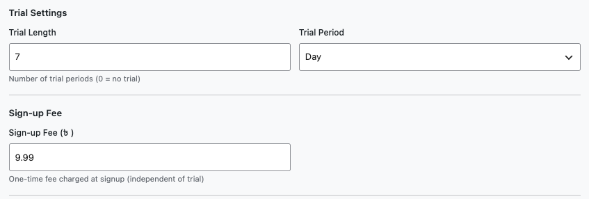
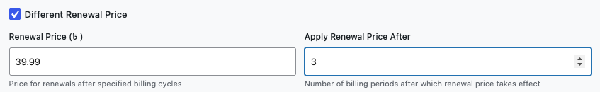
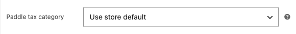

# Info
- Module: Subscription Products
- Availability: Free + Pro
- Last updated: 2026-09-15

# Create and Configure Subscription Products

> Turn any WooCommerce product into a recurring subscription with billing schedules, free trials, signup fees, and tiered renewal pricing.

**Availability:** Free (standard subscription products); Pro with an active license (Different Renewal Price)

## Page Navigation

- **Current guide:** Create and Configure Subscription Products
- **Where to open it:** WordPress Admin -> Products -> Add/Edit Product
- **Section overview:** [Open overview](./README.md)
- **Previous guide:** [Coupons](../coupons/README.md)
- **Next guide:** [Flexible Subscription Duration](./flexible-subscription-duration.md)
- **Troubleshooting:** [Audits, Logs, and Troubleshooting](../audits-and-logs/README.md)

## Overview

For guided creation from ArraySubs, use [Create Products with the Quick Creation Wizard](quick-product-creation.md). Open **ArraySubs → Home → + Subscription Product** to choose simple, variable, box, bundle, or store-credit setup. The dedicated guide covers every main step, both nested configuration builders, review, publishing, and conditional settings with cropped screenshots. This page covers the full WooCommerce editor, including per-variation billing and later product edits.

ArraySubs adds a **Subscription [AS]** checkbox to the WooCommerce product editor. When enabled for a simple product, a new **Subscription Billings [AS]** tab appears with fields for billing period, billing interval, subscription length, free trials, signup fees, and **Different Renewal Price (Pro)**. Both simple products and variable products are supported — variable products allow each variation to have its own independent subscription configuration.

## When to Use This

- You want to sell a product or service that bills customers on a recurring schedule.
- You need to offer free trials before billing begins.
- You want to charge a one-time setup or activation fee at checkout.
- You need tiered pricing where the renewal price changes after a set number of payments.
- You want to offer multiple plan options (monthly, annual, etc.) under a single product using variations.

## Prerequisites

- WooCommerce installed and active.
- ArraySubs core plugin installed and active.
- Admin or Shop Manager access.
- For **Different Renewal Price**, ArraySubsPro must be active with an active license.

## How It Works

Subscriptions use the product's **regular price** as the recurring charge. There is no separate "subscription price" field — the standard WooCommerce price fields control what customers pay each billing cycle. Sale prices also apply: if a sale is active within the scheduled sale dates, the sale price becomes the recurring amount for new subscriptions.

Once a customer subscribes, the **price is locked in** at the time of purchase. Changing the product price afterward does not affect existing subscriptions — only new subscriptions use the updated price.

---

## Simple Subscription Products

### Step-by-Step Setup

1. Go to **Products → Add New** in WooCommerce.
2. Enter a product name and set the **Regular price** in the General tab.
3. In the **Product data** area, check the **Subscription [AS]** checkbox (next to Virtual and Downloadable).
4. Click **Configure subscription billings** below the **Regular price** input. It opens the **Subscription Billings [AS]** tab. You can also select that tab directly.
5. Configure the billing fields described below.
6. Click **Publish** to save the product.

![Simple product General tab with Subscription [AS] enabled and Configure subscription billings below Regular price](create-and-configure.ASSETS/07-simple-configure-billings-shortcut-cropped.png)

The **Configure subscription billings** link appears only when the product type is **Simple product** and **Subscription [AS]** is checked. It sits below Regular price, like the **Schedule** link below Sale price. Unchecking Subscription [AS] hides the shortcut and the billing tab; checking it again reveals them.

### Subscription Billings [AS] Tab Fields

![Subscription Billings [AS] tab with the recurring price and Billing Period, Billing Interval, and Subscription Length fields](create-and-configure.ASSETS/01-simple-recurring-price-billing-fields-cropped.png)

With ArraySubs Pro active, **Subscription Type** appears above Billing Period. Choose **Fixed**, **Flexible Length**, or **Full Flexible**. The selected button uses your WordPress admin accent color. See [Flexible Subscription Duration](./flexible-subscription-duration.md) for the mode-specific settings.

#### Recurring Price per Billing Cycle

This read-only section displays the product's current regular price and sale price (if applicable), along with any scheduled sale dates. It confirms what customers will be charged each billing cycle.

The recurring price is controlled by the WooCommerce **Regular price** and **Sale price** fields in the General tab — not by any field inside the **Subscription Billings [AS]** tab.

#### Billing Period

The unit of time between each charge.

| Option | Example |
|---|---|
| Day | Charge daily |
| Week | Charge weekly |
| Month | Charge monthly |
| Year | Charge annually |
| Lifetime Deal | One-time purchase, no renewals |

**Default:** Month

#### Billing Interval

How many billing periods pass between each charge. Enter a number from **1** to **12**.

| Period | Interval | Result |
|---|---|---|
| Month | 1 | Charge every month |
| Month | 3 | Charge every 3 months (quarterly) |
| Week | 2 | Charge every 2 weeks (biweekly) |
| Year | 1 | Charge once per year |
| Day | 7 | Charge every 7 days |

**Default:** 1

```box class="info-box"
When the billing period is set to **Lifetime Deal**, the interval is automatically set to 1 and cannot be changed.
```

#### Subscription Length

The total number of billing cycles before the subscription ends automatically. Set to **0** for a subscription that continues indefinitely until manually cancelled.

| Value | Meaning |
|---|---|
| 0 | Never expires — renews until cancelled |
| 1 | Charges once and ends after one cycle |
| 6 | Charges 6 times then expires |
| 12 | Charges 12 times then expires |

**Default:** 0 (never expires)  
**Range:** 0 – 365

### Free Trial



A trial gives customers access before their first payment. During the trial, no recurring charge is collected. When the trial ends, normal billing begins.

| Field | Description | Default |
|---|---|---|
| Trial Length | Number of trial periods. Set to 0 for no trial. | 0 |
| Trial Period | Unit for the trial length: Day, Week, Month, or Year. | Day |

**Examples:**

| Trial Length | Trial Period | Result |
|---|---|---|
| 7 | Day | 7-day free trial |
| 14 | Day | 14-day free trial |
| 1 | Month | 1-month free trial |
| 0 | (any) | No trial |

```box class="info-box"
The signup fee (if configured) is still charged at checkout during a trial. Only the recurring price is delayed until the trial ends. See the **Sign-up Fee** section below.
```

### Sign-up Fee

A one-time fee charged at checkout, independent of the trial period. Use this for activation fees, setup costs, or enrollment charges.

| Field | Description | Default |
|---|---|---|
| Sign-up Fee | One-time amount charged on the initial order | 0 |

The signup fee is added to the first order as a separate WooCommerce fee line item labeled **Subscription Signup Fee**. It does not affect the recurring price and is not charged on renewal orders.

**Example:** A $29.99/month subscription with a $9.99 signup fee charges $39.98 on the first order ($29.99 + $9.99), then $29.99 on each subsequent renewal.

### Different Renewal Price



**Pro feature — requires ArraySubsPro and an active license.** In the free plugin, the **Different Renewal Price** checkbox has a red **Pro** label and is disabled. Activating licensed Pro makes the option available in both simple products and individual variations.

Enable it to charge a different price after a specified number of billing cycles. Useful for introductory pricing or promotional periods.

| Field | Description | Default |
|---|---|---|
| Different Renewal Price | Pro checkbox to enable this feature; requires an active Pro license | Off; disabled without licensed Pro |
| Renewal Price | The new recurring amount after the threshold | (empty) |
| Apply Renewal Price After | Number of billing periods before the new price takes effect (minimum: 1) | 1 |

**Example:** $19.99/month for the first 3 months, then $29.99/month afterward.

- Regular price: $19.99
- Different Renewal Price: enabled
- Renewal Price: $29.99
- Apply Renewal Price After: 3

Customers see this pricing breakdown on the product page, cart, and checkout.

```box class="warning-box"
When the different renewal price is enabled, both the **Renewal Price** (must be greater than 0) and **Apply Renewal Price After** (must be at least 1) fields are required. Saving with invalid values will show a validation error.
```

### Paddle Tax Category

This field appears on the product's **General** tab only while the **Paddle** gateway is enabled, and it exists on variations as well as simple products.



| Field | Description | Default |
|---|---|---|
| Paddle tax category | Which category Paddle uses when it remits tax on your behalf | Use store default |

Paddle is a Merchant of Record: it files and pays the tax for you, using exactly this value. A wrong category is a tax problem rather than a cosmetic one, which is why ArraySubs asks instead of sending everything as Standard.

Available choices: **Standard**, **Digital goods**, **Ebooks**, **SaaS**, **Website hosting**, **Implementation services**, **Professional services**, **Software programming services**, **Training services** — or **Use store default**, which falls back to **WooCommerce → Settings → Payments → Paddle (ArraySubs) → Default tax category** (itself defaulting to Standard).

```box class="info-box"
Set the store-wide default to whatever you sell most of, then use this field only for the exceptions. Leaving every product on **Use store default** is fine — as long as that default is actually right for your catalogue.
```

```box class="warning-box"
Pick the category that describes what the product **is**, not the one with the lowest rate. If you sell anything other than physical goods on Paddle, leaving every product on Standard is almost certainly wrong.
```

Selling on Stripe, PayPal, or Mollie? This field does nothing — WooCommerce's own tax settings apply as usual. See the [Paddle Gateway guide](../checkout-and-payments/automatic-payments/paddle.md#tax-category-required) for how the amount reaches Paddle.

---

## Variable Subscription Products

![Variable product editor with the parent Subscription [AS] checkbox enabled and the Annual variation expanded](create-and-configure.ASSETS/04-variable-variation-editor-overview-cropped.png)

Variable products let you offer multiple plans under a single product page. Each variation gets its own independent subscription configuration — different prices, billing periods, trial lengths, and more.

### Step-by-Step Setup

1. Go to **Products → Add New** in WooCommerce.
2. Select **Variable product** as the product type.
3. Check the **Subscription [AS]** checkbox in the product data area.
4. Go to the **Attributes** tab and create an attribute (e.g., "Plan" with values "Monthly" and "Annual").
5. Check **Used for variations** and save the attributes.
6. Go to the **Variations** tab and click **Generate variations** (or add them manually).
7. Open each variation and configure:
   - **Regular price** (required)
   - The **Subscription Billings [AS]** card below the standard variation fields (billing period, interval, length, trial, signup fee, different renewal price)
8. Click **Save changes** on the variations, then **Update** the product.

### How Variation Subscription Fields Work

![Subscription Billings [AS] variation card with its recurring price, subscription type, billing schedule, trial, and signup fee](create-and-configure.ASSETS/05-variable-variation-subscription-fields-cropped.png)

The **Subscription [AS]** checkbox in the product header controls **all variations**. When it is checked, each expanded variation shows a card headed **Subscription Billings [AS]**. There is no separate visible enable checkbox inside the card. You cannot make individual variations non-subscription while the parent is a subscription product.

Unchecking the parent checkbox hides the entire billing card in every variation, including variations loaded afterward. The standard variation fields, such as Regular price and Sale price, remain visible. To show the billing cards again, check **Subscription [AS]** in the product header and expand a variation.

![Variable product with Subscription [AS] unchecked: the expanded variation shows its standard fields without a billing card](create-and-configure.ASSETS/08-variable-subscription-disabled-cropped.png)

Variable products are configured inside **Variations**. They do not use the simple product's pricing shortcut or separate billing tab.

Each variation has its own complete set of subscription fields:

| Field | Per-variation? | Notes |
|---|---|---|
| Regular price | Yes | Standard WooCommerce variation price |
| Sale price | Yes | Standard WooCommerce sale price with schedule |
| Billing Period | Yes | Each variation can have a different period |
| Billing Interval | Yes | Each variation can have a different interval |
| Subscription Length | Yes | Each variation can have a different length |
| Trial Length | Yes | Each variation can have a different trial |
| Trial Period | Yes | Each variation can have a different trial unit |
| Sign-up Fee | Yes | Each variation can have a different fee |
| Different Renewal Price | Yes, with licensed Pro | Each variation can have its own renewal pricing |

### Real-Life Use Case: Monthly vs Annual Plans

A project management tool offers two subscription tiers:

| Variation | Price | Period | Trial | Signup Fee |
|---|---|---|---|---|
| Monthly Plan | $29.99 | Month (every 1) | 14-day free trial | $0 |
| Annual Plan | $249.99 | Year (every 1) | 30-day free trial | $0 |

Both variations live under one product. On the product page, customers select their plan from the dropdown, and the subscription details update dynamically.

---

## Validation Rules

ArraySubs validates subscription fields when you save a product:

| Rule | Error shown if violated |
|---|---|
| Regular price must be greater than 0 | "Subscription products must have a valid regular price greater than zero." |
| Billing interval must be 1–12 | "Billing interval must be between 1 and 12." |
| If different renewal price is enabled, renewal price must be > 0 | "If different renewal price is enabled, you must set a valid renewal price." |
| If different renewal price is enabled, apply-after must be ≥ 1 | "Renewal price after period must be at least 1." |

Lifetime subscriptions have their billing interval automatically set to 1.

---

## Settings Reference

For simple products, the fields below appear in the **Subscription Billings [AS]** tab. For variable products, they appear in each variation's **Subscription Billings [AS]** card. Both require the product-level **Subscription [AS]** checkbox to be enabled.

| Setting | Type | Default | What It Controls |
|---|---|---|---|
| Billing Period | Select | Month | Time unit between charges (Day, Week, Month, Year, Lifetime Deal) |
| Billing Interval | Number (1–12) | 1 | Number of billing periods between each charge |
| Subscription Length | Number (0–365) | 0 | Total billing cycles before auto-expiry (0 = never expires) |
| Trial Length | Number | 0 | Number of trial periods before billing begins (0 = no trial) |
| Trial Period | Select | Day | Time unit for the trial length (Day, Week, Month, Year) |
| Sign-up Fee | Currency | 0 | One-time fee on the initial order |
| Different Renewal Price (Pro) | Checkbox | Off; disabled without licensed Pro | Enable a different renewal price after N cycles |
| Renewal Price (Pro) | Currency | (empty) | Recurring amount after the threshold |
| Apply Renewal Price After (Pro) | Number (≥ 1) | 1 | Number of billing periods before the renewal price takes effect |

---

## Edge Cases and Important Notes

- **Price lock-in:** Subscription prices are locked at the time of purchase. Changing the product price does not retroactively update existing subscriptions.
- **Sale dates:** If a WooCommerce sale schedule is active when the customer subscribes, the sale price becomes the locked-in recurring price. When the sale ends on the product, existing subscriptions continue at the sale price.
- **Lifetime Deal:** A Lifetime subscription collects one payment and never renews. The billing interval is forced to 1 and cannot be changed. Subscription length is ignored.
- **Variable product sync:** Toggling the subscription checkbox on a variable product affects all variations at once. You cannot have a mix of subscription and non-subscription variations under the same product.
- **Signup fee in cart:** The signup fee appears as a separate fee line in the cart and checkout totals, not as part of the product price. It is labeled "Subscription Signup Fee."
- **Signup fee on renewals:** The signup fee is only charged on the initial order. It is never applied to renewal orders.

---

## Troubleshooting

| Problem | Likely Cause | What to Do |
|---|---|---|
| No Subscription Billings [AS] tab appears | The product is variable, the subscription checkbox is off, or the page has not refreshed correctly | For a simple product, select Simple product and check Subscription [AS]. For a variable product, open Variations and expand a variation. Refresh the editor if the expected controls still do not appear. |
| Configure subscription billings is missing below Regular price | The product is not a simple subscription product | Select Simple product and check Subscription [AS]. Variable products use the billing cards inside Variations. |
| Validation error about regular price | Price field is empty or set to 0 | Enter a price greater than 0 in the General tab's Regular price field |
| A variation's entire billing card is hidden | Subscription [AS] is unchecked on the parent product | Check Subscription [AS] in the product header, then expand the variation. The Subscription Billings [AS] card reappears immediately. |
| Signup fee not appearing in cart | Product does not have a signup fee value | Open the Subscription Billings [AS] tab and enter a value in the Sign-up Fee field |
| Different renewal price is disabled or its fields are hidden | Pro is inactive, its license is inactive, or the checkbox is off | Activate ArraySubsPro and its license, then enable **Different Renewal Price** to reveal the price and threshold fields |

---

## Related Guides

- [First-Time Setup](../getting-started/first-time-setup.md) — Quick walkthrough for creating your first subscription product.
- [Plan Switching and Product Relationships](plan-switching-and-relationships.md) — Configure upgrade, downgrade, and crossgrade paths.
- [Product Experience and Display](product-experience.md) — How pricing appears on the product page, cart, and checkout.
- [Coupon Integration](../coupons/README.md) — Apply WooCommerce coupons to subscription renewals.

---

## FAQ

### Can I change a regular product into a subscription product?
Yes. Open the product, check the **Subscription [AS]** checkbox, fill in the billing fields, and save. The product will appear as a subscription in the catalog. This does not affect past orders — only new purchases will create subscriptions.

### Can I have both subscription and non-subscription products in my store?
Yes. Only products with the **Subscription [AS]** checkbox enabled are treated as subscriptions. Regular WooCommerce products continue to work normally. Customers can even mix both in the same cart (if the "Allow mixed cart" setting is enabled in General Settings).

### What happens if I set the billing period to Lifetime Deal?
The product becomes a one-time purchase with no recurring billing. The customer pays once and gets permanent access. The billing interval is automatically set to 1 and cannot be changed.

### Does the trial length count toward the subscription length?
No. The trial period is separate from the billing cycle count. If you set a 7-day trial and a 12-cycle subscription length, the customer gets 7 days free, then 12 paid billing cycles.

### Can each variation of a variable product have a different trial?
Yes. Every variation has its own independent trial length and trial period fields. One variation can have a 7-day trial while another has a 30-day trial.

### Is the signup fee taxed?
The signup fee is added as a WooCommerce fee. Whether it is taxed depends on your WooCommerce tax settings for fees.
