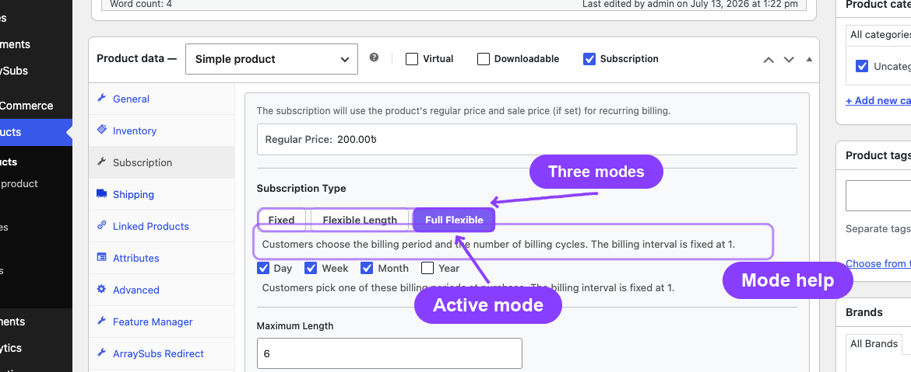
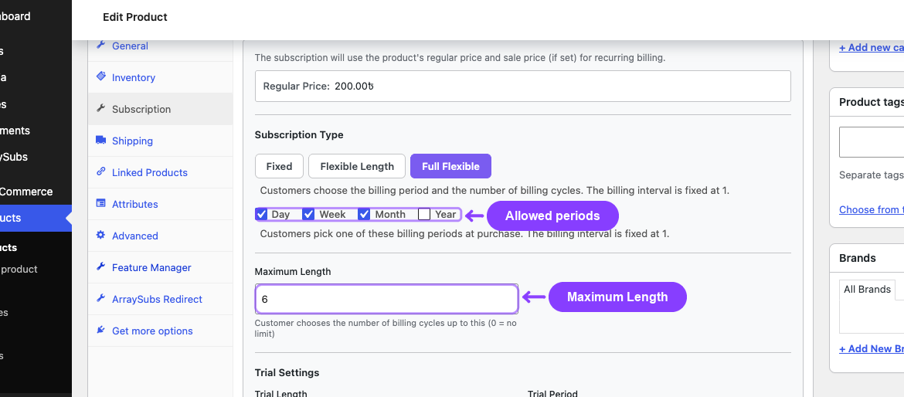
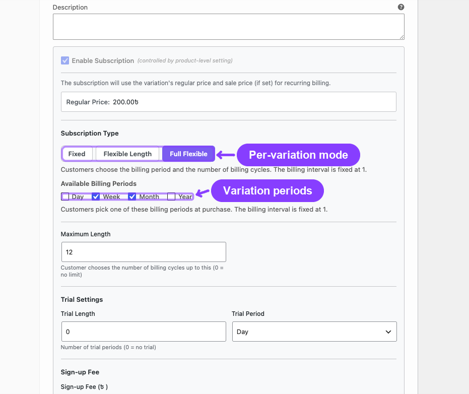
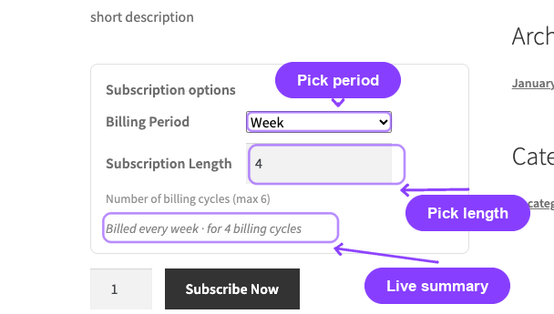
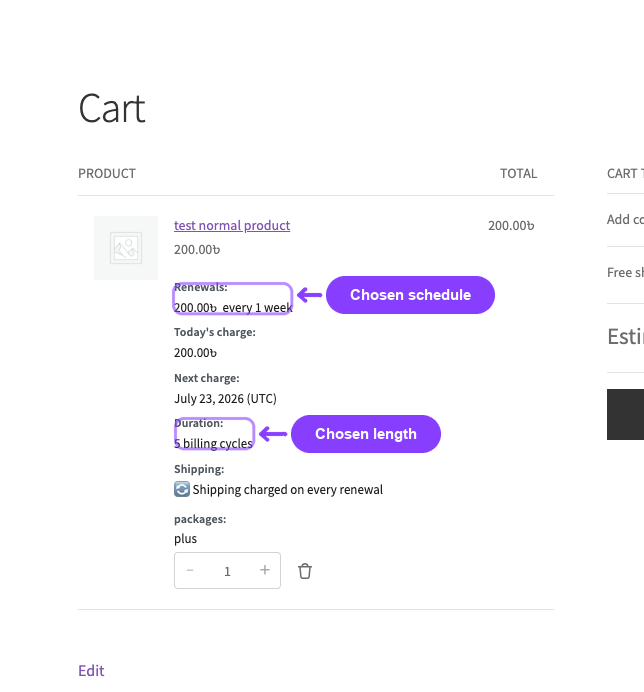

# Info
- Module: Subscription Products
- Availability: Pro
- Last updated: 2026-07-14

# Flexible Subscription Duration

> Let customers choose how long their subscription runs — and, optionally, which billing period it uses — right on the product page, while the store keeps full control over the allowed choices.

**Availability:** Pro

## Page Navigation

- **Current guide:** Flexible Subscription Duration
- **Where to open it:** WordPress Admin -> Products -> Add/Edit Product -> Subscription tab
- **Section overview:** [Open overview](./README.md)
- **Previous guide:** [Create and Configure Subscription Products](./create-and-configure.md)
- **Next guide:** [Plan Switching and Product Relationships](./plan-switching-and-relationships.md)
- **Troubleshooting:** [Audits, Logs, and Troubleshooting](../audits-and-logs/README.md)

## Overview

Flexible Subscription Duration adds a **Subscription Type** selector to the Subscription tab of the WooCommerce product editor. It has three modes:

| Mode | Who sets the length? | Who sets the billing period? |
|---|---|---|
| **Fixed** | Merchant (fixed value) | Merchant |
| **Flexible Length** | Customer (up to a merchant maximum) | Merchant |
| **Full Flexible** | Customer (up to a merchant maximum) | Customer (from a merchant-approved list) |

In the two flexible modes, the customer makes their choice on the product page before adding to the cart. The selection travels through the cart and checkout and is locked into the subscription that gets created — so renewals and automatic expiry follow exactly what the customer picked.

This is a **Pro** feature. Without the Pro add-on, every subscription product behaves as if it were set to **Fixed**.

## When to Use This

- You sell prepaid plans where buyers choose a commitment length — for example, "3, 6, or 12 months."
- You offer a service that some customers want weekly and others want monthly, from the same product.
- You want to reduce cancellations by letting buyers pick a shorter term instead of walking away.
- You want the flexibility of many plan lengths without creating a separate variation for each one.

## Prerequisites

- WooCommerce installed and active.
- ArraySubs core plugin installed and active.
- ArraySubs **Pro** add-on installed and active with a valid license.
- The product is already configured as a subscription (see [Create and Configure Subscription Products](./create-and-configure.md)).
- Admin or Shop Manager access.

## How It Works

The Subscription Type selector sits **above** the Billing Schedule section in the Subscription tab. The mode you choose changes what the customer is allowed to decide at purchase time:

- **Fixed** keeps the classic behavior. The Billing Period, Billing Interval, and Subscription Length you enter are exactly what every buyer gets.
- **Flexible Length** keeps your Billing Period and Interval fixed, but turns **Subscription Length** into a **Maximum Length**. The customer chooses any number of billing cycles from 1 up to that maximum.
- **Full Flexible** additionally lets the customer choose the **billing period**. You pick which periods are allowed (Day, Week, Month, Year); the customer picks one of them at checkout. The billing interval is locked to **1** in this mode.

Whatever the customer selects is re-checked on the server when they add to the cart, so a tampered or out-of-range value can never create a subscription outside your configured limits. The chosen length drives automatic expiry the same way a fixed Subscription Length does, and the chosen period drives the renewal schedule.

---

## Configuring a Simple Product

### The Subscription Type Toggle



1. Open a subscription product and go to the **Subscription** tab in the Product data panel.
2. Find the **Subscription Type** section (above Billing Period).
3. Click one of the three buttons: **Fixed**, **Flexible Length**, or **Full Flexible**.
4. A short description under the buttons explains the selected mode.
5. Configure the mode-specific fields (below), then **Publish** or **Update**.

### Flexible Length Mode

When you select **Flexible Length**:

- The **Subscription Length** field's label changes to **Maximum Length**.
- Billing Period and Billing Interval stay visible and are set by you — every subscription of this product bills on that same schedule.
- The customer chooses how many billing cycles to buy, from **1** up to the Maximum Length.

| Maximum Length | Customer can choose |
|---|---|
| 6 | 1 to 6 billing cycles |
| 12 | 1 to 12 billing cycles |
| 0 | 1 to 365 billing cycles (no merchant cap) |

```box class="info-box"
A **Maximum Length of 0** means you are not setting an upper cap. The customer can still choose a finite number of cycles (up to a system limit of 365), or leave it at the default. Set a specific maximum whenever you want a hard ceiling.
```

### Full Flexible Mode



When you select **Full Flexible**:

- An **Available Billing Periods** row appears with checkboxes for **Day**, **Week**, **Month**, and **Year**. Tick every period you want to offer.
- The Billing Period dropdown and the Billing Interval field are hidden — the customer picks the period, and the interval is fixed at **1**.
- **Subscription Length** again acts as the **Maximum Length** for the customer's cycle choice.

At checkout the customer picks one of the ticked periods and a length. For example, with Week and Month ticked and a Maximum Length of 12, a customer could buy "every week for 4 cycles" or "every month for 12 cycles" from the same product.

```box class="warning-box"
You must tick at least one billing period in Full Flexible mode. If none are ticked, the store falls back to **Month** so the product always has a valid period to offer.
```

---

## Variable Subscription Products



Each variation of a variable subscription product has its **own** Subscription Type selector. One variation can be Fixed while another is Full Flexible — they are independent.

1. Open the **Variations** tab and expand a variation.
2. Find the **Subscription Type** section above the variation's Billing Schedule.
3. Choose the mode and configure it exactly as you would for a simple product.
4. Click **Save changes** on the variations, then **Update** the product.

On the storefront, the flexible options appear only after the customer selects a variation whose mode is Flexible Length or Full Flexible. Selecting a Fixed variation shows no extra options.

---

## What the Customer Sees

### On the Product Page



A **Subscription options** block appears inside the add-to-cart form:

- In **Full Flexible** mode, a **Billing Period** dropdown lists the periods you allowed.
- A **Subscription Length** number field lets the customer enter how many billing cycles to buy, within the allowed range.
- A live summary line (for example, *"Billed every week · for 4 billing cycles"*) updates as the customer changes the fields, so they can confirm their choice before adding to the cart.

For **Flexible Length** products, only the Subscription Length field appears — the billing period is fixed by the merchant.

### In the Cart and at Checkout



The customer's choice is reflected everywhere the subscription terms are shown:

- The **cart** and **mini-cart** show the chosen renewal schedule and duration.
- The **checkout** order review shows the same terms and the next-charge date.
- The **order confirmation** and order emails show the chosen schedule.
- The **subscription** that is created uses the chosen period, interval, and length — so renewals bill on that schedule and the subscription expires automatically after the chosen number of cycles.

---

## Settings Reference

These controls appear in the **Subscription** tab (or per variation) when the Pro add-on is active.

| Setting | Type | Default | What It Controls |
|---|---|---|---|
| Subscription Type | Toggle (Fixed / Flexible Length / Full Flexible) | Fixed | Whether the customer can choose the length and/or billing period |
| Available Billing Periods | Checkboxes (Day, Week, Month, Year) | Month | Which periods the customer may choose (Full Flexible only) |
| Maximum Length | Number (0–365) | 0 | The upper limit for the customer's cycle choice (0 = no merchant cap). Shares the Subscription Length field. |

---

## What Happens After Saving

- The new mode takes effect immediately for **new** add-to-cart actions on that product.
- Existing subscriptions are not changed — they keep the terms locked in when they were purchased.
- Switching a product back to **Fixed** removes the customer-facing options; future buyers get the fixed Billing Period, Interval, and Subscription Length you have set.
- Changing the Available Billing Periods or Maximum Length later only affects new purchases. A customer who already bought "every week for 5 cycles" keeps that schedule even if you later remove Week from the allowed periods.

---

## Edge Cases and Important Notes

- **Lifetime deals are always Fixed.** A product whose billing period is **Lifetime Deal** cannot use a flexible mode — there is no recurring cycle to flex. The toggle forces Fixed.
- **Fixed Period Membership products are always Fixed.** If a product uses the Pro **Fixed-Date Subscriptions** feature (a fixed calendar end date), it cannot also be flexible — the fixed end date would contradict a customer-chosen length. The toggle forces Fixed.
- **Server-side validation.** The chosen length and period are re-validated against the current product configuration on add-to-cart. Out-of-range lengths and disallowed periods are rejected with a notice, so stale carts or tampered form values cannot bypass your limits.
- **The choice is locked at purchase.** Later edits to the product's allowed periods or maximum length never rewrite an existing order or subscription.
- **Automatic-payment gateways.** Gateways that bill renewals from a pre-synced, per-product schedule (for example, Paddle) cannot honor a customer-selected schedule. When such a gateway is selected with a customer-chosen schedule in the cart, checkout shows a notice asking the buyer to choose a different payment method. Manual/offline gateways and Stripe are unaffected.

---

## Troubleshooting

| Problem | Likely Cause | What to Do |
|---|---|---|
| The Subscription Type toggle does not appear | The Pro add-on is not active, or the license is not valid | Confirm ArraySubs Pro is installed, active, and licensed |
| The toggle is stuck on Fixed and will not change | The product is a Lifetime Deal or uses Fixed-Date Subscriptions | Flexible modes are unavailable for those products by design |
| Customers see no options on the product page | The product/variation mode is Fixed, or a Fixed variation is selected | Set the mode to Flexible Length or Full Flexible and re-check the variation |
| "Please choose a subscription length between…" error on add-to-cart | The entered length is outside the allowed range | Enter a value within the displayed minimum and maximum |
| Full Flexible shows only "Month" | No billing periods were ticked, so the store fell back to Month | Tick the periods you want to offer and update the product |
| The options appear but the choice is not applied in the cart | Caching or a JavaScript conflict on the product page | Clear caches and check the browser console for script errors |

---

## Related Guides

- [Create and Configure Subscription Products](./create-and-configure.md) — Set up the base subscription before adding flexible duration.
- [Product Experience and Display](./product-experience.md) — How subscription pricing and terms render on the storefront.
- [Plan Switching and Product Relationships](./plan-switching-and-relationships.md) — Let customers move between plans after subscribing.
- [Fixed Period Membership](./plan-switching-and-relationships.md) — Fixed calendar end dates (mutually exclusive with flexible modes).

---

## FAQ

### Is Flexible Subscription Duration available in the free core?
No. It is a Pro feature. With only the free core active, every subscription product behaves as Fixed and no Subscription Type toggle appears.

### Does the customer's choice affect existing subscriptions?
No. The chosen period, interval, and length are locked into the subscription at purchase. Later changes to the product only affect new purchases.

### Can I limit which billing periods customers choose?
Yes. In Full Flexible mode you tick the exact periods (Day, Week, Month, Year) you want to allow. In Flexible Length mode the period is fixed entirely by you.

### What does a Maximum Length of 0 mean?
It means you are not enforcing a merchant cap. The customer can still pick a finite number of cycles up to a system limit of 365. Set a specific maximum whenever you need a hard ceiling.

### Does this work with variable products?
Yes. Every variation has its own Subscription Type selector, so different variations can use different modes independently.

### Does it work with all payment gateways?
Manual/offline gateways and Stripe support customer-chosen schedules. Gateways that pre-sync a fixed per-product schedule (such as Paddle) cannot, and checkout will prompt the customer to choose a different method when a custom schedule is in the cart.

### What happens to the subscription length during a free trial?
The trial is separate from the billing-cycle count, exactly as with fixed subscriptions. The customer's chosen number of cycles begins after the trial ends.
