# Info
- Module: Subscription Products
- Availability: Free + Pro
- Last updated: 2026-09-14

# Create Products with the Quick Creation Wizard

> Create a subscription product from ArraySubs, review its settings, and publish it without leaving the guided flow.

## Page Navigation

- **Where to open it:** WordPress Admin → ArraySubs → Home → **+ Subscription Product**
- **Section overview:** [Manage Subscription Products](README.md)
- **Full product editor:** [Create and Configure Subscription Products](create-and-configure.md)
- **Getting started:** [First-Time Setup](../getting-started/first-time-setup.md)

## Open the Product Creation Modal

On **ArraySubs → Home**, click **+ Subscription Product**. The dialog is titled **Create subscription product**.

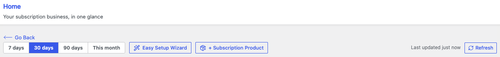

The **ArraySubs → 1-Minute Setup** page has a **Subscription product** card with a **Create a product** or **Add another product** action. The Home onboarding card opens the same modal through these actions. After [1-Minute Setup](../getting-started/easy-setup-wizard.md), use **Create your first subscription product** or **Create a subscription product** on the completion screen. The product card opens this modal; other completion cards open their destination pages.

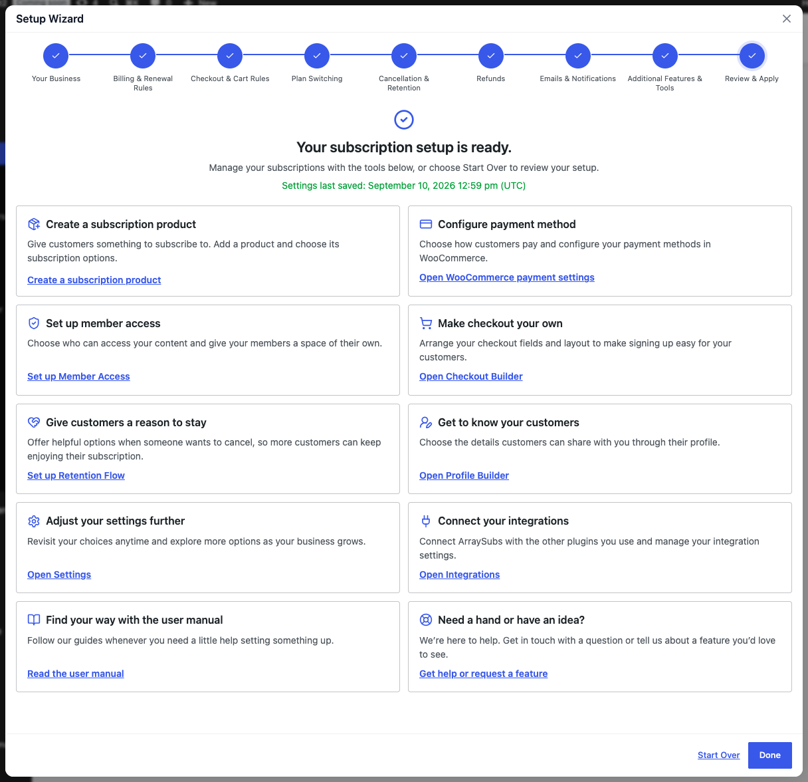

You need WooCommerce and ArraySubs active, plus an account allowed to edit and publish products, such as an administrator or an appropriately configured shop manager. Pro options appear according to the installed and enabled features.

The progress bar shows the current step and total. Use **Next** and **Previous** to move through the form. A product is published only after you review it and confirm **Create product**. **Save Configuration** inside a box or bundle builder saves those choices into the current wizard; it does not publish a product.

## Choose a Product Type

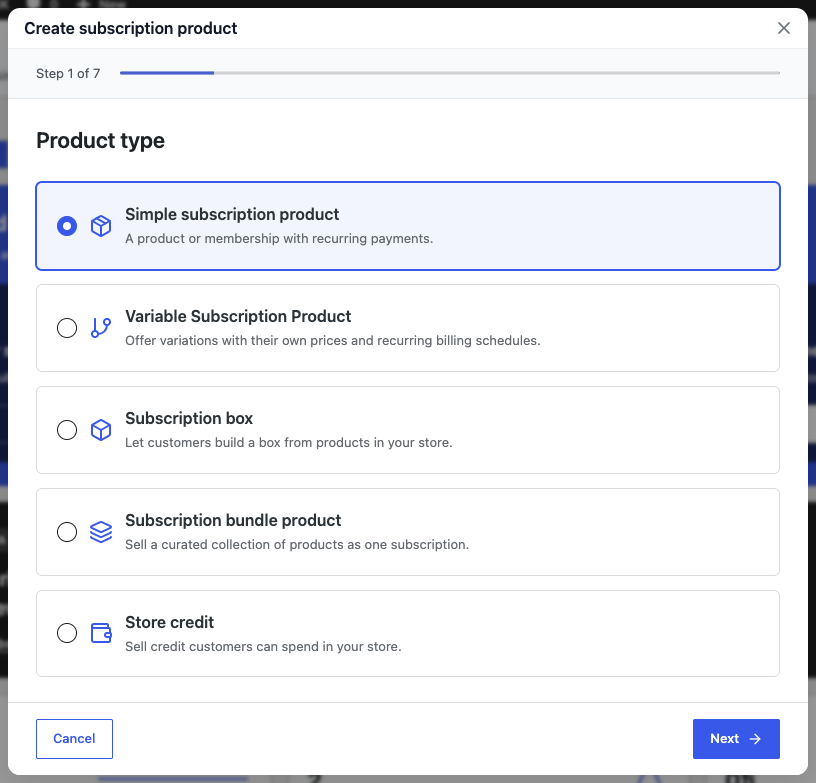

| Choice | What it creates | Route through the wizard |
|---|---|---|
| **Simple subscription product** | A product or membership with its own billing terms | Seven steps: type, details, billing, trial/signup, renewal sync, other settings, review |
| **Variable Subscription Product** | A guide to setting up variations in WooCommerce | Two screens: type and setup guide; create the product in the full editor |
| **Subscription box** | A box that customers assemble from your configured steps | Five main steps, with a three-screen box builder |
| **Subscription bundle product** *(Pro)* | A fixed collection you choose for the customer | Five main steps, with a three-screen bundle builder |
| **Store credit** *(Pro)* | Credit customers can purchase and spend in the store | Four steps: type, details, credit settings, review |

Jump to [Simple subscriptions](#simple-subscription-products), [Variable products](#variable-subscription-products), [Boxes](#subscription-boxes), [Bundles](#subscription-bundles), or [Store credit](#store-credit-products).

### When a Product Type Needs Setup

A disabled card explains what is missing and provides a shortcut. For example, **Add a regular product** opens WooCommerce's product editor, while **Start with a simple subscription** selects the simple-product card.

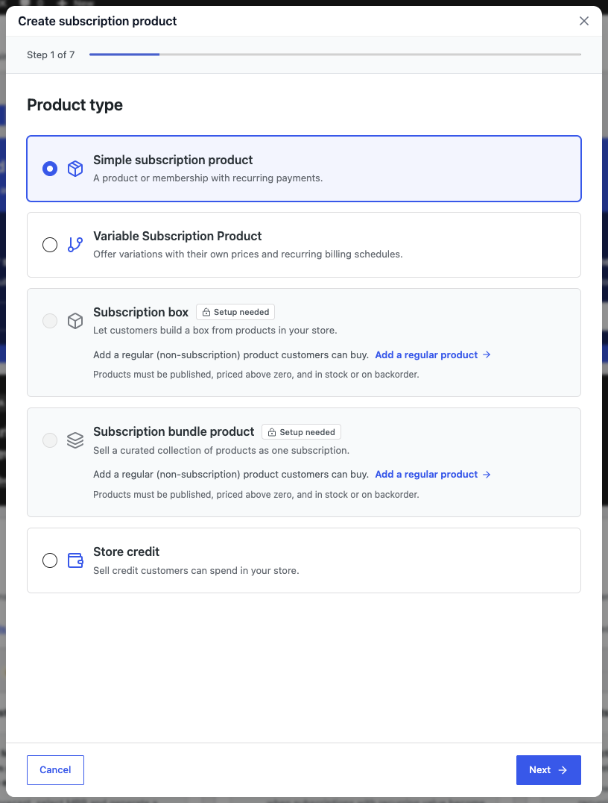

To unlock box and bundle creation, have both a qualifying simple subscription product and a regular, non-subscription simple product in the catalog. They must be published, priced above zero, and in stock or available on backorder. The subscription must use recurring billing with the same price at each renewal; lifetime products and products with a different renewal price do not qualify. The relevant product module must also be available.

For **Store credit**, enable the **Store Credit System** and **Credit Purchases** in [Store Credit Settings](../store-credit/store-credit-settings.md). Cards marked **Pro** require the premium feature. If a card says its tools are not ready, follow its reload instruction after completing setup.

## Simple Subscription Products

### Step 2 — Product Details

Enter a **Product title**, an optional **Description**, and a **Price** greater than zero. An optional **Sale price** must be greater than zero and lower than Price. Amounts use the store's currency; these screenshots use taka (৳).

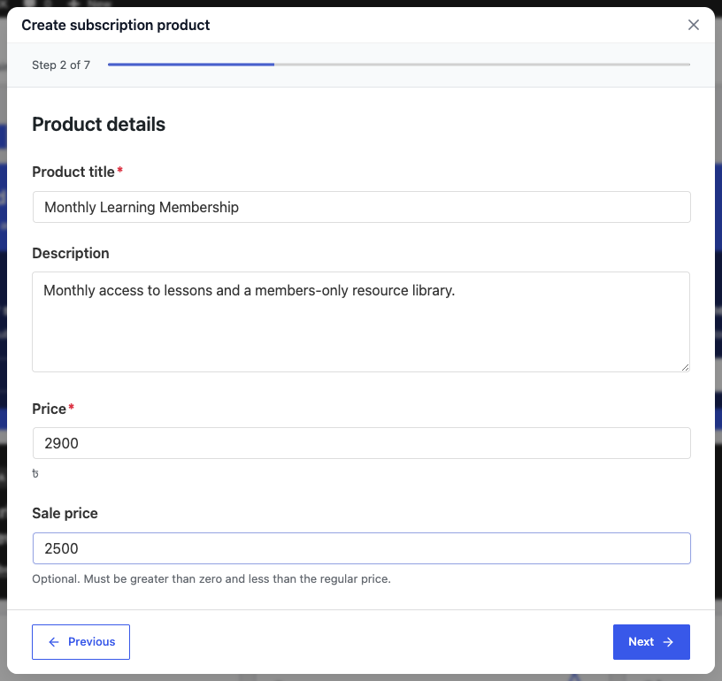

The example uses a regular price of 2,900৳ and a sale price of 2,500৳. The price fields become the product's WooCommerce prices. Product images, categories, inventory details, and other catalog settings can be added later with **Edit product**.

### Step 3 — Recurring Billing

For a standard membership, keep **Fixed schedule** when the Subscription type selector is available.

| Field | How to use it |
|---|---|
| **Billing period** | Choose Day, Week, Month, Year, or Lifetime deal |
| **Billing interval** | Charge every this many periods; allowed range is 1–12 |
| **Subscription length** | Number of billing cycles, from 0–365; 0 means no expiry |
| **Use a different renewal price** | Enable the additional price and threshold fields |

For example, Month with interval 1 bills monthly; Month with interval 3 bills quarterly.

#### Different Renewal Price

Enable **Use a different renewal price**, enter a positive **Renewal price**, and set **Apply renewal price after** to at least 1 billing period.

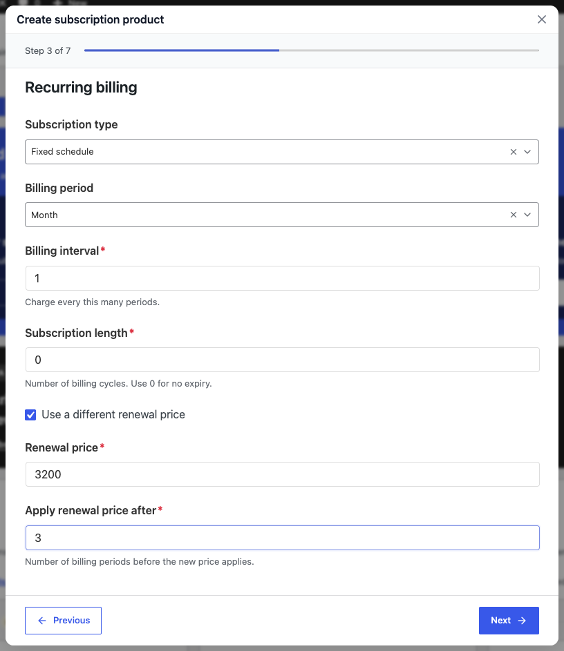

This example changes the recurring price to 3,200৳ after three billing periods. Enabling a different renewal price makes a custom renewal-sync segment plan unavailable in this wizard. See [Different Renewal Price](create-and-configure.md#different-renewal-price) for the full pricing explanation.

#### Customer Chooses Length — Pro

With Flexible Subscription available, select **Customer chooses length**. Keep the billing period and interval under your control and use **Subscription length** to set the allowed maximum; 0 leaves the product-specific maximum unset.

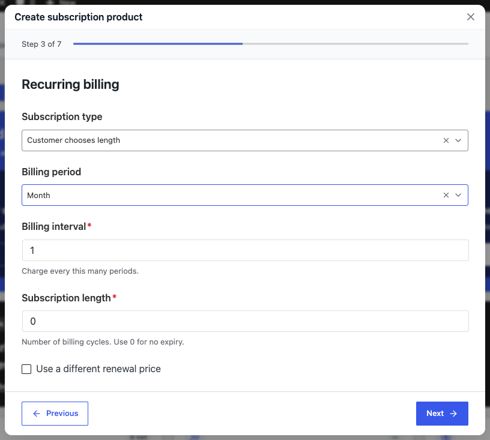

#### Customer Chooses Period and Length — Pro

Select **Customer chooses period and length**, check the **Available billing periods**, and choose a **Default billing period** from those periods. **Subscription length** sets the maximum. The interval field is hidden because this mode uses one selected period per billing cycle.

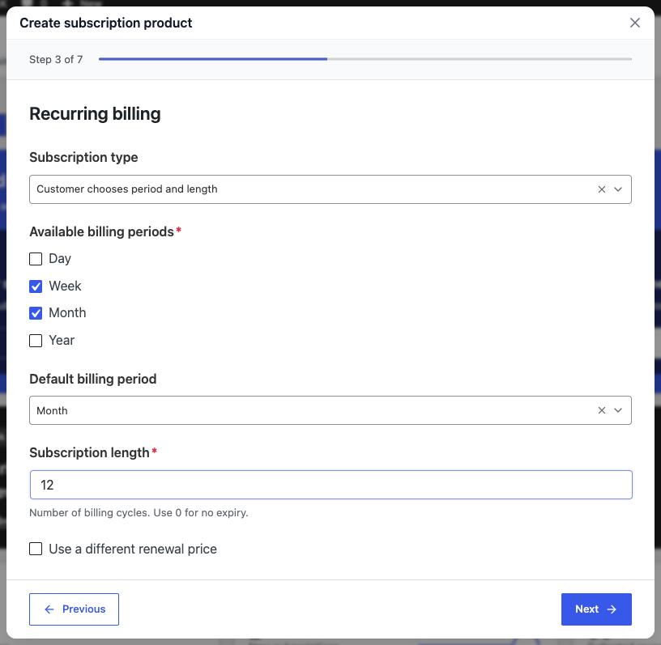

See [Flexible Subscription Duration](flexible-subscription-duration.md) for the customer-facing choices and limits.

#### Lifetime Deal

Choose **Lifetime deal** for a one-time purchase without renewals. Recurring interval, length, flexible-mode, and different-renewal-price controls are hidden. Later steps omit trial fields and explain that lifetime products do not renew; the signup fee remains available.

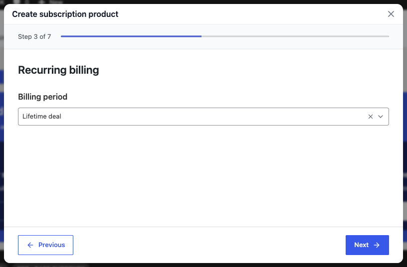

### Step 4 — Trial and Signup

Set **Trial length** to 0 for no trial, or enter a length and choose Day, Week, Month, or Year. **Signup fee** is an optional one-time amount, charged even when a trial is offered.

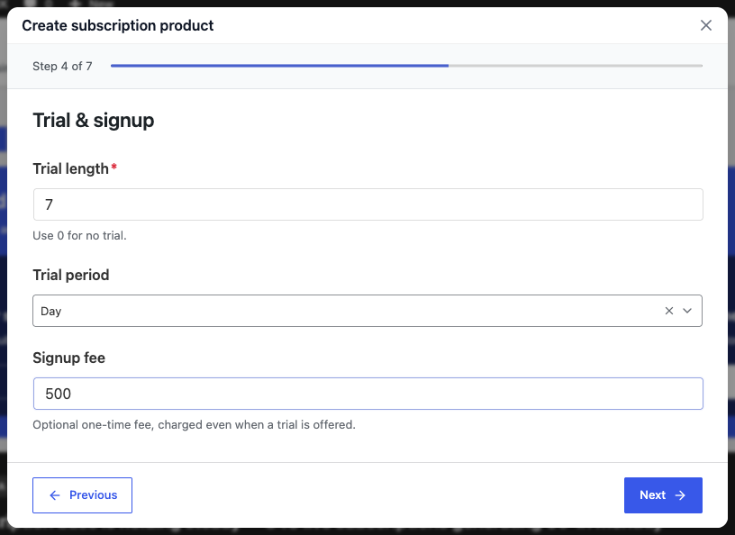

The screenshot demonstrates a seven-day trial. For the custom renewal-sync example below, Trial length is returned to 0. See [Trial Management](../billing-and-renewals/trial-management.md) for trial restrictions and payment-method requirements.

### Step 5 — Renewal Sync

Leaving **Use a custom renewal segment plan** unchecked follows the store-wide renewal-sync setting. It does not necessarily turn renewal synchronization off.

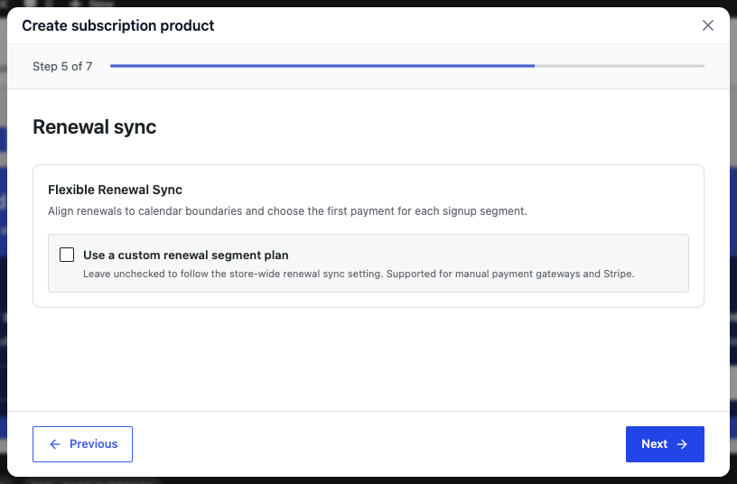

With Flexible Renewal Sync available, check the option to show the timeline and signup segments. Enable the segments you need and drag the boundary handles to adjust their day ranges. At least one segment must remain enabled.

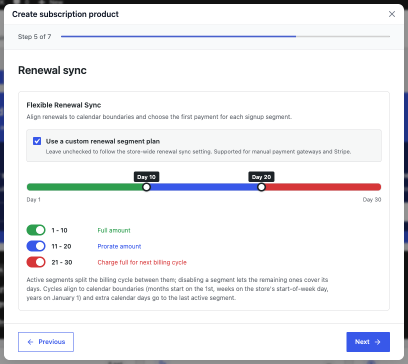

The monthly example uses days 1–10 for **Full amount**, 11–20 for **Prorate amount**, and 21–30 for **Charge full for next billing cycle**. The screen identifies manual payment gateways and Stripe as supported. See [Renewal Sync](../billing-and-renewals/renewal-sync.md) before choosing a plan for your store.

A custom plan requires no trial, no different renewal price, and a billing cycle of at least three days. Otherwise the wizard explains why the standard renewal rules apply. When the module is unavailable, it explains that renewals follow store-wide settings; lifetime products have no renewals.

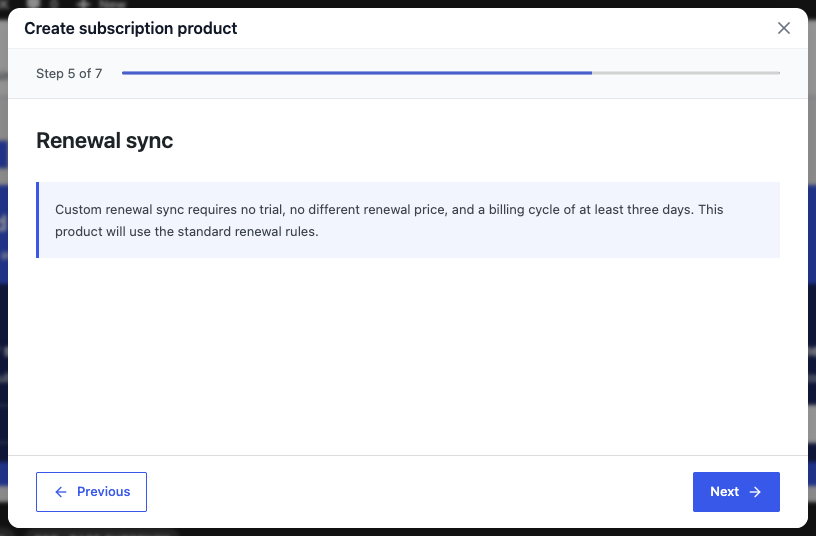

### Step 6 — Other Settings

For digital access, check **Virtual product — no shipping required**. Shipping fields disappear.

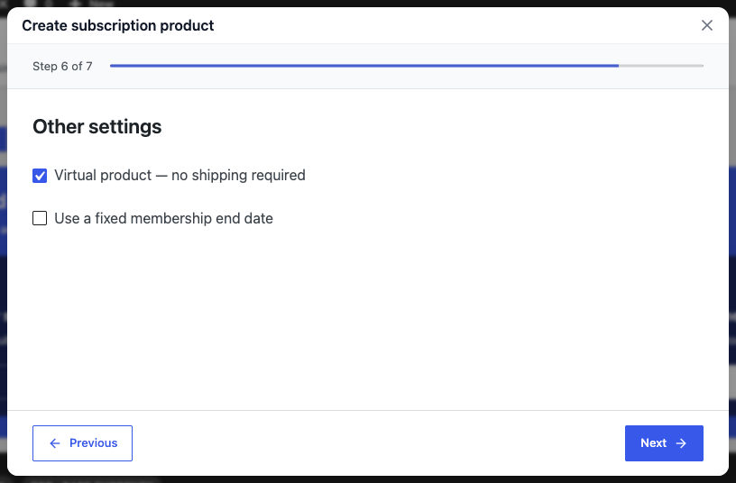

#### Physical Products and Shipping — Pro

With Subscription Shipping available, leave Virtual product unchecked to configure **Shipping charges**. Choose **Every renewal** to show initial and renewal shipping overrides. Leaving the initial override empty or at 0 uses WooCommerce shipping.

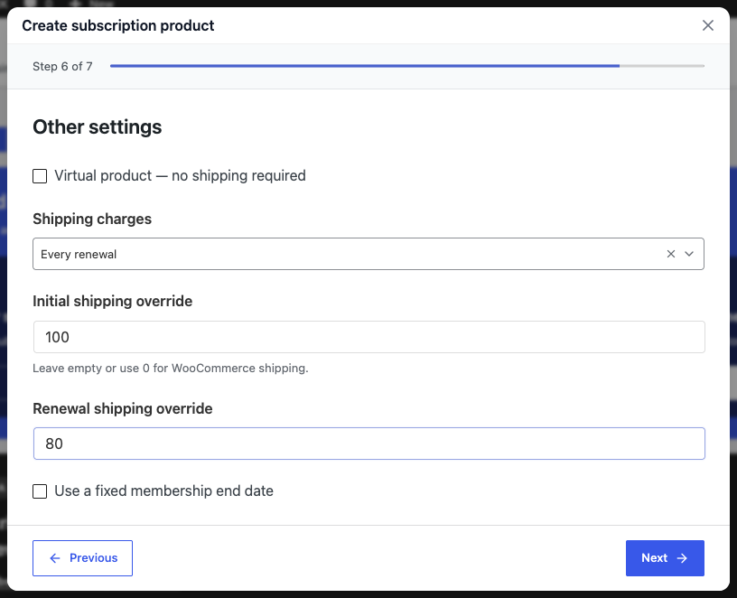

Choose **First order only** for a single shipping charge. The renewal shipping override is hidden.

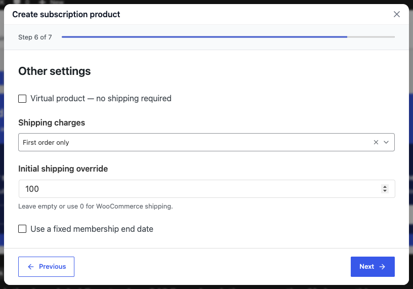

See [Subscription Shipping](../subscription-shipping/README.md) for shipping calculations and customer behavior.

#### Fixed Membership End Date — Pro

With Fixed Period Membership available, a non-lifetime product using **Fixed schedule** can enable **Use a fixed membership end date**. This replaces its cycle-count expiry with a membership end date.

Choose **Specific date** and enter the date. Optionally set **Enrollment opens** and **Enrollment closes**; the closing date must not precede the opening date. Under **At the membership end date**, choose **Expire membership** or **Renew membership**.

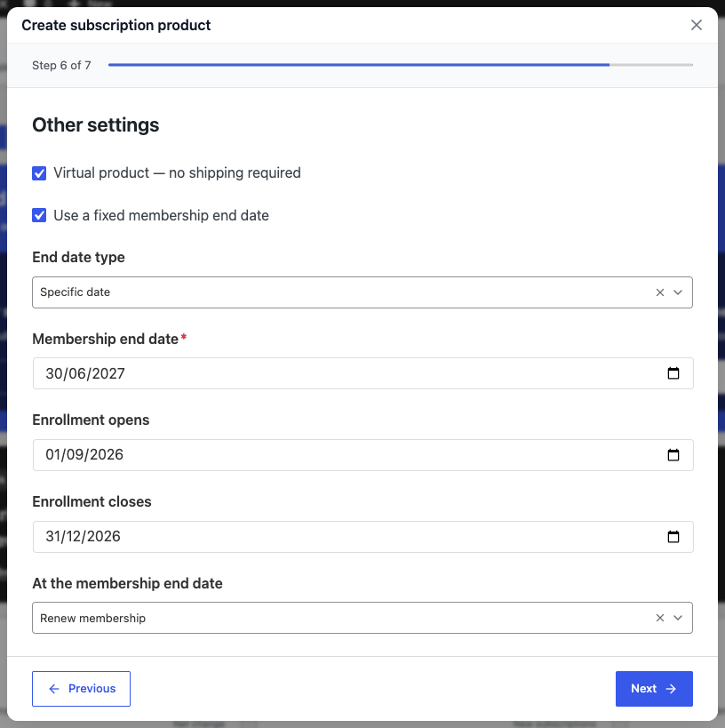

For a yearly cutoff, choose **Annual cutoff** and enter the **Membership end date** as `MM-DD`, such as `12-31`. Enrollment dates remain full calendar dates.

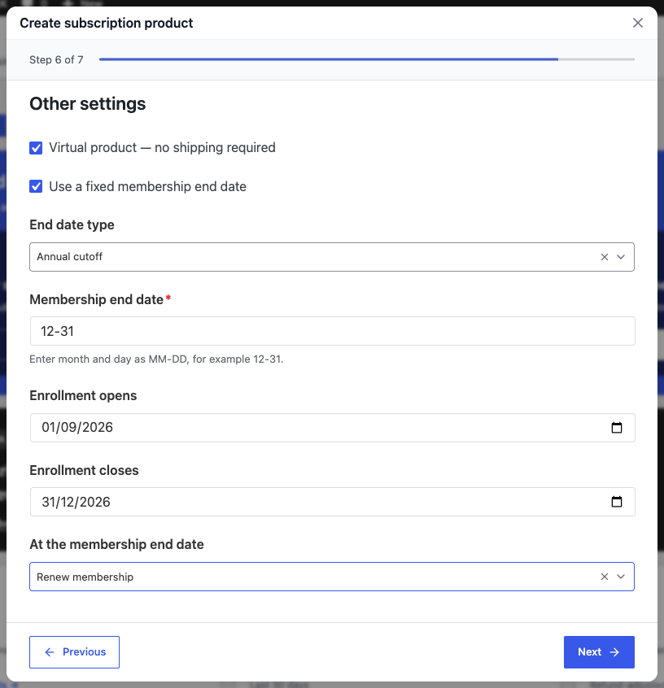

See [Plan Switching and Product Relationships](plan-switching-and-relationships.md) for fixed-period membership behavior. This control is not offered with customer-chosen subscription terms.

### Step 7 — Review

Review every section, including the effective billing terms and renewal-sync choice. Click a section's **Edit** link to revisit its screen, then continue through the remaining steps to return to review.

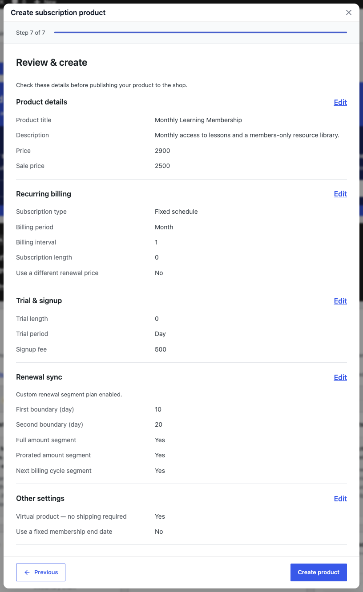

The example review shows monthly billing without a trial, a 500৳ signup fee, the custom segment plan, and a virtual product. Continue with [Publish and Next Steps](#publish-and-next-steps).

## Variable Subscription Products

Choose **Variable Subscription Product** and click **Next**. The second screen is a setup guide; the modal does not create variations or publish a variable product.

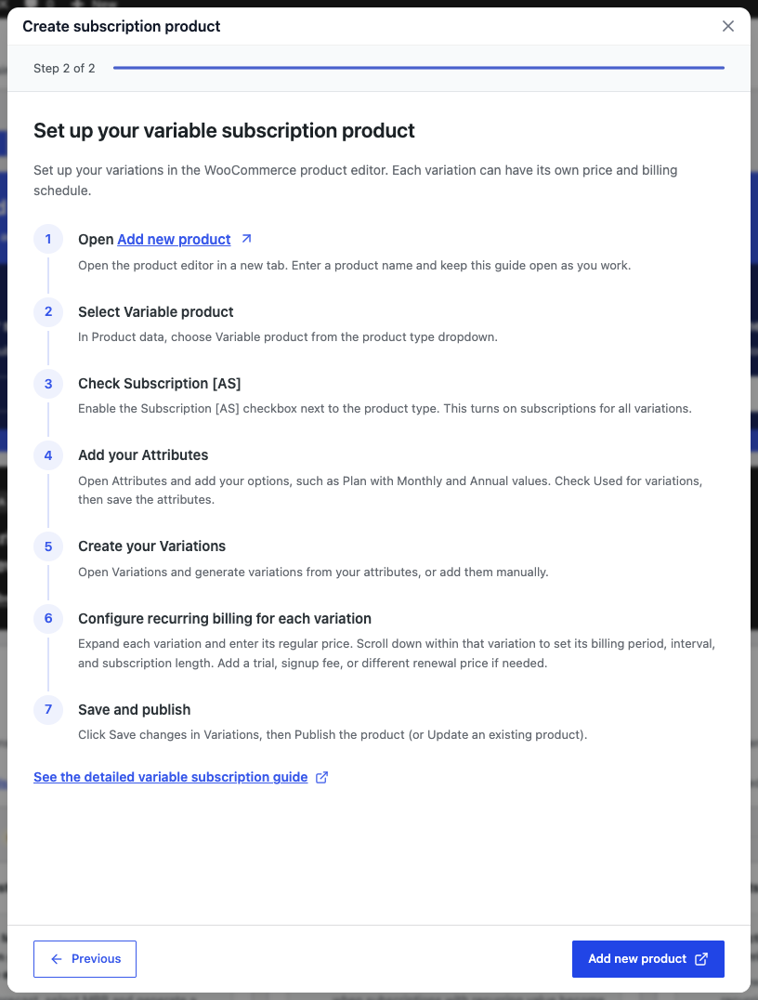

1. Click **Add new product** to open the WooCommerce editor in a new tab. Keep the guide open beside it.
2. Select **Variable product** in Product data.
3. Check **Subscription [AS]** for the parent product.
4. Add attributes, such as Plan with Monthly and Annual values. Check **Used for variations** and save them.
5. Generate or add variations.
6. Expand each variation, enter its regular price, and configure its **Subscription Billings [AS]** card.
7. Click **Save changes** in Variations, then **Publish** or **Update** the product.

For screenshots of the full editor and per-variation fields, follow [Variable Subscription Products](create-and-configure.md#variable-subscription-products). **Previous** returns to the product-type choices.

## Subscription Boxes

The five main steps are **Product type → Product details → Recurring billing → Other settings → Review & create**. Between details and billing, configure the box in its three-screen builder.

### Box Details

Enter the title and description, then click **Configure box**. This path has no standalone Price or Sale price field: the customer's chosen contents and your box discounts determine the amount.

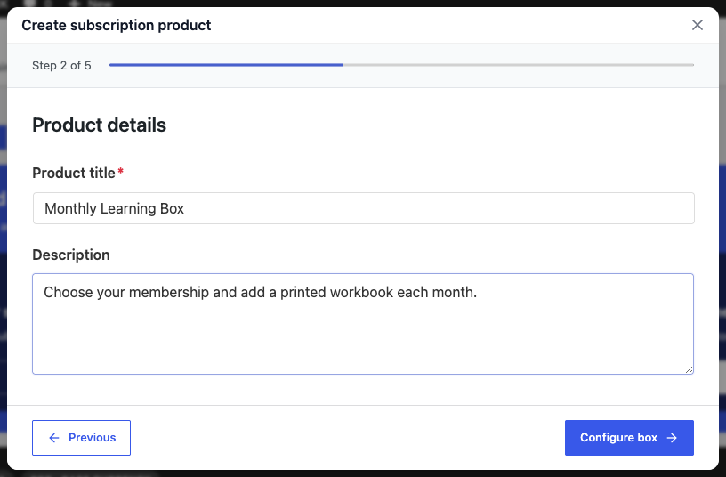

### Builder Screen 1 — Box Steps

Set the **Box Schedule**: billing period, interval, and subscription length. **Keep signup fees** optionally adds up the selected products' signup fees for the first payment. Free trials are switched off for contents of a box.

Give each step a title and add at least one element. The box needs at least one **Product** or **Product Categories** element. Product elements select a single item; category elements let customers choose from matching products. Optional question elements collect text, selections, or uploads. Configure their labels, required status, and type-specific controls in the expanded element.

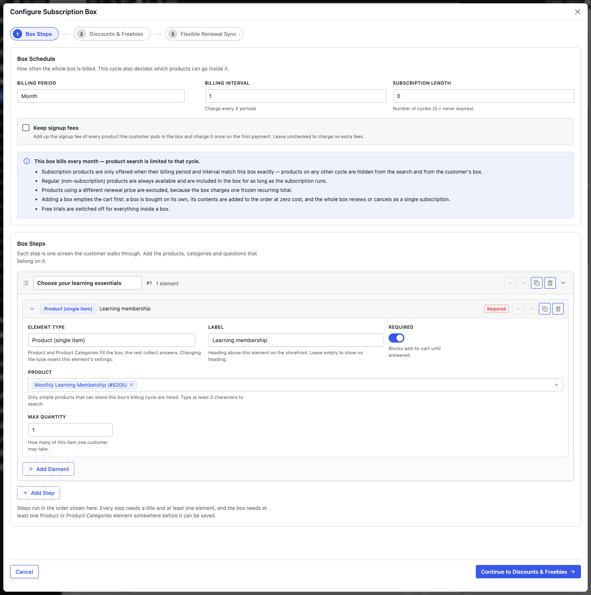

Type at least three characters in product search. Subscription items must match the box's billing period and interval; regular products can also be included. Lifetime products and products with a different renewal price are excluded. The on-screen notice explains these restrictions.

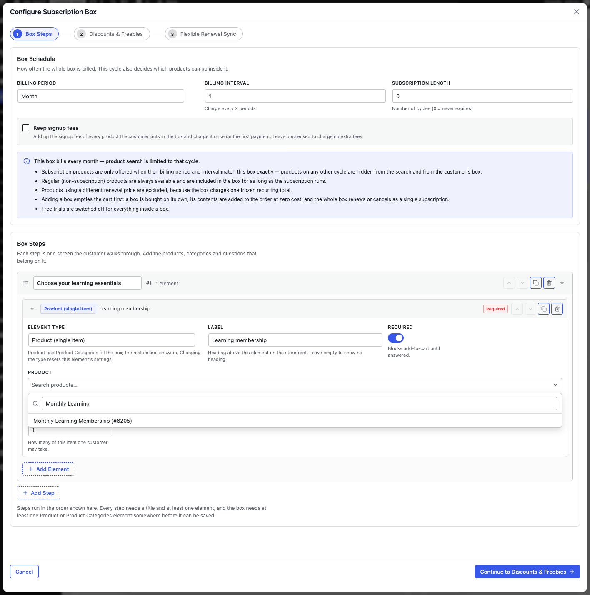

Use the step and element controls to add, reorder, duplicate, or remove entries. For each element's detailed configuration, use the [Subscription Boxes guide](subscription-box.md).

### Builder Screen 2 — Discounts and Freebies

Click **Continue to Discounts & Freebies**. Choose whether ranges use **Total Value** or **Total Count**, and set the maximum amount or count used to draw the range picker. That maximum sets the drawing scale, not a limit on what customers can buy.

Use **Add Range Point** for another tier. For each range, select any freebie products and choose **No discount**, **Fixed amount**, or **Percentage**. Fill the amount or percentage when applicable. Check the summary beneath the range settings.

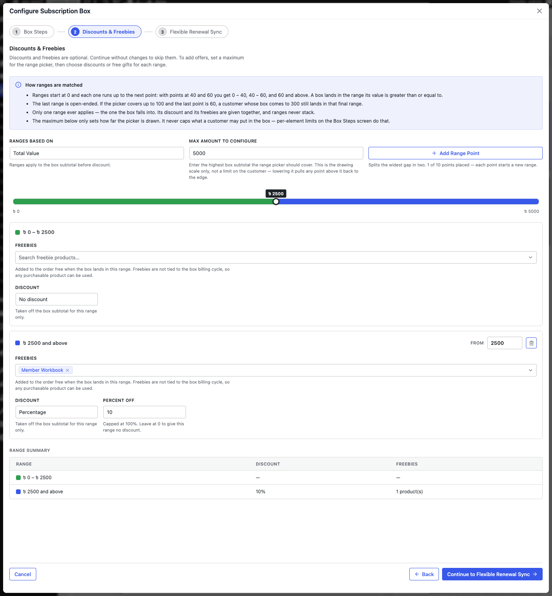

The example offers 10% off and a workbook in the range starting at 2,500৳. The lower range has no discount or freebie.

### Builder Screen 3 — Flexible Renewal Sync

Click **Continue to Flexible Renewal Sync**. Leave **Give this box its own segment plan** unchecked to follow the store-wide setting, or enable it and configure the boundaries and segments. The box owns the renewal schedule; it does not use the individual contents' renewal-sync plans.

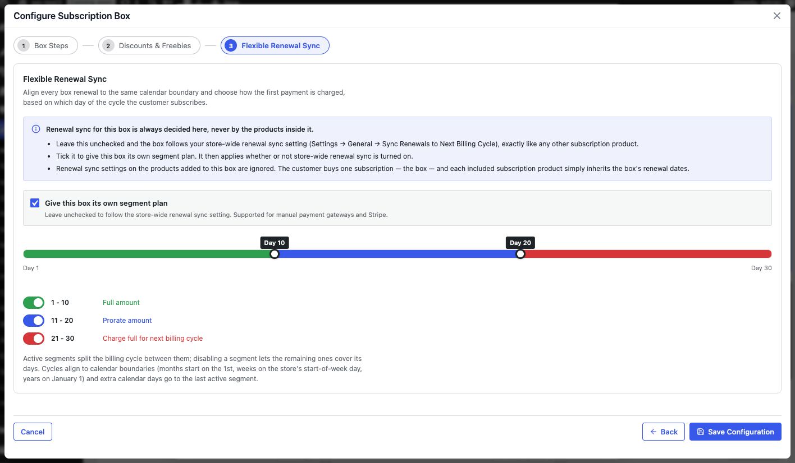

Click **Save Configuration** to return to the main creation modal.

### Box Billing Summary

The **Recurring billing** step displays the saved schedule, signup-fee choice, renewal-sync choice, steps, and discount ranges. Click **Configure box** to revise them.

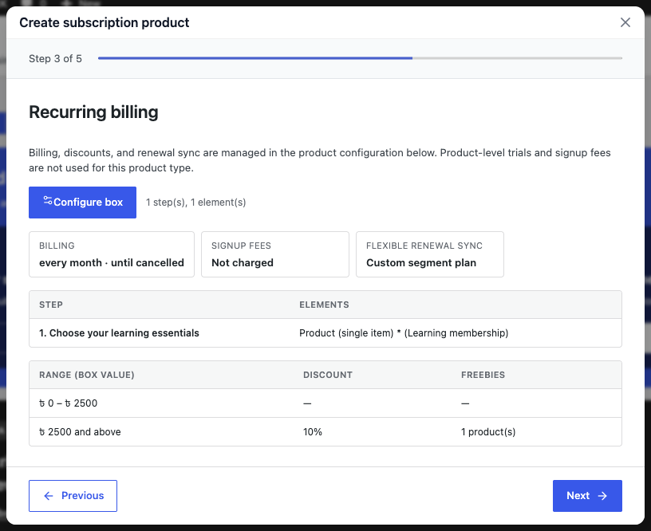

The outer wizard does not offer product-level trials or a separate signup-fee amount for boxes. The builder's **Keep signup fees** choice governs fees from included products.

### Box Other Settings and Review

Choose whether the box is virtual, then click **Next**. Leave the option unchecked for a physical box.

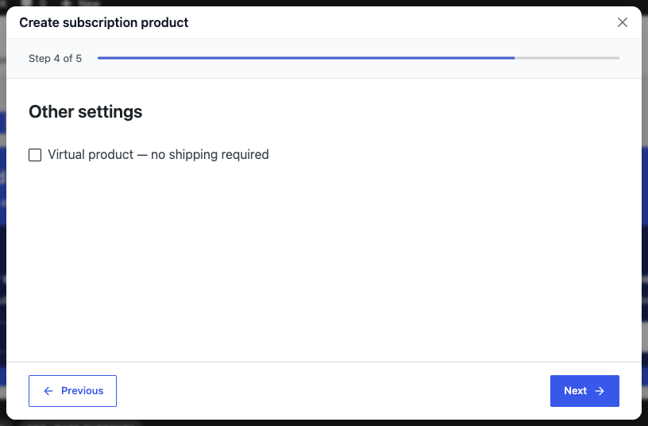

Review the title, description, virtual status, and saved box configuration. Use **Edit** or **Configure box** to make corrections before publishing.

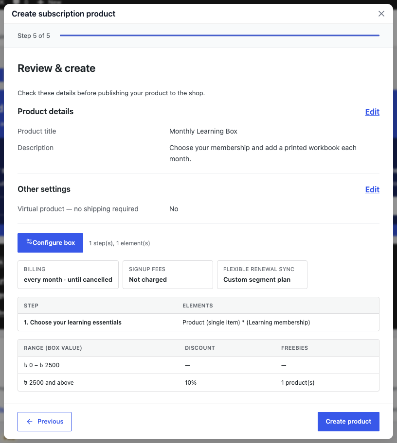

Continue with [Publish and Next Steps](#publish-and-next-steps). See [Subscription Box Customer Experience](subscription-box-customer-experience.md) for the storefront builder, checkout, and renewals.

## Subscription Bundles

Bundles require the Pro bundle feature and the catalog prerequisites described above. They use the same five main steps as boxes, with a dedicated three-screen bundle builder.

### Bundle Details

Enter a title and description, then click **Configure bundle**. Prices come from the selected contents and the bundle-wide discount.

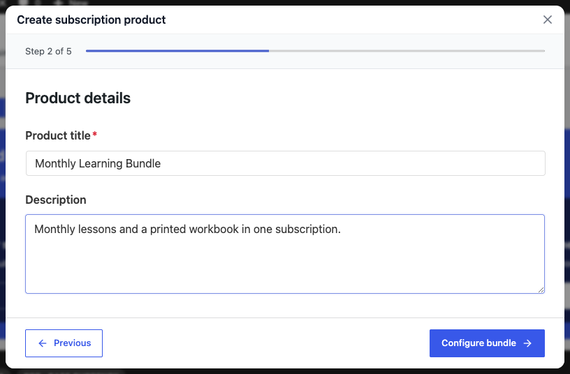

### Builder Screen 1 — Bundle Products

Set the **Bundle Schedule** and optional **Keep signup fees** choice. Search for products by typing at least three characters. Subscription products must match the bundle cycle; regular products can be added alongside them. The builder explains excluded products and what happens if you change the schedule.

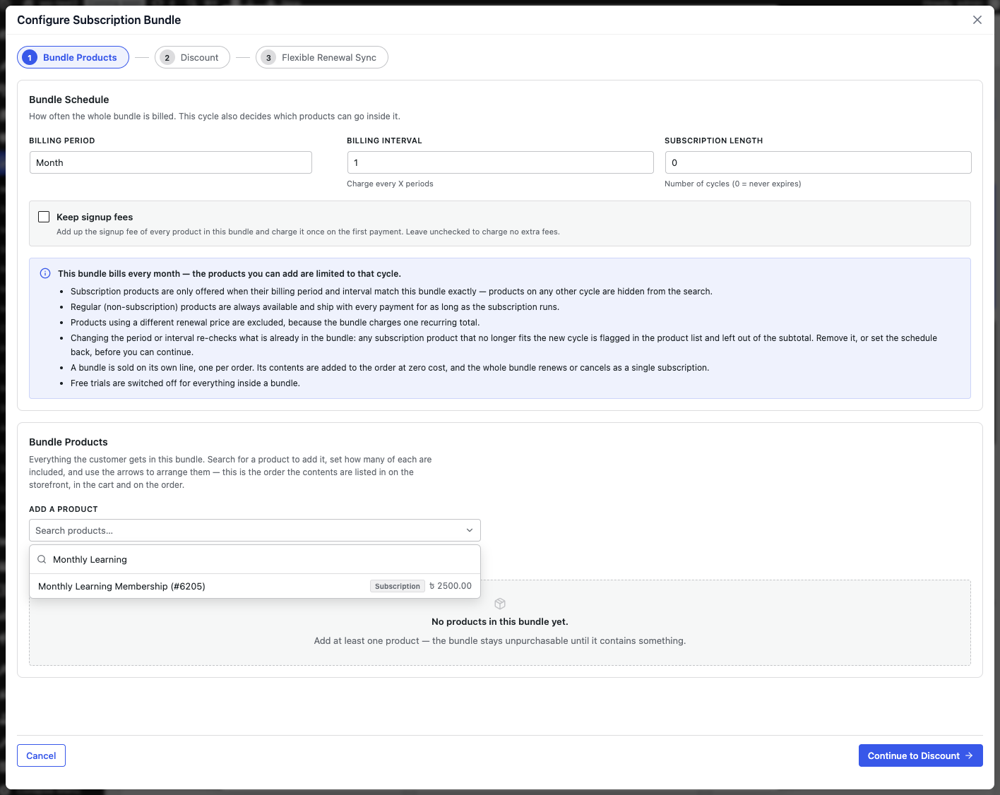

Add the products, set quantities, and use the row controls to reorder or remove them. Check the subtotal. The example contains one monthly membership at 2,500৳ and one workbook at 500৳.

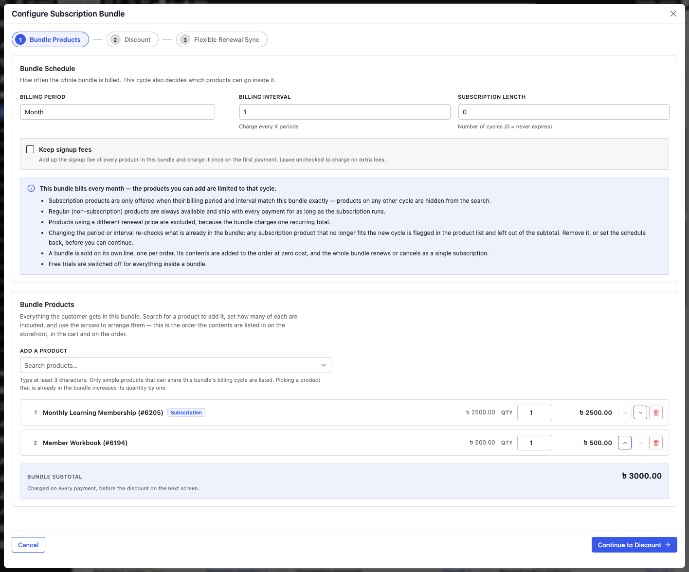

### Builder Screen 2 — Discount

Click **Continue to Discount**. Choose **No discount**, **Fixed amount**, or **Percentage**. Enter the amount or percentage and review the price preview. A percentage is capped at 100%; a fixed discount cannot exceed the subtotal.

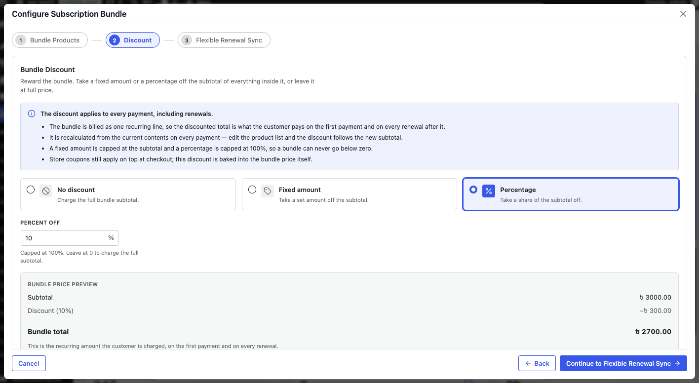

In this example, a 10% discount reduces 3,000৳ to 2,700৳ per payment.

### Builder Screen 3 — Flexible Renewal Sync

Click **Continue to Flexible Renewal Sync**. Follow the store-wide setting or enable **Give this bundle its own segment plan** and set its boundaries. The bundle's own schedule controls its contents' renewal dates.

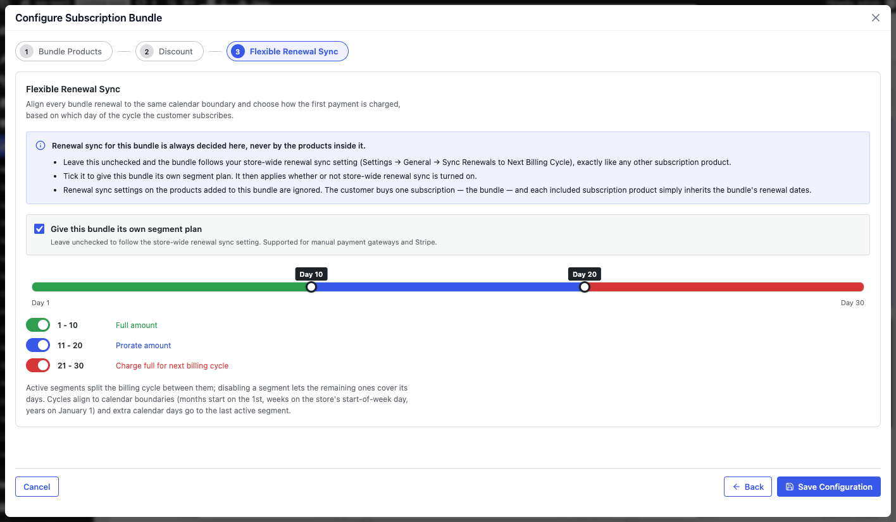

Click **Save Configuration** to return to the creation wizard.

### Bundle Billing Summary and Review

Check **Recurring billing** for the schedule, discount, renewal-sync choice, item prices, and total per payment. **Configure bundle** reopens the builder.

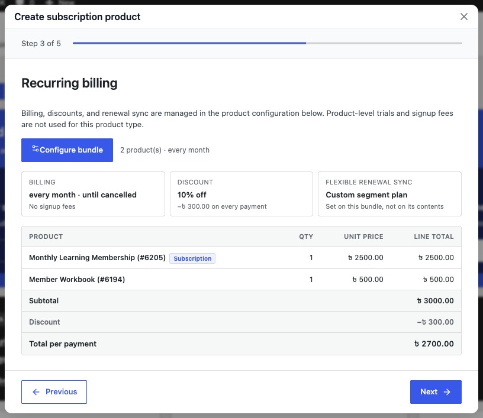

Click **Next** to reach **Other settings**. This is the same virtual-product choice shown in the [box flow](#box-other-settings-and-review). Continue to **Review & create** and check the final details and bundle summary.

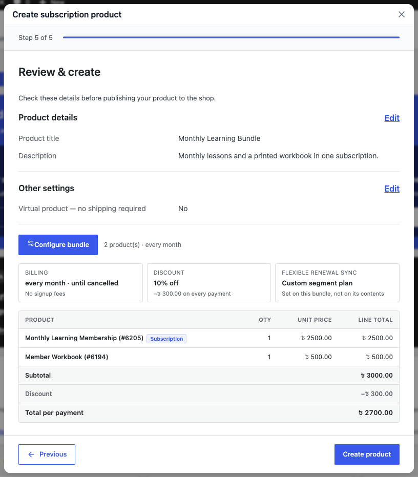

Continue with [Publish and Next Steps](#publish-and-next-steps). For eligibility rules and storefront behavior, see [Subscription Bundles](subscription-bundle.md) and [Subscription Bundle Customer Experience](subscription-bundle-customer-experience.md).

## Store Credit Products

With the Pro Store Credit feature and credit purchases enabled, choose **Store credit**. This flow sells prepaid credit, so it has no recurring-billing, trial, or renewal-sync steps. Store-credit products are virtual automatically.

### Step 2 — Credit Product Details

Enter a **Product title**, optional **Description**, and positive **Price**. The wizard also offers an optional **Sale price**, which must be positive and lower than Price.

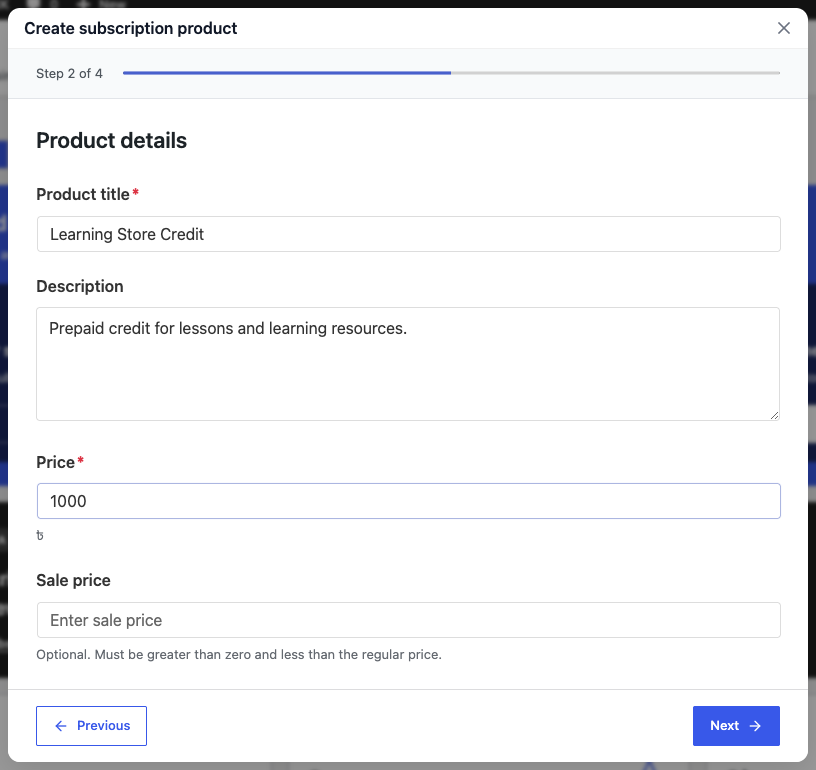

### Step 3 — Credit Amount and Bonus

For **Fixed amount**, enter a positive **Store credit value** and a **Bonus credit (%)** from 0–100. The product's selling price and the credit value are separate choices.

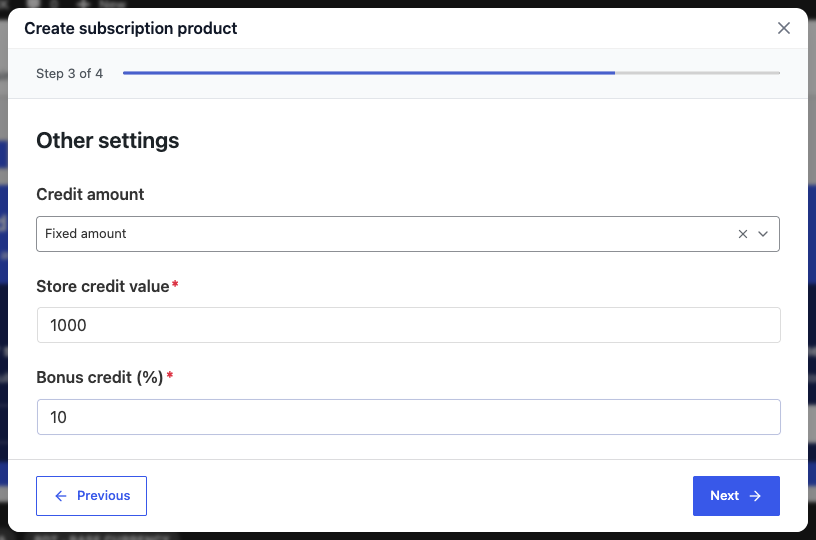

For **Customer chooses amount**, the fixed credit-value field disappears. Keep the bonus percentage if you want to award extra credit. The customer chooses the purchase amount on the storefront, subject to the store's credit-purchase settings.

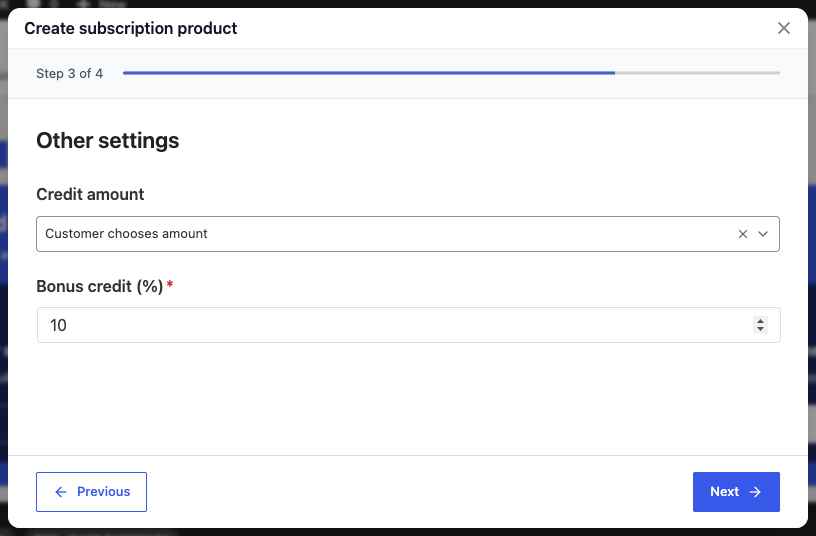

See [Store Credit Purchase Product](../store-credit/purchase-product.md) for credit calculation, purchase limits, and the storefront experience.

### Step 4 — Review

Review the product details, credit amount mode, and bonus. The screenshot shows the customer-chosen amount variant. Use **Edit** to change either section before publishing.

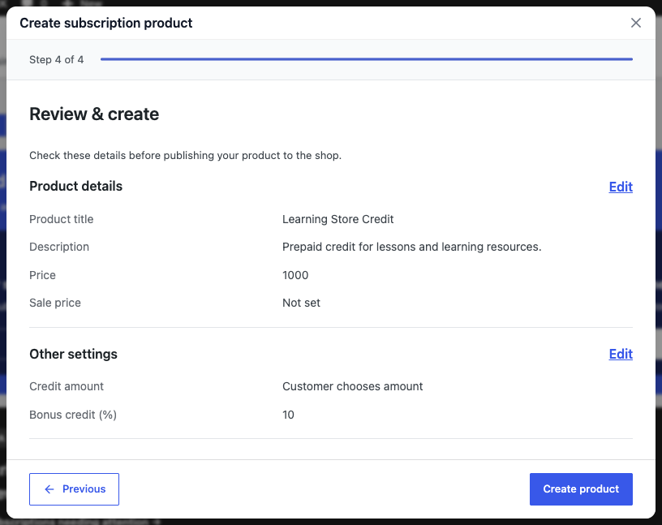

## Publish and Next Steps

On **Review & create**, click **Create product**. A confirmation names the product and states that it will be created and published in your store. Choose **Keep reviewing** to go back, or **Create product** to publish.

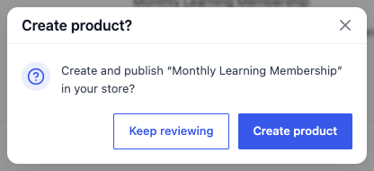

The confirmation shows a creating/loading state while the request runs. Wait for **Congratulations! Your product is ready.** This success screen is shared by products published through the modal; the variable-product guide publishes through WooCommerce instead.

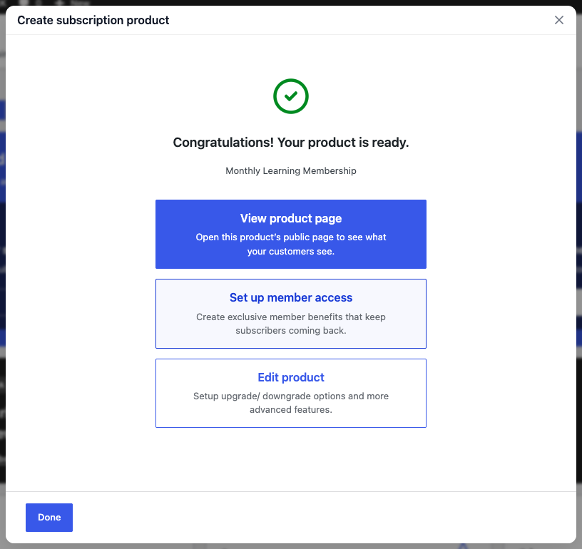

| Action | What to do next |
|---|---|
| **View product page** | Inspect the public product page in a new tab |
| **Set up member access** | Configure access rules and membership benefits; creating a product alone does not define them |
| **Edit product** | Open the full WooCommerce editor for images, categories, linked products, plan switching, and other settings |
| **Done** | Close the creation modal |

Product creation does not place an order or create a customer subscription. Continue with [First-Time Setup](../getting-started/first-time-setup.md#step-4-place-a-test-order) to test a purchase and customer access.

## Validation and Unsaved Changes

If a required field is empty or a value is invalid, the wizard keeps you on the affected step and shows an error. Correct the highlighted fields and try **Next** again.

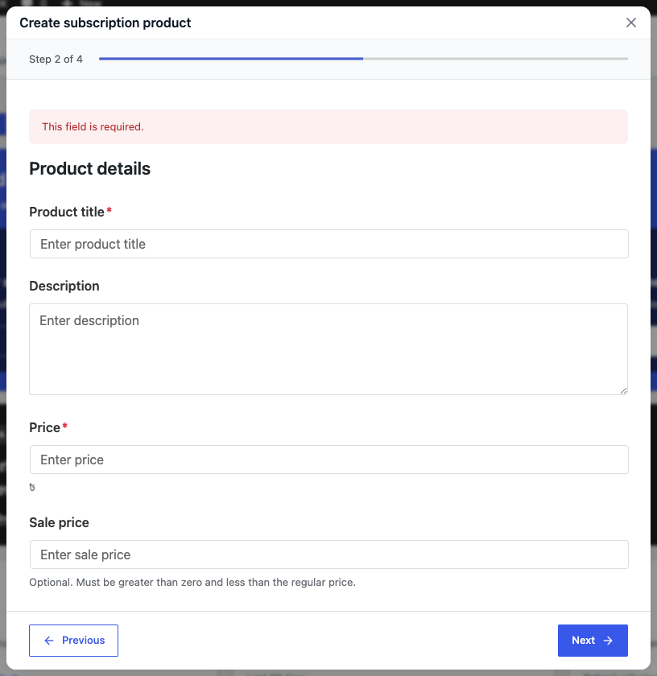

Closing the outer modal after entering details opens **Discard product?**. Choose **Keep editing** to continue, or **Discard product** to abandon the unsaved product. Closing an unsaved box or bundle configuration also asks whether to discard its changes. Finish each nested builder with **Save Configuration** to retain its work in the current wizard.

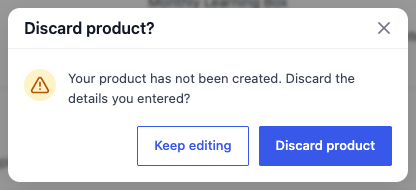

| Situation | What to check |
|---|---|
| A product card is disabled | Read its prerequisite list; check qualifying products, Pro availability, or credit-purchase settings |
| Product search returns no suitable items | Type at least three characters; check price, stock, publication status, and matching billing cycle |
| A box cannot advance | Give each step a title and at least one valid element; include a Product or Product Categories source |
| Custom renewal sync is unavailable | Check the trial, different renewal price, billing cycle length, and module availability |
| Shipping settings are missing | Virtual products have no shipping fields; advanced shipping also requires its module |
| Fixed membership end date is missing | Use a non-lifetime fixed schedule and ensure the membership module is available |
| Creation fails | Read the error, correct the settings, and retry after the current request finishes |

## Related Guides

- [Create and Configure Subscription Products](create-and-configure.md) — Full WooCommerce editor and variation billing.
- [First-Time Setup](../getting-started/first-time-setup.md) — Test the first purchase and customer portal.
- [1-Minute Setup](../getting-started/easy-setup-wizard.md) — Configure store-wide subscription settings.
- [Member Access](../member-access/README.md) — Define the benefits attached to a subscription.
