# Info
- Module: Subscription Products
- Availability: Pro
- Last updated: 2026-07-27

# Subscription Box Customer Experience

> What shoppers see when they build a subscription box, how it appears in the cart, at checkout, and on the order — and how the box and the subscriptions inside it behave for the rest of their life.

**Availability:** Pro

## Page Navigation

- **Current guide:** Subscription Box Customer Experience
- **Where to open it:** Storefront -> Subscription Box product page, and WordPress Admin -> ArraySubs -> Subscriptions
- **Section overview:** [Open overview](./README.md)
- **Previous guide:** [Subscription Boxes](./subscription-box.md)
- **Next guide:** [Plan Switching and Product Relationships](./plan-switching-and-relationships.md)
- **Troubleshooting:** [Audits, Logs, and Troubleshooting](../audits-and-logs/README.md)

## Overview

This guide follows a subscription box from the product page to the tenth renewal. It covers the storefront builder, the cart and checkout rows, the order line items, the subscriptions that are created, and what the customer can and cannot do in their account.

For the admin side — creating the product, defining steps and elements, discounts, and renewal sync — see [Subscription Boxes](./subscription-box.md).

## When to Use This

- You are about to launch a box and want to know exactly what customers will see.
- Support is asking why a box "disappeared" from a cart, or why a customer cannot cancel one item of a box.
- You need to explain to your team why one purchase produced several subscriptions.
- You want to confirm what a renewal order will contain before the first renewal runs.

## Prerequisites

- ArraySubs core and ArraySubs **Pro** installed, active, and licensed.
- A published **Subscription Box [ArraySubs]** product with at least one configured step.
- A payment gateway that supports recurring payments, or a manual/offline gateway for testing.

## How It Works

A box is bought in one flow: the customer opens a builder on the product page, walks through the steps you configured, and adds the finished box to the cart. From that moment the box behaves as a single subscription that happens to carry a frozen list of contents.

Three rules explain almost every behavior on this page:

1. **The box owns the cart.** It is sold individually, and adding a box empties the cart first.
2. **The box carries the money.** The box line holds the whole recurring amount; everything inside it is a zero-priced line.
3. **The box drives the lifecycle.** The subscriptions created for the products inside the box never bill, and always follow the box's status and dates.

## Real-Life Use Cases

### Use Case 1: The Weekly Coffee Club

A customer opens "Build Your Weekly Coffee Box". The product page says *"Billed: Every week"*. They click **Create Subscription Box**, pick two bags of coffee and one bag of decaf on step 1, choose "Filter" from a **Grind** dropdown and type a delivery note on step 2, and watch the footer say *"You save $4.20"* and *"Add $8.00 more to unlock: 10% off"*. They add one more bag, the discount kicks in, and they check out.

The store gets one weekly subscription for the box, three zero-value subscriptions (one per coffee, because those are subscription products), an order that lists the box at the full price with the three coffees beneath it at $0.00, and a fulfilment note carrying the grind choice. Every week, the same order is reproduced automatically.

---

## Building a Box on the Storefront

### The Product Page

The box product page replaces WooCommerce's normal add-to-cart form with a small launcher:

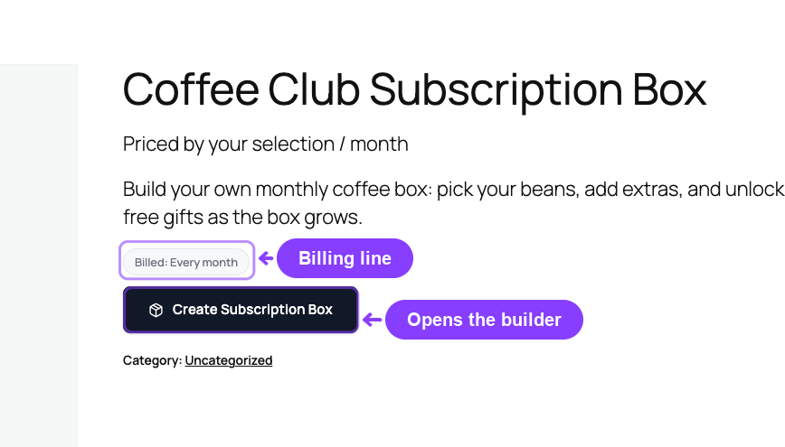

- A billing line: **"Billed: Every month"**, or **"Billed: Every month for 6 cycles"** when the box has a fixed subscription length.
- A **Create Subscription Box** button.

Where WooCommerce normally shows a price, a box shows **"Priced by your selection / month"** — because the price depends entirely on what the customer puts inside.

If the box has not been configured yet, the button is replaced by *"This subscription box is not available yet."*

```box class="info-box"
There is no quantity field and no "add to cart" shortcut in the shop loop. A box can only be built on its own product page.
```

### The Builder Overlay

Clicking **Create Subscription Box** opens a full-screen overlay:

- The header shows the product name and one **chip per step**. The current chip is highlighted and completed chips are marked as done, so the customer always knows how far along they are.
- The body shows one panel at a time, titled with the step title you configured.
- The footer shows the running total and the navigation buttons: **Back**, **Next**, and on the last step **Add to Cart**.

The overlay closes with the × button, the Escape key, or a click on the backdrop. Selections are kept while the page stays open.

### Step Panels and Product Cards

Product and category elements render as a grid of cards. Each card shows:

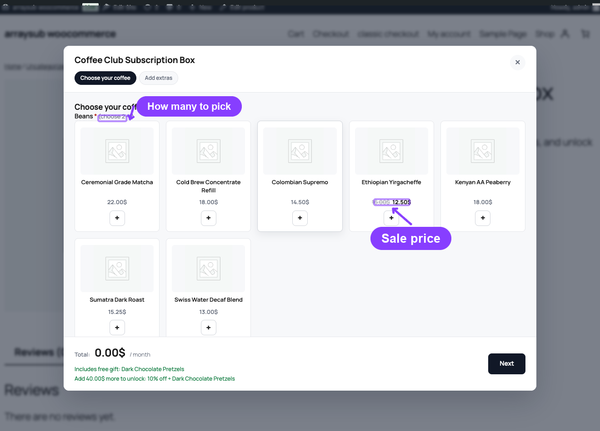

- the product image,
- the product name,
- the price,
- a quantity stepper.

Cards start at zero. Clicking **+** reveals the quantity field and the **−** button and marks the card as selected; going back to zero hides them again. The stepper never goes past the element's limit — pushing further shows *"Maximum quantity for this item is 5."*

A child product that is **on sale** is priced the way WooCommerce prices any discounted product: the original price struck through, the sale price beside it. Only the sale price counts toward the box total.

Category elements show their limits next to the label, for example *"(choose 3–5)"*, *"(choose at least 2)"*, or *"(choose up to 5)"*. Required elements are marked with an asterisk.

### Questions, Choices, and Uploads

Non-product elements render as ordinary form fields inside the same panel:

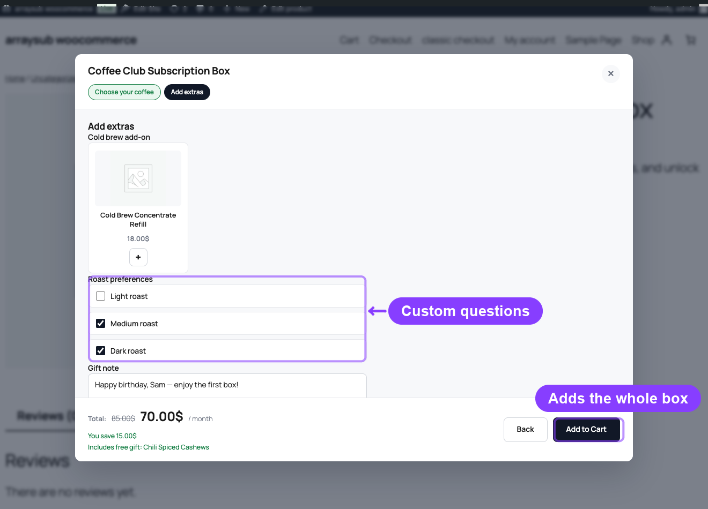

| Element | Storefront control |
|---|---|
| **Text Input** | Single-line field with your placeholder (max 500 characters) |
| **Textarea** | Multi-line field with your placeholder (max 5,000 characters) |
| **Checkbox** (single) | One tick box labelled with the element label |
| **Checkbox** (multi) / **Multi Select** | A list of tick boxes, several allowed |
| **Select** | A dropdown that starts on "Choose an option…" |
| **Upload** | A file field with a "Max 5 MB." hint |

Uploads are sent to the server as soon as the file is chosen, and the field shows **"Uploading…"** while that happens. The customer cannot leave the step or submit the box while an upload is still in flight.

### Per-Step Validation

**Next** validates the current step before moving on, and **Add to Cart** re-validates every step the customer has visited. Problems are shown inline under the field, or as a notice in the footer:

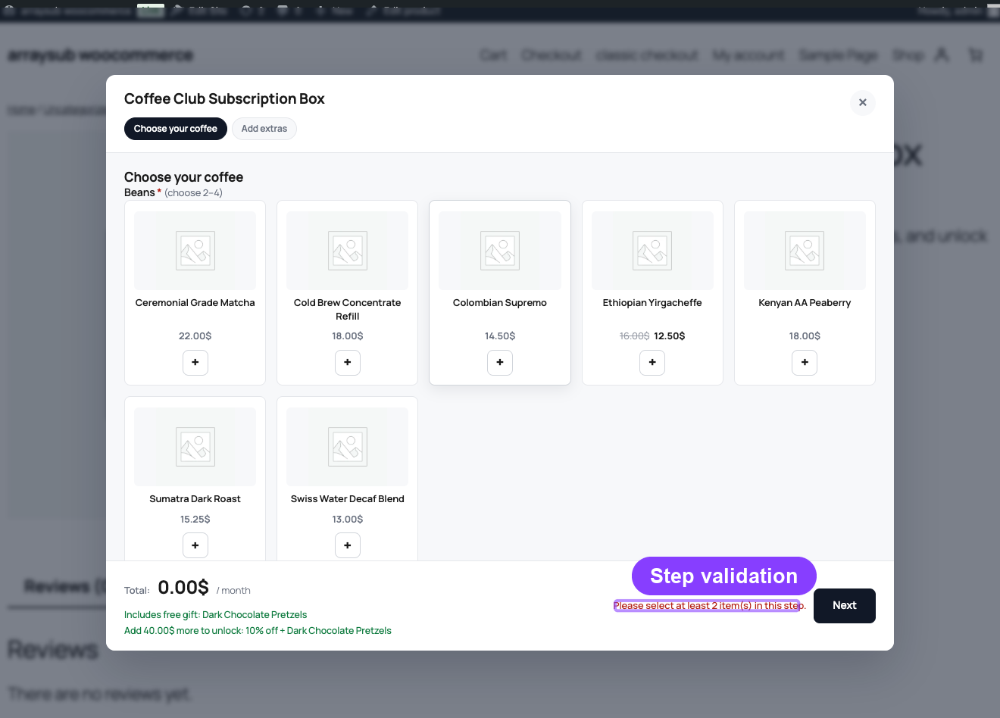

| Message | Cause |
|---|---|
| "This field is required." | A required question was left empty |
| "Please select at least 2 item(s) in this step." | Below the element's **Min Items** |
| "You can select at most 5 item(s) in this step." | Above the element's **Max Items** |
| "Maximum quantity for this item is 3." | Above a product element's **Max Quantity** |
| "Please add at least one product to your box." | The box is empty |
| "Uploading…" | A file upload has not finished yet |

Every one of these checks is repeated on the server when the box is added to the cart, so a tampered form can never bypass them.

### The Live Total, Savings, and Next-Tier Hint

The footer updates on every change:

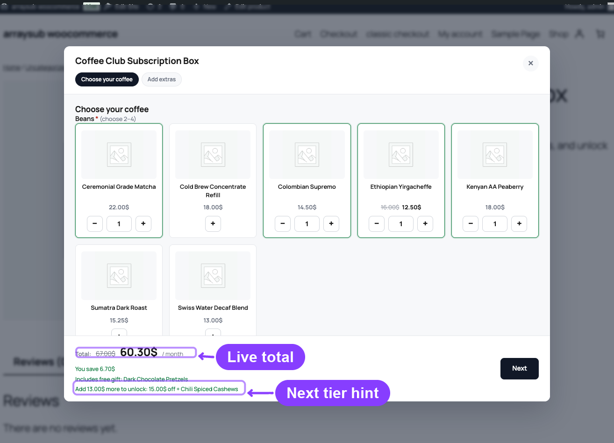

- **Total:** the current box price, followed by the billing suffix, for example **"/ month"**.
- When a discount applies, the pre-discount subtotal appears beside the total.
- A hint line, which can carry several messages at once:
  - **"You save $4.20"** — the discount currently applied.
  - **"Includes free gift: Ceramic Mug"** — the freebie in the current range.
  - **"Add $8.00 more to unlock: 10% off"** — how far the customer is from the next range. When the discounts are based on item count, it reads **"Add 2 more item(s) to unlock: …"** instead.

```box class="info-box"
The footer figure is a preview. The amount that is actually charged is always recomputed on the server from the current product prices and your configuration — the browser's total is never trusted.
```

---

## Cart and Checkout

### In the Cart

When the box is added, the customer is taken straight to the cart. **Adding a box empties the cart first** — a box is bought on its own.

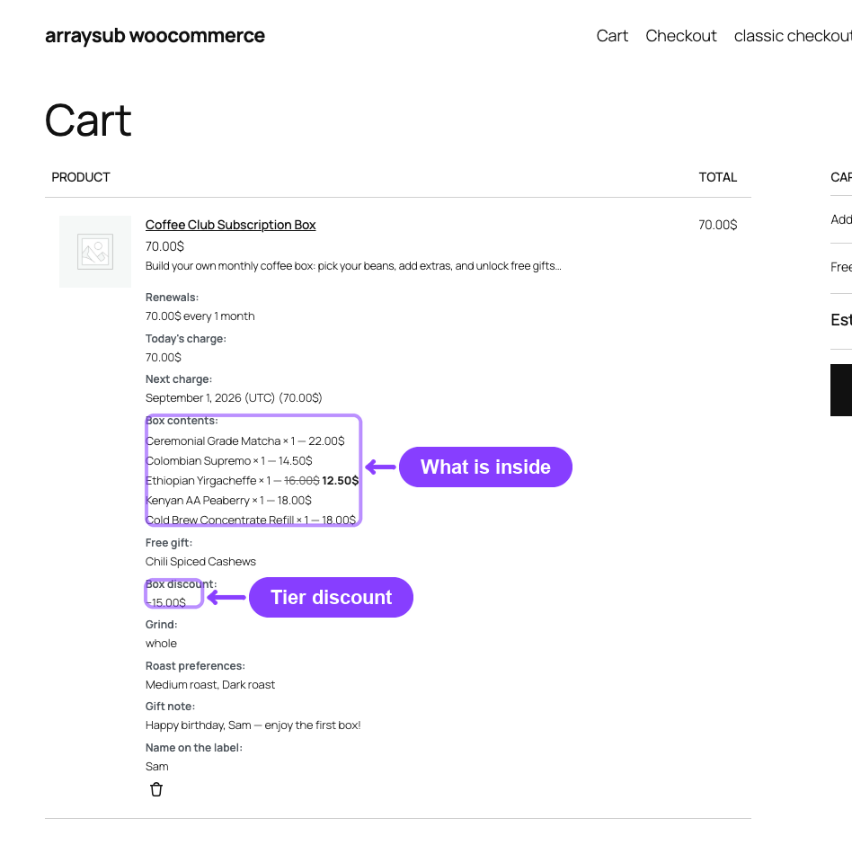

The cart shows **one line**: the box product, quantity 1, priced at the box total. Under the product name, the box's contents are listed as item data:

| Row | Content |
|---|---|
| **Box contents** | One line per chosen product: *name × quantity — unit price*, with sale prices shown struck-through where they apply |
| **Free gift** | One row per freebie earned by the current range |
| **Box discount** | The discount applied, for example *"10% off (−$6.00)"* or *"−$5.00"* |
| Your questions | One row per answered element, using your element label ("Gift note", "Grind", the uploaded file name) |

If the box has **Keep signup fees** enabled, a separate **Box Signup Fee** fee line appears in the cart totals. It is charged once and never recurs.

The box cannot be added by a direct `?add-to-cart=` link. Those requests are refused with *"Please build your subscription box on the product page first."*

### Cart Revalidation

Every time the cart or the checkout page loads, each box in the cart is re-checked against the current configuration and the current product data. If everything is still valid, the box is silently repriced. If it is not, the box is removed and a notice explains why:

> "Weekly Coffee Box" was removed from your cart: the box options changed — please rebuild your box.

That happens when a chosen product went out of stock, was unpublished, lost its eligibility, or when you edited the box configuration in a way that no longer allows the customer's selection.

### At Checkout

The checkout order review repeats the same single box line with the same **Box contents**, **Free gift**, **Box discount**, and customer-input rows, plus the usual subscription terms and next-payment date. The recurring amount shown is the box total; the signup fee, when present, is a one-time line.

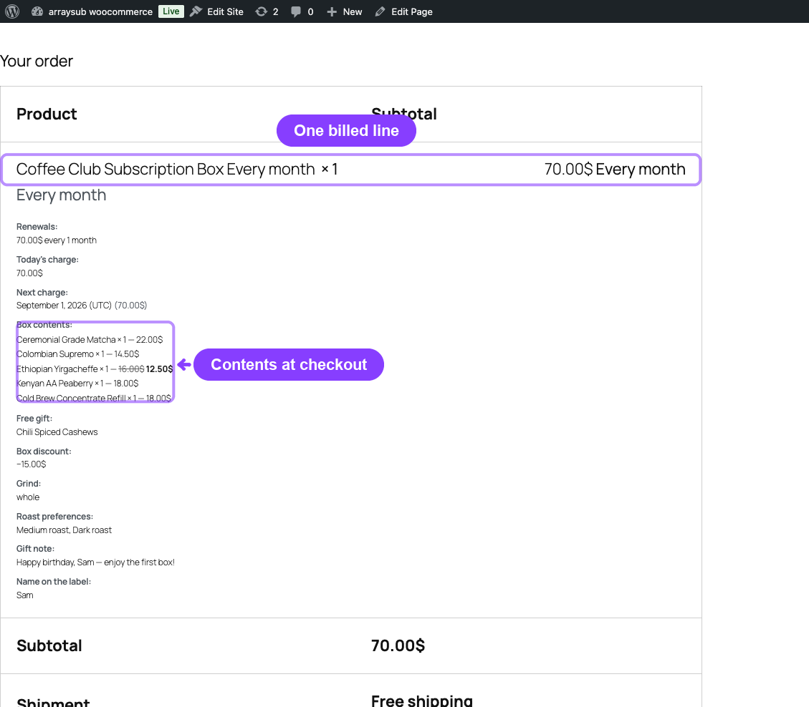

### The Order Confirmation

On the order-received page and in the order emails, the order contains:

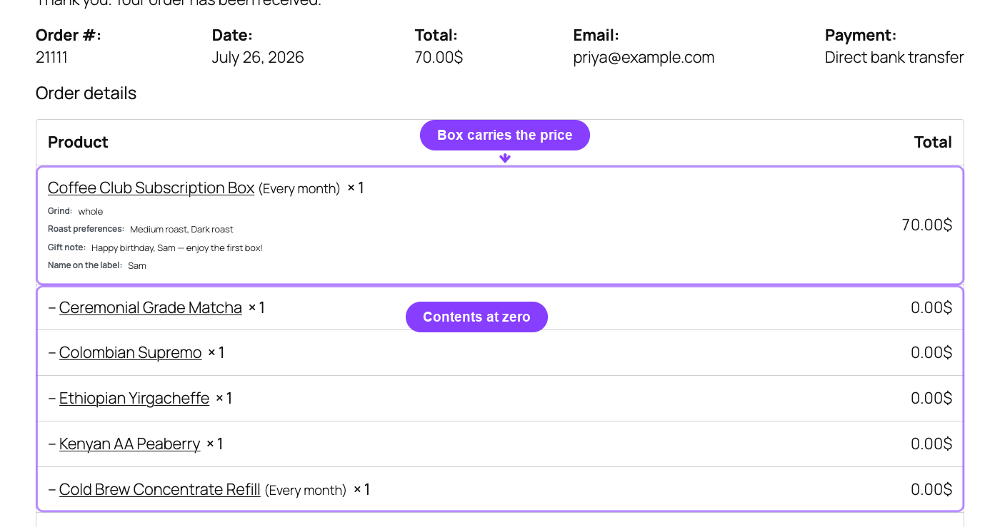

- the **box line**, at the full box price — this is the line that recurs;
- one **zero-priced line item per included product**, prefixed with an arrow so they read as box contents;
- one zero-priced line per freebie, tagged **Free gift**;
- the customer's answers as item meta on the box line, with any uploaded file rendered as a link.

### On the Admin Order Screen

The admin order screen shows the same structure. Two rules apply to the child lines:

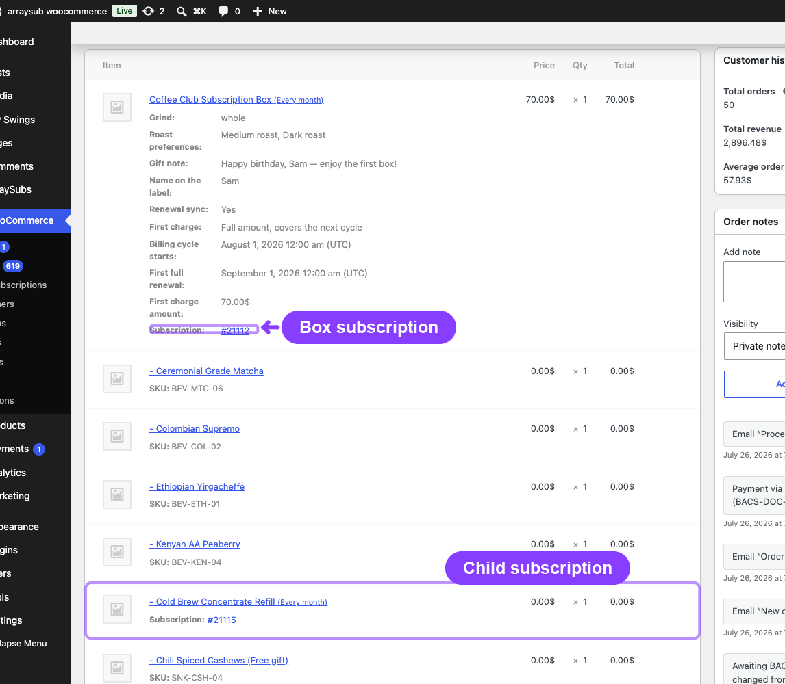

- They are always **$0.00**. Their value is already inside the box line.
- They **cannot be removed on their own.** Deleting the box line deletes every child line with it and adds an order note: *"Subscription box removed: 3 included items were removed with it."*

Internal box plumbing meta is hidden from the item meta display, so the order screen only shows the customer-facing answers.

**Order again** skips box children: they would otherwise be re-added at full price. The box line itself cannot be re-ordered either — the customer is asked to build the box again on the product page.

---

## Subscriptions Created by a Box

### What Gets Created

One checkout can produce several subscription records:

| Record | Recurring amount | Created for |
|---|---|---|
| The **box subscription** | The full box total | Always |
| A **child subscription** | 0 | Each **subscription product** inside the box |
| (nothing) | — | Plain, non-subscription products inside the box |

Free gifts follow the same rule as the products the customer picked: a freebie that is itself a
subscription product also receives its own zero-value child subscription, inheriting the box's
billing dates. A freebie that is a plain product gets none.

### Why the Zero-Value Children Exist

A box is one purchase, but the store still needs to know that the customer is subscribed to each product inside it. The zero-value child subscriptions make that true without charging anything twice:

- **Member Access** rules keyed to a product keep working.
- **Feature Manager** entitlements attached to a product are granted and revoked normally.
- Any third-party or custom code that asks "does this customer have an active subscription for product X" gets the right answer.
- Reporting and lookups that walk subscriptions per product still see the product.

Because their recurring amount is zero, they never add a cent to any invoice.

### How Children Behave

Child subscriptions are entirely parent-driven:

- They **never generate their own renewal invoices or orders**, and they hold no scheduled billing jobs.
- They mirror the box's **status**, **next payment date**, **last payment date**, and **completed payment count**.
- They are **cancelled or expired together with the box**, and their next payment date is cleared at that point.
- The box's renewal order is attached to them as well, so each child shows the same order history.

### The Box Subscription in the Customer Portal

Opening the box subscription in **My Account → Subscriptions** shows the normal subscription details plus:

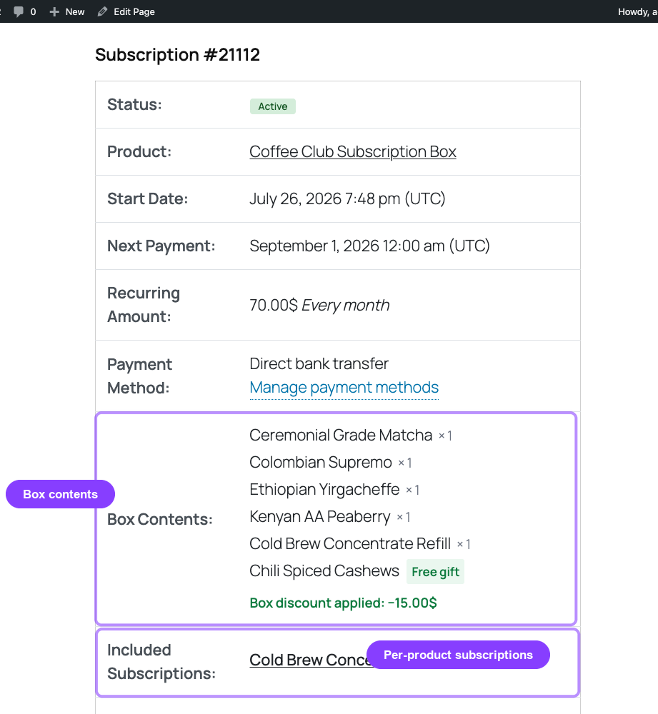

- **Box Contents:** the frozen list of products with their quantities, and freebies tagged **Free gift**.
- **Box discount applied: −$6.00**, when a discount was earned.
- **Included Subscriptions:** a link to each child subscription, with its ID.
- One row per customer answer, using your element labels.

All the usual actions — cancel, reactivate, change payment method, update shipping address — apply to the box as a whole.

### Included (Child) Subscriptions Are Read-Only

Opening a child subscription shows the same details, but no action buttons at all. Instead the customer sees:

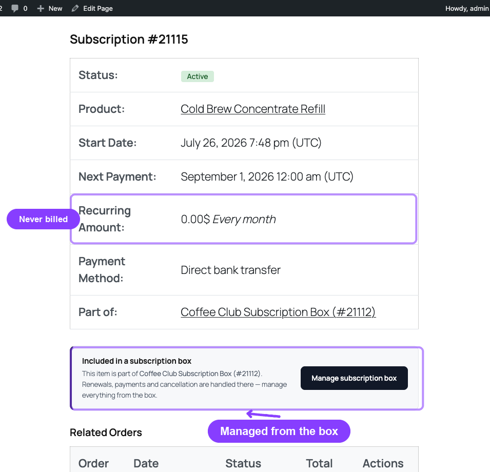

- a **Part of:** row linking to the box, labelled with the box name and ID;
- a panel titled **Included in a subscription box** explaining that renewals, payments, and cancellation are handled there;
- a **Manage subscription box** button that opens the box subscription.

Skip, pause, cancel, reactivate, the payment-method link, and the shipping-address controls are all hidden for a child.

```box class="warning-box"
This is enforced on the server, not just hidden in the interface. Any customer-initiated write aimed at a child subscription is rejected with *"This subscription is included in a subscription box. Manage it from the box subscription instead."*
```

### In the Admin Subscriptions List

Both kinds of record appear in **ArraySubs → Subscriptions**:

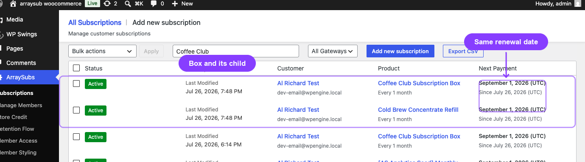

- the **box** subscription, carrying the full recurring amount and the box product name;
- one **child** subscription per included subscription product, with a recurring amount of 0 and a private note saying which box it belongs to.

A child's status always matches its box, because status changes are mirrored automatically.

---

## What Happens at Renewal

Every renewal reproduces the box exactly as it was bought:

- The box line is billed at the **frozen** recurring total. Later price changes to the products inside never change it.
- The same children, in the same quantities, are added to the renewal order at **$0.00**, together with the same freebies.
- The customer's answers travel with the renewal, so gift notes, grind choices, and uploaded files are on every renewal order.
- The signup fee is **never** charged again.
- Child subscriptions are advanced in step with the box: same next payment date, same payment count, same order history.

If a product inside the box no longer exists in the catalog, the renewal still lists it from the stored snapshot and adds an order note naming the missing products, so fulfilment can react instead of silently shipping the wrong box.

If the customer switches the subscription away from the box to a non-box plan, the frozen box contents are dropped so retired contents stop shipping on renewals.

---

## Edge Cases and Important Notes

- **A box empties the cart.** Anything already in the cart is cleared when a box is added, and the box cannot be combined with other items.
- **Quantity is always 1.** Boxes are sold individually; to get more, the customer buys a second box after the first checkout.
- **Direct add-to-cart links are blocked.** The builder payload is required.
- **Totals are always recomputed server-side.** The builder's live figures are a preview.
- **Sale prices are honored at build time and frozen at purchase.** If a child later leaves the sale, an existing box keeps the price it was bought at; a cart that has not checked out yet is repriced.
- **Out-of-stock and unpublished children invalidate a cart**, not an existing subscription.
- **Non-subscription products inside the box** get no subscription of their own, but their price is part of the recurring box total and they are included in every renewal.
- **Uploads** are content-sniffed, given random file names, and stored in a separate uploads folder outside the media library with directory listing switched off. They are referenced through signed tokens and rate-limited. Anyone holding the link can open the file, which is what lets the order and its renewal orders link to it.
- **Renewal sync proration affects the first payment only.** The recurring amount stays the frozen box total, so a prorated first invoice never under-bills later renewals.
- **Child order lines cannot be removed individually.** Removing the box line removes them all.

---

## Troubleshooting

| Problem | Likely Cause | What to Do |
|---|---|---|
| The product page shows "This subscription box is not available yet." | The box has no configuration | Configure at least one step with a product or category element, then update the product |
| **Create Subscription Box** does nothing | JavaScript error or a caching/minification conflict | Clear caches and check the browser console on the product page |
| The builder shows no products in a step | No eligible product matched that element for the box's cycle | Check the element's product/categories and the products' billing period, interval, and type |
| "Please build your subscription box on the product page first." | Something tried a direct add-to-cart link | Use the builder; this message is the intended block |
| The box was removed from the cart with a notice | A child went out of stock or unavailable, or the configuration changed | Rebuild the box; the notice names the reason |
| The cart total differs from the builder footer | The server recomputed the price from current product data | The server figure is authoritative; check whether a child's price changed |
| The customer was charged less on the first payment | Renewal sync proration applied to the first invoice | Expected — later renewals bill the full frozen box total |
| The order shows extra $0.00 lines | Those are the box contents and freebies | Expected — the money sits on the box line |
| The customer cannot cancel one product of the box | Child subscriptions are read-only | Cancel the box; children are cancelled with it |
| A child subscription shows a next payment date but never bills | Children mirror the box's dates and never invoice | Expected — the box's renewal covers them |
| A renewal order lists a product that no longer exists | The frozen snapshot is reproduced | Check the order note listing the missing products and update the box for future customers |
| "Order again" does not restore the box | Boxes must be rebuilt through the builder | Send the customer to the product page |

---

## Related Guides

- [Subscription Boxes](./subscription-box.md) — The admin guide: product type, wizard, elements, discounts, and renewal sync.
- [Customer Portal Self-Service Actions](../customer-portal/self-service-actions.md) — What customers can do with a subscription, and what a locked subscription hides.
- [Renewal Sync](../billing-and-renewals/renewal-sync.md) — How first payments are aligned to calendar boundaries.
- [Renewal Operations](../billing-and-renewals/renewal-operations.md) — How renewal orders are generated and retried.
- [Manage Subscriptions](../manage-subscriptions/README.md) — Working with subscription records in the admin.
- [Feature Manager](../feature-manager/README.md) — Product entitlements granted by the zero-value subscriptions inside a box.
- [Plan Switching and Product Relationships](./plan-switching-and-relationships.md) — What happens when a subscription moves to another plan.

---

## FAQ

### Why did one checkout create several subscriptions?
Because every **subscription product** inside the box also gets its own subscription, with a recurring amount of zero, linked to the box. That keeps per-product entitlements and integrations working. Only the box is actually billed.

### Do the zero-value subscriptions cost the customer anything?
No. Their recurring amount is 0, they never generate invoices, and they never appear as a charge.

### Can the customer cancel just one item from their box?
No. Child subscriptions are read-only and show a **Manage subscription box** button instead of actions. Cancelling the box cancels everything inside it.

### Can a customer change the contents of an existing box?
Not from an existing subscription. The contents are frozen at purchase so renewals reproduce exactly what was bought. To change contents, the customer builds and buys a new box.

### Why was the customer's cart emptied?
A box is sold individually and owns the whole cart, so adding one clears anything else that was in it.

### Why does the cart total differ from what the builder showed?
The server always recomputes the price from the current product data and your configuration. If a child's price changed between building and loading the cart, the server figure wins.

### Are the products inside the box shipped on every renewal?
Yes. Each renewal order reproduces the exact children, quantities, freebies, and answers from the frozen snapshot.

### Is the signup fee charged again on renewals?
No. The **Box Signup Fee** is a one-time charge on the first payment only.

### Does a coupon applied at checkout reduce future renewals?
No. Checkout-time discounts and renewal-sync proration affect the paid order only. The subscription keeps the frozen box total as its recurring amount.

### What happens if a product inside the box is deleted from the catalog?
Renewals still list it from the stored snapshot, and the renewal order gets a note naming the missing products so your team can react.

### Where can the customer see what is in their box?
In **My Account → Subscriptions**, on the box subscription: **Box Contents:**, any free gifts, the discount applied, **Included Subscriptions:**, and their own answers.

### Should I test the full flow before launching?
Yes. Build a box as a test customer, check the cart and checkout rows, complete the order, confirm the box and child subscriptions were created, and run one renewal to verify the reproduced contents.
