# Info
- Module: Subscription Products
- Availability: Pro
- Last updated: 2026-07-27

# Subscription Boxes

> Sell a build-your-own box: customers assemble it from steps you define, and pay one recurring amount for the whole box.

**Availability:** Pro

## Page Navigation

- **Current guide:** Subscription Boxes
- **Where to open it:** WordPress Admin -> Products -> Add/Edit Product -> Product data -> Subscription Box [ArraySubs]
- **Section overview:** [Open overview](./README.md)
- **Previous guide:** [Flexible Subscription Duration](./flexible-subscription-duration.md)
- **Next guide:** [Subscription Box Customer Experience](./subscription-box-customer-experience.md)
- **Troubleshooting:** [Audits, Logs, and Troubleshooting](../audits-and-logs/README.md)

## Overview

A subscription box is a WooCommerce **product type** added by ArraySubs Pro: **Subscription Box [ArraySubs]**. Instead of a fixed price, the box is priced by what the customer puts inside it. You define the steps of a small wizard — pick a coffee, pick two snacks, add a gift note, upload artwork — and the customer walks through those steps on the product page.

Everything the customer chooses becomes **one subscription** that carries the whole recurring amount. The individual products go onto the order as included contents, not as separately billed lines.

All box controls live in the product's **General** tab. There is no extra admin menu.

## When to Use This

- You sell a curated or build-your-own box (coffee, snacks, skincare, pet supplies, meal kits) and want one recurring charge for the whole box.
- You want tiered incentives — "spend more, save more", or "add a third item and get a free gift".
- You need to collect extras with the order: a gift note, a grind preference, a size choice, an uploaded logo.
- You want the box to renew, cancel, and pause as a single unit, while the products inside it still count as "subscribed" for entitlements and member access.
- You want the box itself to sync renewals to a calendar boundary, independent of your store-wide setting.

## Prerequisites

- WooCommerce installed and active.
- ArraySubs core plugin installed and active.
- ArraySubs **Pro** add-on installed and active with a valid license.
- At least one published **simple** product to offer inside the box, priced above zero.
- Admin or Shop Manager access.

## How It Works

### One Box, One Recurring Charge

A box has its own billing schedule — period, interval, and length — exactly like any other subscription product. The customer's selection is priced on the server, the discount rules are applied, and the resulting amount becomes the box's recurring price. That price is **frozen at purchase**: later product price edits never change an existing box subscription.

### The Products Inside the Box

Each product the customer chose is added to the order as a **zero-priced line item** attached to the box line. Their value is already inside the box total, so they never add anything to the invoice.

In addition, every product inside the box that is itself a **subscription product** gets its own subscription with a **zero** recurring amount, linked to the box. Plain (non-subscription) products get no subscription at all. This keeps per-product integrations working unchanged — **Member Access**, **Feature Manager** entitlements, and any third-party code that looks up "does this customer have a subscription for product X".

Those child subscriptions never bill on their own. They mirror the box's status and dates and are cancelled or expired with it.

```box class="info-box"
The box is **sold individually** and owns the whole cart. Adding a box empties the cart first, and the box line always has a quantity of 1.
```

## Real-Life Use Cases

### Use Case 1: A Weekly Coffee Club

A roastery sells a "Build Your Weekly Coffee Box" at **Every week**. Step 1 offers two coffee categories with a **Min Items** of 2 and a **Max Items** of 4. Step 2 offers a single accessory product with **Max Quantity** 1. Step 3 asks a **Select** question ("Grind: whole bean / filter / espresso") and an optional **Textarea** for delivery notes. A discount range gives 10% off from $40 and adds a free mug from $60. The customer pays one weekly amount; the roastery packs exactly what the frozen box contents say.

### Use Case 2: A Monthly Skincare Box With Entitlements

A skincare brand puts three monthly **subscription products** inside a box, each of which unlocks a members-only routine through Feature Manager. The customer buys one box for one monthly price. Behind the scenes each of the three products still has its own (zero-value) subscription, so the entitlements light up exactly as they would if the products had been bought separately.

### Use Case 3: A Corporate Gift Box With Artwork

A gifting store adds an **Upload** element restricted to images and PDF at 5 MB, plus a required **Text Input** for the recipient's name. The uploaded file is stored outside the media library and appears as a link on the order and on every renewal order, so fulfilment always has the right artwork.

---

## Creating the Box Product

### Choosing the Subscription Box [ArraySubs] Product Type

1. Go to **Products → Add New**.
2. Enter a product name, description, and image as usual.
3. In the **Product data** panel, open the product type dropdown and choose **Subscription Box [ArraySubs]**.
4. The box controls appear in the **General** tab. Everything else — the price fields, the standard **Subscription [ArraySubs]** fields — is not used by a box.
5. Configure the box (below), then click **Publish**.

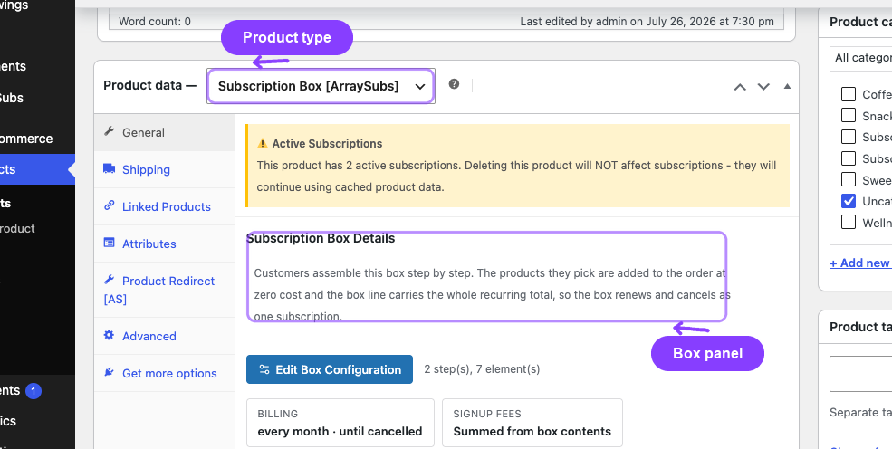

```box class="warning-box"
A box has **no price fields**. The regular price, sale price, signup fee, trial, and different renewal price are cleared on save — the box is priced entirely by what the customer selects and by the schedule inside the configuration wizard.
```

### The Subscription Box Details Panel

The **General** tab shows a read-only summary of the current configuration, so you can see at a glance what the box does without opening the wizard.

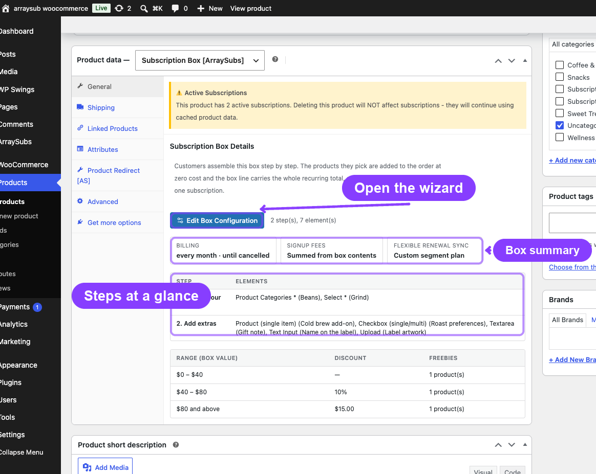

Before anything is configured you see:

> No box configuration yet. Customers cannot purchase this box until steps are configured.

Once steps exist, the panel shows three fact cards and two summary tables.

| Fact card | Possible values | Meaning |
|---|---|---|
| **Billing** | "every month · until cancelled", "every 2 weeks · 6 cycles" | The box schedule and how long it runs |
| **Signup fees** | **Summed from box contents** / **Not charged** | Whether **Keep signup fees** is on |
| **Flexible renewal sync** | **Custom segment plan** / **Store default** | Whether this box has its own segment plan |

Below the cards:

- A **Step / Elements** table listing every step in order and the elements on it. Required elements are marked with `*` and a custom label is shown in brackets.
- A **Range** table listing every discount range with its **Discount** and **Freebies** count. The first column header reads **Range (box value)** or **Range (item count)** depending on the basis you picked.

Next to the **Edit Box Configuration** button is a counter, for example "2 step(s), 7 element(s)".

---

## The Box Configuration Wizard

Click **Configure Box** (or **Edit Box Configuration** once the box has steps) to open the **Configure Subscription Box** modal. It has three screens:

1. **Box Steps**
2. **Discounts & Freebies**
3. **Flexible Renewal Sync**

Move forward with **Continue to Discounts & Freebies** / **Continue to Flexible Renewal Sync**, back with **Back**, and finish with **Save Configuration**. **Cancel** discards everything you changed in the modal.

```box class="info-box"
Every forward move re-checks the **Box Steps** screen first. If something is incomplete, the wizard jumps back to screen 1 and shows the reason in a red notice.
```

The configuration is written into a hidden field and saved with the product — you still need to click **Publish** or **Update** afterwards.

### Box Schedule and Billing

The **Box Schedule** section sits at the top of the first wizard screen, above **Box Steps**. It decides how often the whole box is billed — and, just as importantly, which products may go inside it.

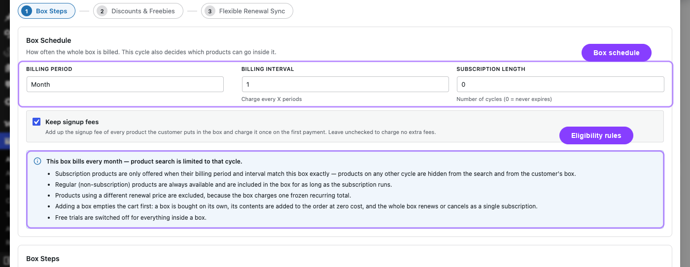

| Field | Type | Default | Notes |
|---|---|---|---|
| **Billing Period** | Select: Day, Week, Month, Year | Month | There is no Lifetime option — a box always renews |
| **Billing Interval** | Number 1–12 | 1 | "Charge every X periods" |
| **Subscription Length** | Number 0–365 | 0 | "Number of cycles (0 = never expires)" |
| **Keep signup fees** | Checkbox | Off | See below |

An information alert under the fields restates the current cycle, for example *"This box bills every month — product search is limited to that cycle."*, and lists the eligibility rules that follow from it.

### Keep Signup Fees

- **On** — the signup fee of every product the customer puts in the box is added up and charged **once** on the first payment, as a cart fee named **Box Signup Fee**. It never recurs.
- **Off** — no extra fee is charged at all, even if the chosen products have signup fees of their own.

Free trials are always switched off for a box and for everything inside it.

### Which Products Can Go Inside a Box

Because a box is a single recurring purchase, its contents must all be able to share one cycle. The same rule is applied everywhere — in the admin pickers, on the storefront, in the cart, and during server-side validation:

| Product | Eligible? | Why |
|---|---|---|
| Simple product, not a subscription | Yes | Its price is folded into the recurring box total |
| Simple subscription product with the **same** billing period **and** interval as the box | Yes | It can share the box's cycle |
| Subscription product on any other period or interval | No | Its schedule would conflict with the box |
| Subscription product with **Different Renewal Price** enabled | No | Its price would drift away from the frozen box total |
| Variable, grouped, or external product | No | Only simple products are supported |
| Another subscription box | No | Boxes cannot nest |
| Product priced at 0 | No | Rejected at add-to-cart with "cannot be added to a subscription box" |

```box class="warning-box"
Changing the **Billing Period** or **Billing Interval** after the box is live re-scopes eligibility. Products that no longer match disappear from the storefront, and any cart holding them is rebuilt or removed on the next cart or checkout load. Existing subscriptions keep the contents frozen at purchase.
```

### Step 1: Box Steps

**Box Steps** is a two-level nested repeater:

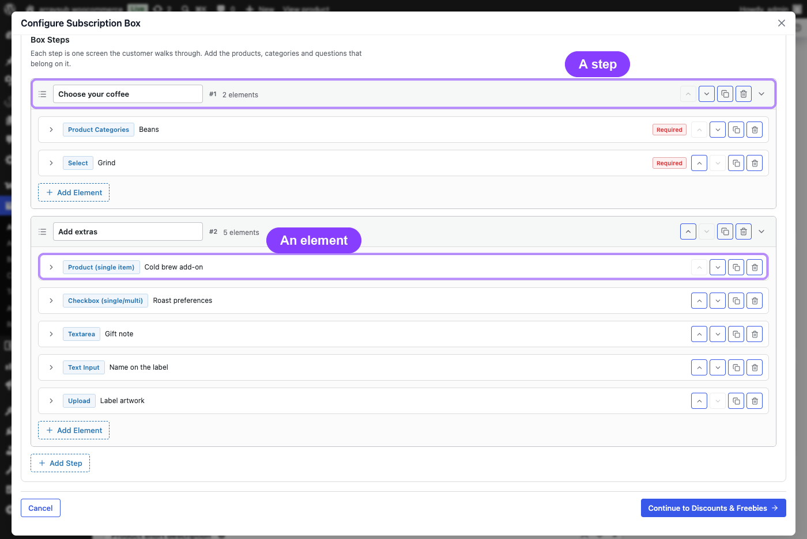

- **Level 1 — a step.** One step is one screen the customer walks through. It has a title and a list of elements.
- **Level 2 — the elements on that step.** Products, category pickers, and questions.

Working with steps:

1. Click **Add Step**. Type the step title in the header field (it becomes the customer-facing panel heading and the chip in the storefront wizard).
2. Click **Add Element** inside the step and choose an **Element Type**.
3. Give the element a **Label** ("Shown to the customer") and switch **Required** on if the customer must answer it.
4. Use the arrow buttons to reorder, the copy button to duplicate, and the trash button to delete. Deleting a step asks for confirmation and removes all of its elements.
5. Collapse a step or an element by clicking its chevron; the header keeps showing the type badge, the label, a **Required** badge, and the element count.

Before the wizard lets you move on, it checks that:

- there is at least one step;
- every step has a title and at least one element;
- every **Product** element has a product selected;
- every **Product Categories** element has at least one category;
- every **Select**, **Multi Select**, and multi-mode **Checkbox** element has at least one option;
- the box has at least one **Product** or **Product Categories** element, so customers can actually fill it.

### Element Types

| Type | What the customer sees | Settings | Notes |
|---|---|---|---|
| **Product (single item)** | One product card with image, name, price, and a quantity stepper | **Product**, **Max Quantity** | The picker only offers products eligible for the box cycle |
| **Product Categories** | A grid of cards for every eligible product in the chosen categories | **Categories**, **Min Items**, **Max Items** | Min/Max count the total quantity chosen across the whole element |
| **Text Input** | A single-line text field | **Placeholder** | Stored with the order, max 500 characters |
| **Textarea** | A multi-line text field | **Placeholder** | Stored with the order, max 5,000 characters |
| **Checkbox (single/multi)** | One tick box, or a list of tick boxes | **Mode** (Single / Multi), **Options** (multi only) | Single mode stores "Yes" when ticked |
| **Select** | A dropdown with one choice | **Options** | A "Choose an option…" placeholder is added automatically |
| **Multi Select** | A list of tick boxes, several choices allowed | **Options** | Stored as a comma-separated list of labels |
| **Upload** | A file field with a size hint | **Max File Size (MB)**, **Allowed File Types** | Files are stored outside the media library |

Every element type can be marked **Required**.

### Product Element

Use this when you want to offer one specific item.

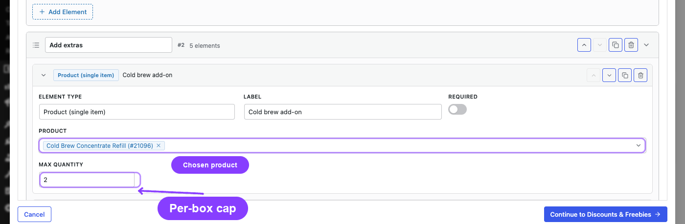

| Setting | Type | Default | What it controls |
|---|---|---|---|
| **Product** | Searchable single select | (empty) | The product offered on this card |
| **Max Quantity** | Number, minimum 1 | 1 | How many of this item one customer may take |

Marking a **Product** element **Required** forces the customer to take at least one of it.

### Product Categories Element

Use this when you want to offer a choice: "pick any 3 coffees".

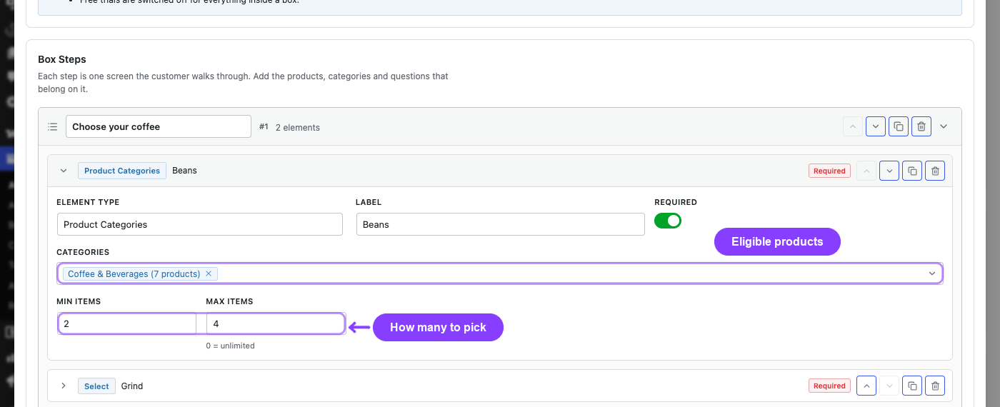

| Setting | Type | Default | What it controls |
|---|---|---|---|
| **Categories** | Searchable multi select | (empty) | Which product categories to draw from |
| **Min Items** | Number | 0 | Minimum total quantity across this element |
| **Max Items** | Number, 0 = unlimited | 0 | Maximum total quantity across this element |

Only **eligible** products from those categories are rendered, and at most **100** products are resolved per element — keep categories reasonably sized. If you mark the element **Required** while **Min Items** is 0, the effective minimum becomes 1.

If you enter a **Min Items** larger than **Max Items**, the two values are swapped when the configuration is saved.

### Searchable Product and Category Pickers

Every product and category field is an AJAX-backed searchable select, not a long dropdown:

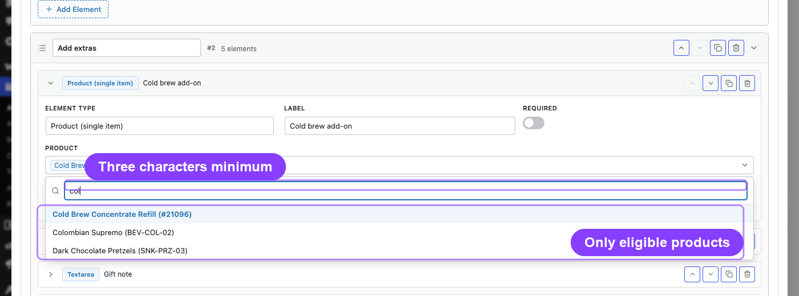

- Click the field to open it; the search box reads **Type at least 3 characters…**.
- Nothing is queried until you have typed **3 characters**, and typing is throttled with a 250 ms debounce, so the store is not hammered while you type.
- Results are **scoped to the box's billing cycle** — a product that cannot legally sit in this box never appears.
- Up to 20 matches are returned per search. Refine the search rather than scrolling.
- Category options show how many eligible products each category currently holds, for example "Single Origin (12 products)".
- Selected values appear as removable tags. Already-saved values are always resolved and shown, even if they would no longer match a search.

```box class="info-box"
If a picker says "No results found.", the products you expect are probably ineligible — check their billing period, interval, product type, and the **Different Renewal Price** switch before assuming the search is broken.
```

### Text, Textarea, Select, and Checkbox Elements

These elements collect information rather than products. Their answers travel with the box into the cart, the order, the subscription, and every renewal order.

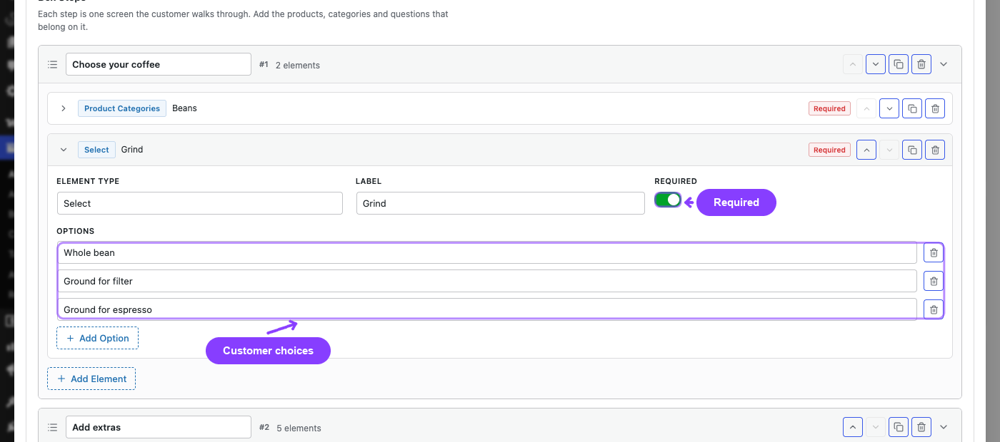

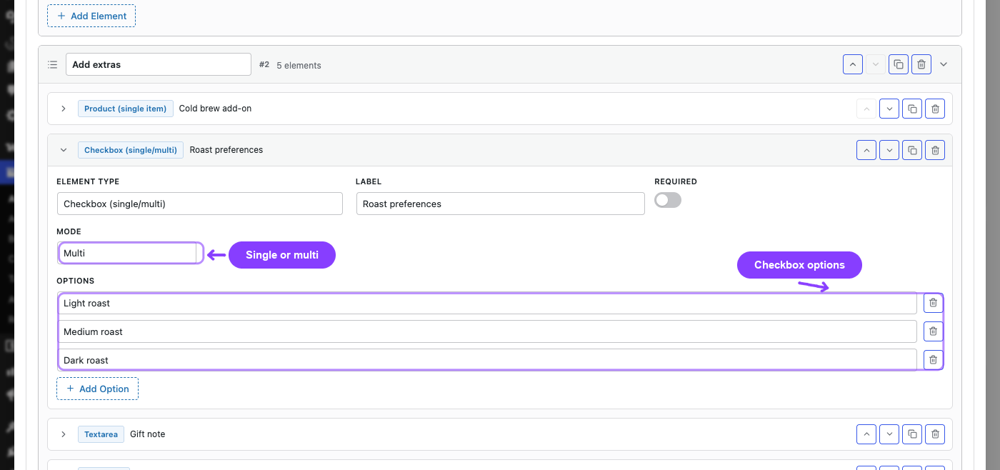

- **Text Input** and **Textarea** take a **Placeholder** only.
- **Checkbox** has a **Mode**. **Single** renders one tick box using the element label. **Multi** renders one tick box per option and needs an **Options** list.
- **Select** and **Multi Select** always need an **Options** list.
- Options are edited inline: type an option label, click **Add Option** for the next one, and use the trash button to remove one. The label is used as the stored value.

Answers are validated on the server: a submitted value that is not in the configured option list is discarded, and a **Required** element with no answer blocks the add-to-cart.

### Upload Element

| Setting | Type | Default | What it controls |
|---|---|---|---|
| **Max File Size (MB)** | Number, 1 to the site upload limit | 5 MB, or the site limit if lower | Per-file size cap |
| **Allowed File Types** | Checkboxes: **Images**, **PDF**, **CSV** | Images | Which file kinds are accepted |

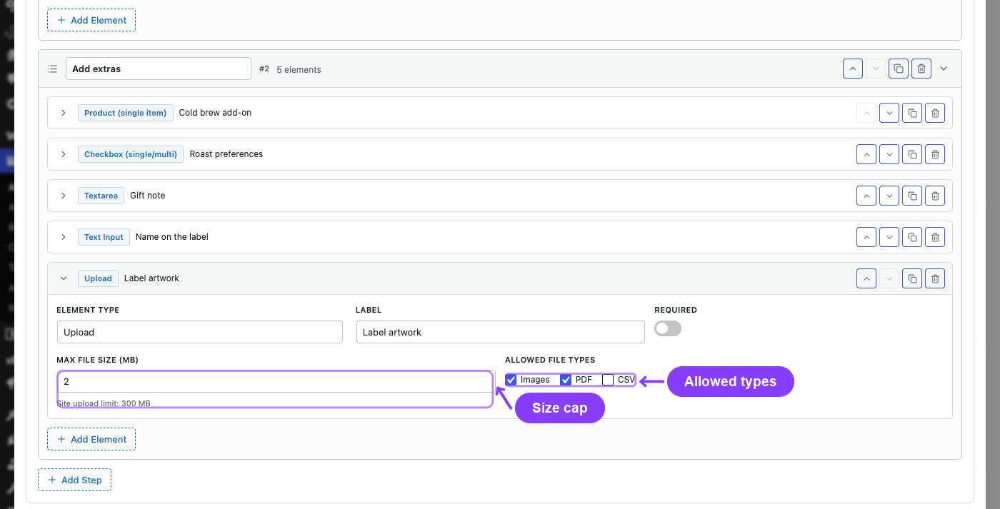

The field shows your site's own WordPress limit under it (for example "Site upload limit: 64 MB") and can never be set above it. If you untick every type, the setting falls back to **Images**.

Uploaded files are content-sniffed (not trusted by extension), given a random file name, and stored in a separate uploads folder outside the media library with directory listing switched off. They are referenced through a signed token and uploads are rate-limited. The order and every renewal order show the file name as a link to the stored file, so anyone holding that link can open it.

### Step 2: Discounts & Freebies

This screen turns the box into a tiered offer.

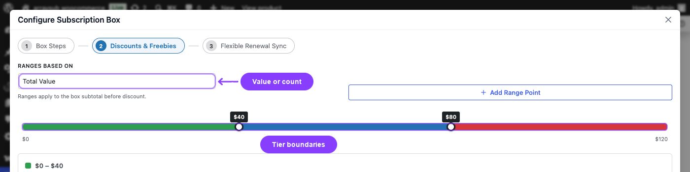

**Ranges Based On** decides what the tiers measure:

| Option | Tiers measure | Helper text |
|---|---|---|
| **Total Value** | The box subtotal before discount | "Ranges apply to the box subtotal before discount." |
| **Total Count** | The number of items in the box | "Ranges apply to the number of items in the box." |

Click **Add Range Point** to split the scale. Each new point is placed in the middle of the largest gap, and you can drag it on the multi-point slider or type an exact value in the range card's **From** field. You can add up to **10** points, which gives up to 11 ranges. Removing a point merges its range into the one before it.

Ranges are half-open and always start at 0: with points at 40 and 60 you get `0 – 40`, `40 – 60`, and `60 and above`. A box lands in a range when its basis value is greater than or equal to that range's start.

### Range List and Summary

Under the slider, every range gets its own card with a colour swatch:

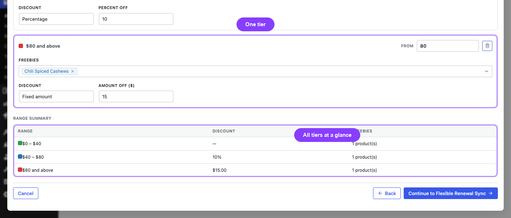

| Field | Options | Notes |
|---|---|---|
| **Freebies** | Searchable multi select of products | Added to the order at no charge when the box lands in this range |
| **Discount** | **No discount**, **Fixed amount**, **Percentage** | |
| **Amount Off (currency)** | Number | Shown for a fixed discount; never reduces the box below zero |
| **Percent Off** | Number, capped at 100 | Shown for a percentage discount |

Only **one** range applies to any box — the range the basis value falls into. Its freebies and its discount are applied together; ranges do not stack.

A **Range Summary** table at the bottom repeats every range with its discount and freebie count, which is the same table you see later in the **Subscription Box Details** panel.

```box class="info-box"
A discount amount of 0 is treated as **No discount** when the configuration is saved. A fixed discount is capped at the box subtotal, so the recurring total can never go negative — but it must still end up above zero, or the add-to-cart is rejected.
```

Freebie products are **not** limited to the box billing cycle, because they are added at zero cost and never billed. Pick anything purchasable. One consequence is worth knowing: a freebie that happens to be a subscription product is still a subscription product inside the box, so it gets its own zero-value subscription alongside the ones the customer chose. See [Subscription Box Customer Experience](subscription-box-customer-experience.md).

### Step 3: Flexible Renewal Sync

The last screen decides how the box's **first** payment behaves when renewals are aligned to a calendar boundary.

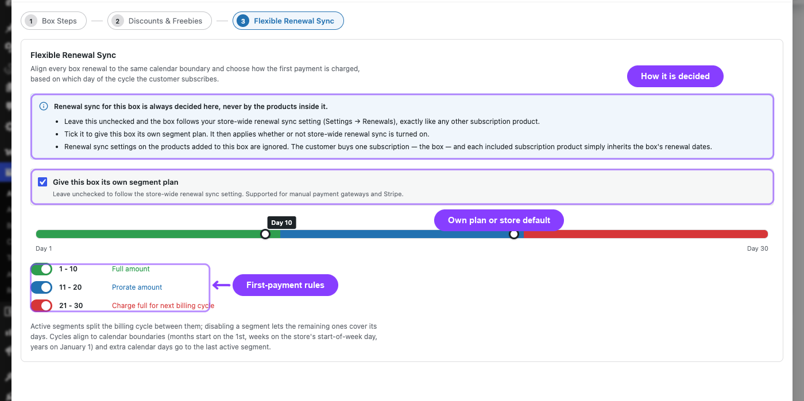

The only checkbox is **Give this box its own segment plan**:

| State | What happens |
|---|---|
| **Unchecked** (default) | The box follows the store-wide renewal sync setting (**ArraySubs → Settings → General → Sync Renewals to Next Billing Cycle**), exactly like any other subscription product. This is *not* "no syncing". |
| **Checked** | The box gets its own segment plan, which applies whether or not store-wide renewal sync is turned on. |

```box class="warning-box"
Renewal sync settings on the products placed **inside** the box are always ignored. The customer buys one subscription — the box — and each included subscription simply inherits the box's renewal dates.
```

When the checkbox is on, a segment slider splits the billing cycle by the day the customer signs up. Up to three segments can be active:

| Segment | Meaning |
|---|---|
| **Full amount** | Charge the full box price now |
| **Prorate amount** | Charge a proportional amount for the remainder of the cycle |
| **Charge full for next billing cycle** | Charge the full price now, but count it as payment for the next cycle — the first renewal is pushed one full cycle past the upcoming boundary |

Use the toggles beside each segment to turn it on or off — at least one must stay active — and drag the boundary handles to set the day each active segment ends. The scale runs from **Day 1** to the nominal length of the cycle (a day counts as 1, a week as 7, a month as 30 and a year as 365, multiplied by the interval).

Cycles align to calendar boundaries: months start on the 1st, weeks on the store's start-of-week day, years on January 1. Any extra calendar days go to the last active segment.

If the cycle is shorter than **3 days**, the slider is replaced with: *"This billing cycle is too short to split into segments. Renewal sync needs a cycle of at least 3 days."*

Segment plans are supported for manual payment gateways and Stripe.

### Saving the Configuration

Click **Save Configuration** to close the modal and write the configuration back into the product form, then **Publish** or **Update** the product. Nothing is stored until the product itself is saved.

---

## Finding Boxes in the Products List

**Subscription Box [ArraySubs]** is a real WooCommerce product type, so it appears in the **Filter by product type** dropdown on **Products → All Products**. Pick it to list only your boxes. Boxes have no stored price, so the **Price** column shows the same dynamic-pricing label as the storefront — for example **Priced by your selection / month** — instead of a figure.

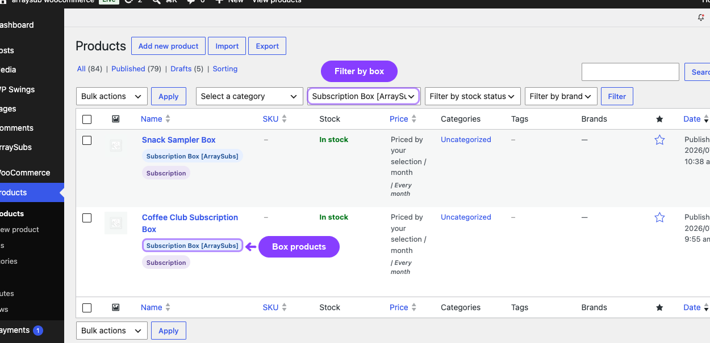

---

## Settings Reference

All controls below live in **Products → Edit Product → General → Edit Box Configuration**.

| Setting | Screen | Type | Default | What It Controls |
|---|---|---|---|---|
| **Billing Period** | Box Steps | Select (Day, Week, Month, Year) | Month | How often the box is billed, and which products are eligible |
| **Billing Interval** | Box Steps | Number 1–12 | 1 | How many periods between charges |
| **Subscription Length** | Box Steps | Number 0–365 | 0 | Total cycles before the box expires (0 = until cancelled) |
| **Keep signup fees** | Box Steps | Checkbox | Off | Sum the contents' signup fees into a one-time **Box Signup Fee** |
| Step title | Box Steps | Text | "Step N" | The panel heading the customer sees |
| **Element Type** | Box Steps | Select | Product Categories | Which kind of element this is |
| **Label** | Box Steps | Text | (empty) | Shown to the customer above the element |
| **Required** | Box Steps | Toggle | Off | Whether the customer must answer or choose |
| **Product** | Box Steps | Searchable select | (empty) | The single product offered by a Product element |
| **Max Quantity** | Box Steps | Number ≥ 1 | 1 | Per-item quantity cap on a Product element |
| **Categories** | Box Steps | Searchable multi select | (empty) | Categories a Product Categories element draws from |
| **Min Items** | Box Steps | Number | 0 | Minimum total items for that element |
| **Max Items** | Box Steps | Number (0 = unlimited) | 0 | Maximum total items for that element |
| **Placeholder** | Box Steps | Text | (empty) | Placeholder for Text Input / Textarea |
| **Mode** | Box Steps | Select (Single / Multi) | Single | Checkbox behavior |
| **Options** | Box Steps | Repeatable text rows | one empty row | Choices for Select, Multi Select, multi Checkbox |
| **Max File Size (MB)** | Box Steps | Number 1–site limit | 5 (or the site limit) | Per-file upload cap |
| **Allowed File Types** | Box Steps | Checkboxes (Images, PDF, CSV) | Images | Accepted upload kinds |
| **Ranges Based On** | Discounts & Freebies | Select (Total Value / Total Count) | Total Value | What the discount tiers measure |
| Range points | Discounts & Freebies | Slider, up to 10 points | none | Where the tiers start |
| **Freebies** | Discounts & Freebies | Searchable multi select | (empty) | Free products added inside that range |
| **Discount** | Discounts & Freebies | Select (No discount / Fixed amount / Percentage) | No discount | Discount kind for that range |
| **Amount Off** / **Percent Off** | Discounts & Freebies | Number (percent capped at 100) | 0 | Discount size |
| **Give this box its own segment plan** | Flexible Renewal Sync | Checkbox | Off | Off = follow **ArraySubs → Settings → General → Sync Renewals to Next Billing Cycle**; On = use this box's own plan |
| Segment boundaries and toggles | Flexible Renewal Sync | Slider + toggles | Even thirds, all active | How the first payment is charged by signup day |

---

## What Happens After Saving

- The box configuration is stored on the product, and the **Subscription Box Details** panel redraws with the new fact cards and tables.
- The schedule is mirrored onto the product's subscription meta, so the engine treats the box like any other subscription product for checkout, renewals, and the customer portal.
- The trial length and product-level signup fee are forced to 0, **Different Renewal Price** is removed, **Sold individually** is switched on, and the price fields are cleared.
- If the box's segment plan is enabled, its segment values are written to the Flexible Renewal Sync engine; if it is disabled, the box simply falls back to the store-wide setting.
- A private note is recorded ("Subscription Box #123 settings updated for …") in the global notes log.
- If you save a box with no steps, WooCommerce shows an admin error and the product stays unpurchasable until you add at least one step with a product or category element.
- **Existing box subscriptions are not touched.** They keep the exact contents, quantities, freebies, inputs, and price frozen at purchase.
- Carts that already hold this box are revalidated on the next cart or checkout load: they are repriced if they are still valid, and removed with a notice if the configuration no longer allows what the customer picked.

---

## Edge Cases and Important Notes

- **Only simple products can go inside a box.** Variable, grouped, external, and other box products are never offered.
- **Subscription children must match exactly.** Both the billing period and the billing interval must equal the box's — "every month" and "every 2 months" cannot share a box.
- **Different Renewal Price products are excluded** because their price would drift away from the frozen box total.
- **Trials are always off inside a box**, both for the box and for the products inside it.
- **A box has no stored price.** It is purchasable only once a valid configuration exists, and its price comes from the customer's selection.
- **The box owns the cart.** It is sold individually, and adding one empties the cart first.
- **Zero-priced products are rejected** as box contents.
- **Category elements resolve at most 100 products.** A product outside that cap that a customer legitimately chose is still accepted on revalidation, as long as it still belongs to one of the element's categories and is still eligible.
- **Category pickers hide empty categories.** A category with no eligible products is not offered, though an already-saved category always resolves so you can see and remove it.
- **Freebies are not schedule-scoped.** They are added at zero cost, so any purchasable product can be a freebie — the freebie picker deliberately searches the whole catalogue, unlike the pickers on the box steps. A freebie that is itself a subscription product still receives a zero-value child subscription.
- **Switching the product type away** from Subscription Box drops the box marker but keeps the configuration, so switching back restores your work.
- **Boxes never use Lifetime Deal.** A box always renews, so only Day, Week, Month, and Year are offered.
- **Renewal-sync gateway support.** Segment plans work with manual payment gateways and Stripe.

---

## Troubleshooting

| Problem | Likely Cause | What to Do |
|---|---|---|
| **Subscription Box [ArraySubs]** is missing from the product type dropdown | ArraySubs Pro is inactive or unlicensed | Confirm the Pro add-on is installed, active, and licensed |
| The General tab shows nothing about boxes | The product type is not set to Subscription Box, or the admin script failed to load | Re-select the product type; check the browser console for JavaScript errors |
| "No box configuration yet. Customers cannot purchase this box until steps are configured." | The box has no steps | Open **Configure Box** and add at least one step with a product or category element |
| Admin error on save: "add at least one box step…" | The product was saved with an empty configuration | Configure the box, then save again |
| A product I expect does not appear in the picker | It is not simple, not published, on a different period/interval, uses **Different Renewal Price**, or is another box | Check the product's type and its Subscription [ArraySubs] settings |
| The picker shows nothing while typing | Fewer than 3 characters typed | Type at least 3 characters; searching starts after that |
| A category is missing from the category picker | It currently holds no eligible products for this cycle | Add eligible products, or change the box schedule |
| The wizard jumps back to Box Steps with a red notice | A step, element, or option list is incomplete | Fix the item named in the notice, then continue |
| Discount never applies | The basis value never reaches the range start, or the amount is 0 | Check **Ranges Based On**, the range points, and the amount |
| The segment slider is replaced by a warning | The billing cycle is shorter than 3 days | Use a longer cycle, or leave the segment plan off |
| Renewal sync seems to be off although the box checkbox is unchecked | Unchecked means "follow the store-wide setting" | Check **ArraySubs → Settings → General → Sync Renewals to Next Billing Cycle** |
| Customers report the box vanished from their cart | The configuration or a child product changed after they built it | This is intentional; the cart notice explains the reason, and the customer can rebuild the box |

---

## Related Guides

- [Subscription Box Customer Experience](./subscription-box-customer-experience.md) — What shoppers see, and how the box and its included subscriptions behave afterwards.
- [Create and Configure Subscription Products](./create-and-configure.md) — Set up the simple subscription products you will offer inside a box.
- [Renewal Sync](../billing-and-renewals/renewal-sync.md) — The store-wide setting a box follows when it has no segment plan of its own.
- [Flexible Subscription Duration](./flexible-subscription-duration.md) — Customer-chosen lengths and periods for ordinary subscription products.
- [Product Experience and Display](./product-experience.md) — How subscription pricing renders on the storefront.
- [Feature Manager](../feature-manager/README.md) — Product entitlements that keep working for the subscriptions inside a box.
- [Member Access](../member-access/README.md) — Product-keyed access rules that keep working for the subscriptions inside a box.

---

## FAQ

### Is the subscription box available in the free plugin?
No. The **Subscription Box [ArraySubs]** product type ships with ArraySubs Pro only. Without Pro the product type does not appear in the dropdown.

### Can a box contain variable products?
No. Only simple products are eligible. If you need variations inside a box, publish the relevant variations as separate simple products.

### Can I mix subscription and regular products in one box?
Yes. Regular products are always available; subscription products are offered when their billing period and interval match the box exactly. Both kinds count toward the box total.

### Why is my monthly product missing from a weekly box?
Because its billing cycle does not match the box's. A box charges one recurring amount, so every subscription product inside it must bill on the same cycle.

### Does a box charge signup fees?
Only when **Keep signup fees** is ticked. Then the signup fees of the chosen products are summed into a single one-time **Box Signup Fee** on the first payment. It never recurs.

### Can I offer a free trial on a box?
No. Trials are forced off for a box and for everything inside it.

### Do the discount ranges stack?
No. Exactly one range applies — the one the box's total value or item count falls into. Its discount and its freebies apply together.

### What does leaving the Flexible Renewal Sync checkbox unchecked do?
It makes the box follow your store-wide renewal sync setting (**ArraySubs → Settings → General → Sync Renewals to Next Billing Cycle**), exactly like any other subscription product. It does not disable syncing.

### Do the renewal-sync settings of products inside the box matter?
No. They are always ignored. The box decides, and the included subscriptions inherit the box's dates.

### What happens to live subscriptions if I edit the box later?
Nothing. Existing box subscriptions keep the contents and price frozen at purchase. Only new purchases use the new configuration — and carts built under the old configuration are repriced or removed at the next cart load.

### Where do uploaded files go?
Into a separate uploads folder outside the media library, with random file names, directory listing switched off, and signed references. They appear as links on the order and on renewal orders, so anyone holding a link can open that file.

### Should I test a box before going live?
Yes. Build one as a customer with a test account, check the cart and checkout rows, complete the order, and confirm the box subscription and its included subscriptions were created as expected.
