# Info
- Module: Subscription Products
- Availability: Pro
- Last updated: 2026-07-27

# Subscription Bundle Customer Experience

> What shoppers see on the storefront, how a bundle appears in the cart and at checkout, and how the bundle and its included subscriptions behave through renewals.

**Availability:** Pro

## Page Navigation

- **Current guide:** Subscription Bundle Customer Experience
- **Where to open it:** Storefront product page -> Cart -> Checkout -> My Account -> Subscriptions
- **Section overview:** [Open overview](./README.md)
- **Previous guide:** [Subscription Bundles](./subscription-bundle.md)
- **Next guide:** [Plan Switching and Relationships](./plan-switching-and-relationships.md)
- **Troubleshooting:** [Audits, Logs, and Troubleshooting](../audits-and-logs/README.md)

## Overview

A subscription bundle is bought like any other subscription product: the customer opens the product page, reads what is included, and clicks **Add to Cart** once. There is no builder to walk through and nothing to choose — you decided the contents when you configured the bundle.

Behind that single click, ArraySubs creates **one billed subscription** for the bundle plus **one zero-value subscription for each subscription product inside it**, and writes every included product onto the order as a zero-priced line.

This page covers the shopper's side. To build the bundle, see [Subscription Bundles](./subscription-bundle.md).

## When to Use This

- You are writing storefront copy and need to know exactly what the customer sees.
- You are supporting a customer who asks why one purchase produced several subscriptions.
- You are checking how a bundle behaves at renewal, or why a bundle cannot be checked out.

## Prerequisites

- A published **Subscription Bundle [ArraySubs]** product with at least one available product inside it.
- ArraySubs **Pro** active with a valid license.
- A payment gateway enabled for testing.

## How It Works

1. The customer opens the bundle product page and sees the contents, the billing cycle, and the bundle total.
2. **Add to Cart** puts a single bundle line in the cart at the bundle total.
3. Checkout creates the order, the bundle subscription, and one zero-value subscription per subscription product inside the bundle.
4. Every renewal reproduces the same contents at the frozen price.

## Real-Life Use Case: A Membership Welcome Bundle

A membership site sells a **Welcome Bundle** at $46.74 a month: the *Basic Monthly* plan, a *Plain Mug*, and a *Standard Tee*, with 15% off the $54.99 subtotal. The customer clicks once. They get one monthly charge, keep their Basic Monthly entitlements, and receive the mug and tee with every payment.

## On the Storefront

### In the Shop

A bundle appears in the shop like any other product. When a bundle discount applies, the pre-discount subtotal is struck through beside the bundle total, the way WooCommerce prices any discounted product, followed by the billing suffix.

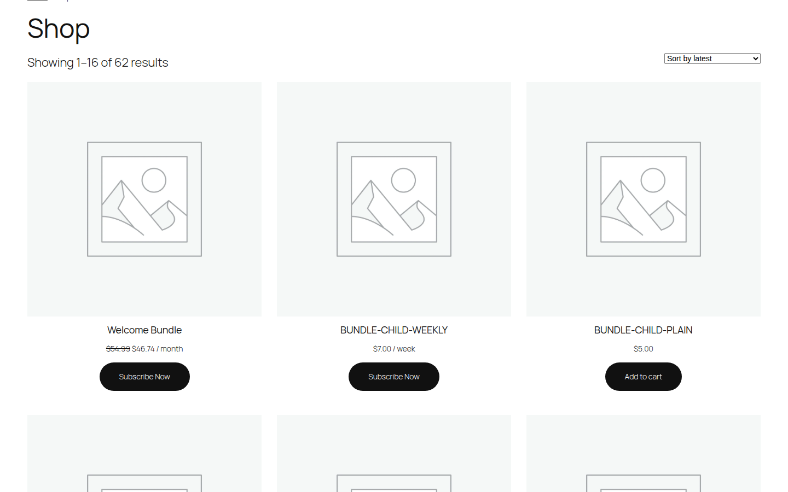

### The Product Page

The product page shows a **What's included** panel between the price and the Add to Cart button:

- A **Billed every …** pill stating the bundle's cycle.
- One row per included product with its quantity and unit price.
- **Subtotal**, **Bundle discount**, and **Bundle total** with the billing suffix.

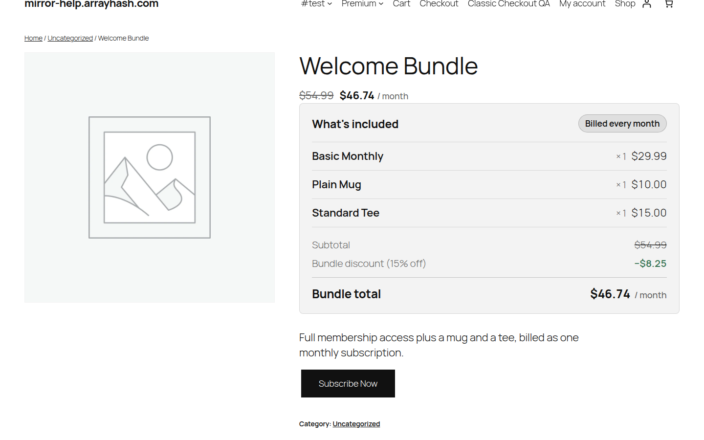

The button text comes from your subscription button setting under **Settings → General** — "Subscribe Now" by default — so a bundle reads exactly like your other subscription products. No quantity box is shown: a bundle is sold one per order.

```box class="info-box"
Unlike a subscription box, adding a bundle does **not** empty the cart. A bundle is an ordinary add-to-cart product and follows your normal mixed-cart rules.
```

### When a Bundle Cannot Be Bought

Bundles are all-or-nothing. If a product inside it is out of stock, deleted, or otherwise unavailable, the add is refused and the customer is told which product is the problem.

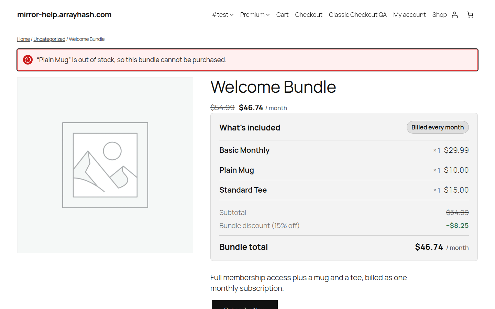

## Cart and Checkout

### In the Cart

The cart shows **one line** for the bundle at the bundle total, with the contents listed underneath it:

- **Bundle contents** — every included product with its quantity and unit price.
- **Bundle discount** — the saving, as a percentage or a fixed amount.
- The standard subscription rows: renewal amount, today's charge, next charge, duration, shipping, and the first billing-cycle explanation.

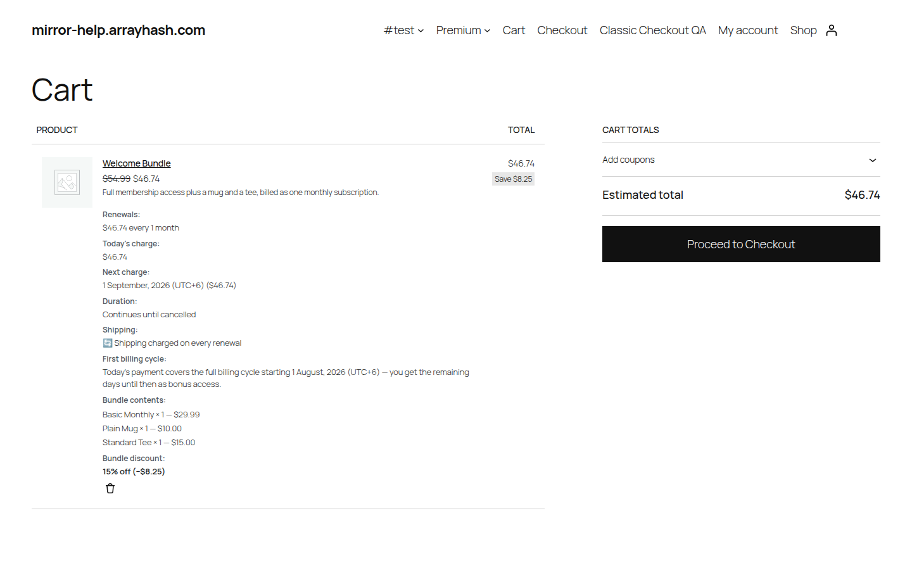

The included products are **not** separate cart lines — their value is already inside the bundle total, so charging them again would double-bill the customer.

### Cart Revalidation

Every bundle in the cart is rechecked on each cart and checkout load:

- If you edit the bundle, or a product inside it changes price, the line is **repriced** to the new total.
- If something inside it becomes unavailable, checkout is **blocked** with a notice naming the product.

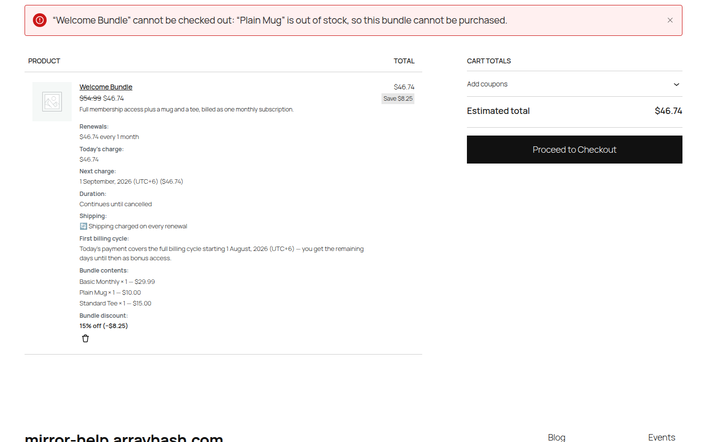

The bundle total is always recomputed on the server, so a stale or tampered price can never reach checkout.

### At Checkout

The order summary repeats the bundle line, its contents, and the discount, so the customer confirms exactly what they are subscribing to.

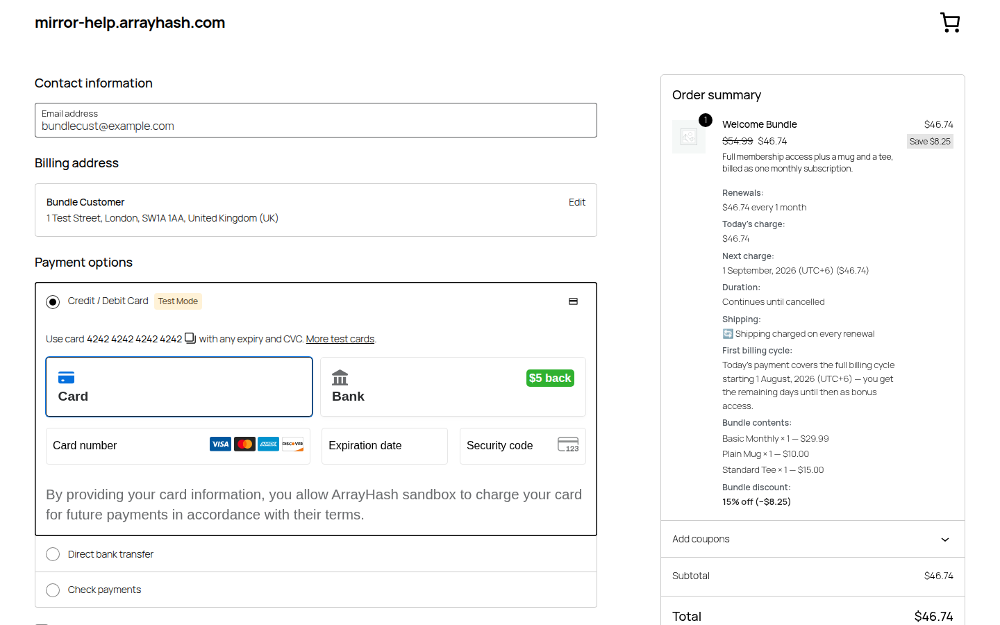

Both the block checkout and the classic checkout are supported.

### The Order Confirmation

The order-received page lists the bundle and its included products, with the contents at $0.00.

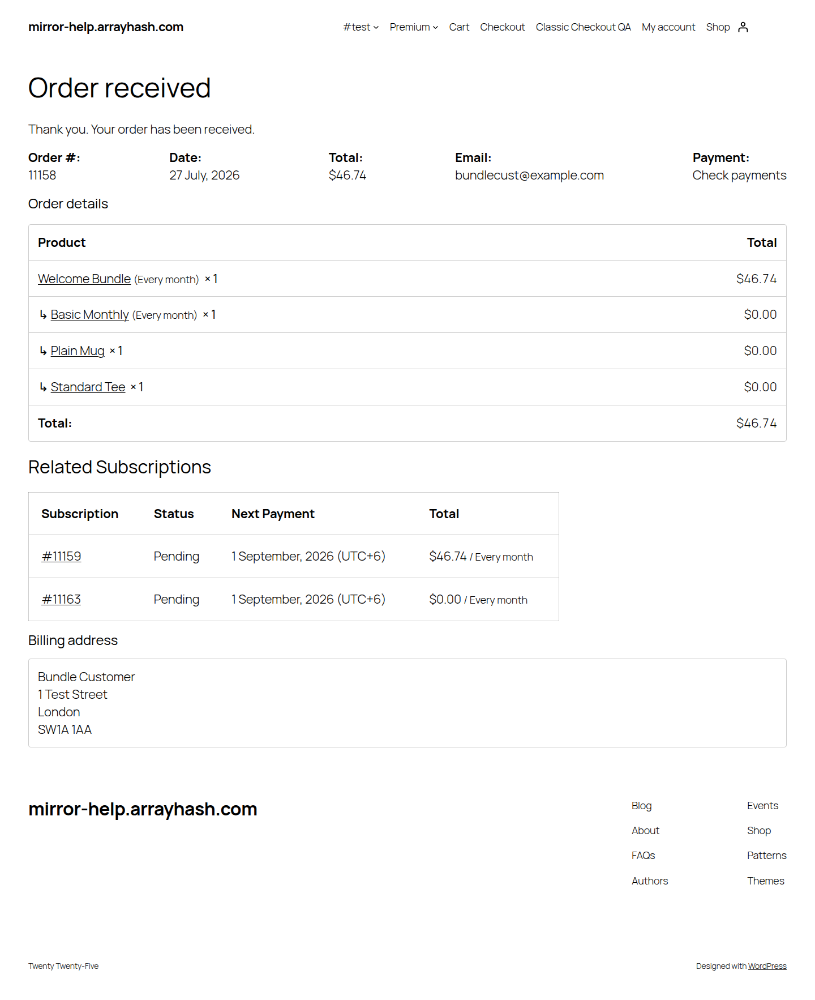

### On the Admin Order Screen

The order carries the bundle line at the full recurring amount and each included product as a zero-priced line prefixed with **↳**. The bundle line links to its subscription; each included subscription product links to its own.

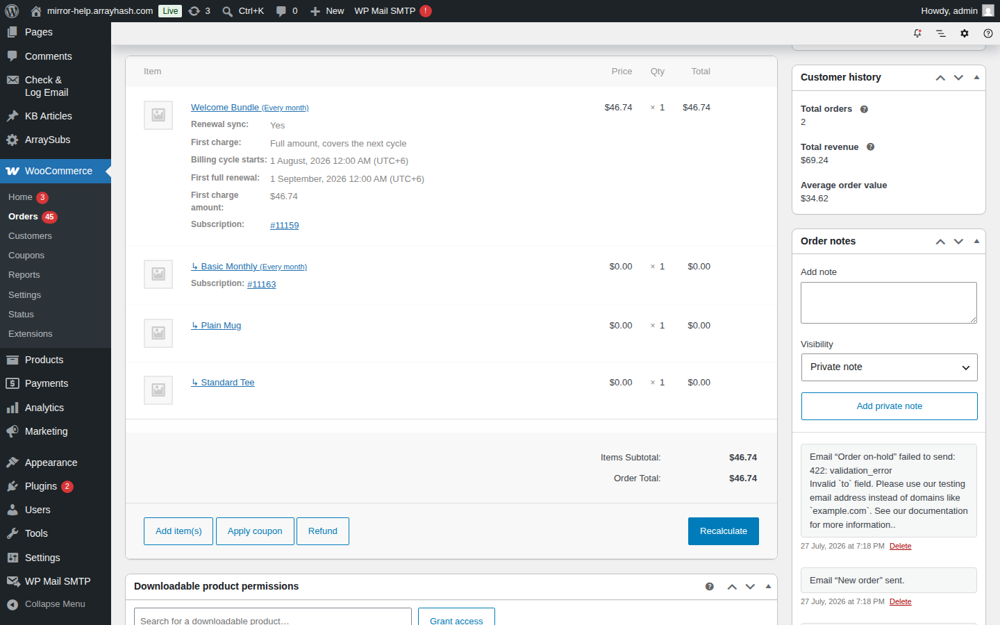

The included lines cannot be removed on their own — removing the bundle line removes all of them. **Order again** skips bundle contents instead of re-adding them at full price.

## Subscriptions Created by a Bundle

### What Gets Created

One checkout produces:

| Record | Recurring amount | Purpose |
| --- | --- | --- |
| The **bundle subscription** | The full bundle total | The one that actually bills. |
| One **included subscription** per subscription product in the bundle | $0.00 | Keeps per-product entitlements working. |

Plain, non-subscription products get **no** subscription — they are simply reproduced on every renewal order.

### Why the Zero-Value Subscriptions Exist

Anything keyed on "does this customer have a subscription for product X" keeps working unchanged: **Member Access** rules, **Feature Manager** entitlements, and third-party integrations. Without them, a customer who bought a membership plan inside a bundle would lose the access that plan grants.

### How Included Subscriptions Behave

- They never raise a renewal invoice of their own.
- They mirror the bundle's status, next payment date, last payment date, and payment count.
- They are cancelled or expired together with the bundle.
- Deleting the bundle subscription deletes them too.
- Switching the bundle subscription to a non-bundle plan cancels and unlinks them.

### The Bundle Subscription in the Customer Portal

The customer's subscription view lists **Bundle Contents**, the discount that was applied, and **Included Subscriptions** linking to each child. Actions such as **Cancel Subscription** live here, on the bundle.

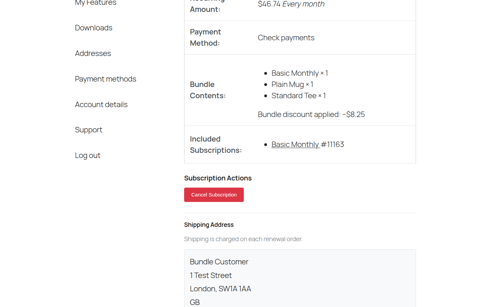

### Included Subscriptions Are Read-Only

An included subscription opens with a **Part of** row, a **$0.00** recurring amount, and an **Included in a subscription bundle** panel in place of every action, with a **Manage subscription bundle** link back to the bundle.

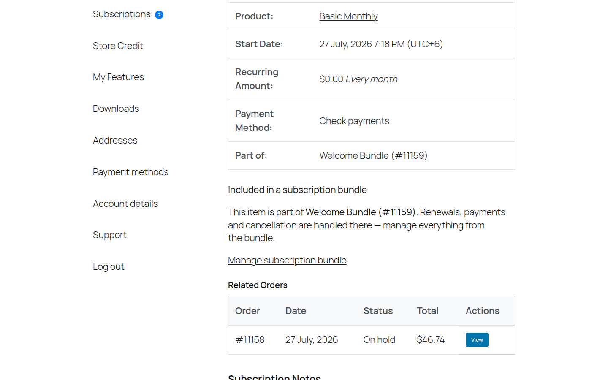

Requests that try to change an included subscription directly are refused server-side, not just hidden in the interface.

### In the Admin Subscriptions List

Both the bundle subscription and its included subscriptions appear in the list. The included ones carry the product name of the item inside the bundle and a $0.00 recurring amount.

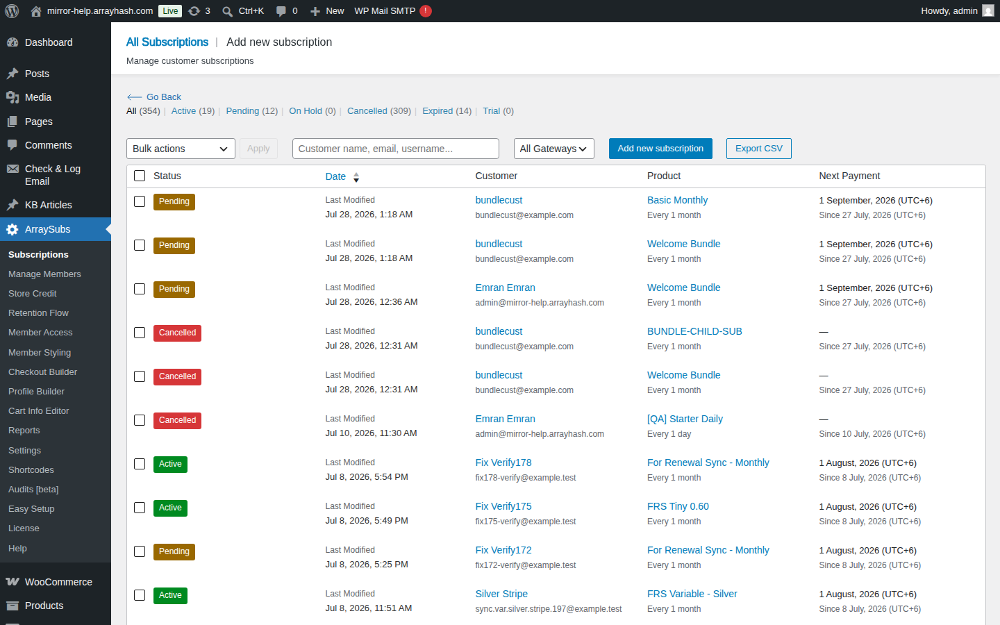

## What Happens at Renewal

Every renewal order reproduces the exact bundle the customer bought:

- The bundle line carries the **frozen** recurring amount — later price edits never change it.
- Every included product is re-added as a zero-priced line, including the plain non-subscription ones, so a bundle that ships physical goods keeps shipping them.
- Included subscriptions have their dates and payment counts advanced in step with the bundle.
- The signup fee, if one was charged, is never charged again.
- If a product inside the bundle has since been deleted from the catalogue, it is still reproduced from the stored snapshot and the order gets a note listing what is missing — a renewal is never failed because of a catalogue change.

## Edge Cases and Important Notes

- **The customer cannot change the contents of an existing bundle.** The contents are frozen at purchase. To change them, they cancel and buy the new bundle.
- **The customer cannot cancel just one item.** Cancellation happens on the bundle; the included subscriptions follow.
- **Editing a live bundle does not change existing subscriptions**, only new purchases and anything currently sitting in a cart.
- **A bundle worth nothing cannot be bought.** A 100% discount blocks checkout, because a zero-value subscription would never bill.
- **Coupons apply on top at checkout** and follow your normal coupon rules; the bundle discount is part of the bundle price itself.

## Troubleshooting

| Symptom | Likely cause | Fix |
| --- | --- | --- |
| Add to Cart does nothing and shows a notice | A product inside the bundle is unavailable | Restock it or edit the bundle contents. |
| Checkout is blocked with a bundle notice | Cart revalidation found an unavailable product | Same as above; the notice names the product. |
| The cart total is not the sum of the contents | The bundle discount is applied | Check the Bundle discount row under the cart line. |
| One purchase created several subscriptions | Expected — one bundle plus one per subscription product inside it | Nothing to fix. |
| A customer says they cannot cancel an item | Included subscriptions are read-only by design | Cancel the bundle subscription instead. |
| A renewal order is missing a product | The product was deleted from the catalogue | Check the order notes; the snapshot line is still added. |

## Related Guides

- [Subscription Bundles](./subscription-bundle.md) — building and configuring the bundle.
- [Subscription Box Customer Experience](./subscription-box-customer-experience.md) — the customer-assembled alternative.
- [Manage Subscriptions](../manage-subscriptions/README.md)
- [Customer Portal](../customer-portal/README.md)
- [Feature Manager](../feature-manager/README.md)
- [Member Access](../member-access/README.md)

## FAQ

### Why did one checkout create several subscriptions?

One is the bundle, which carries the whole recurring amount. The others are zero-value records for each subscription product inside it, so per-product entitlements keep working.

### Do the zero-value subscriptions cost the customer anything?

No. They are $0.00 and never raise an invoice.

### Can the customer cancel just one item from their bundle?

No. Cancellation happens on the bundle, and the included subscriptions follow it.

### Can a customer change the contents of an existing bundle?

No. Contents are frozen at purchase. They would cancel and buy the updated bundle.

### Why was the customer's cart not emptied?

A bundle is an ordinary add-to-cart product. Only subscription **boxes** take over the whole cart.

### Are the products inside the bundle shipped on every renewal?

Yes. Every included product, including plain non-subscription ones, is re-added to each renewal order at zero cost.

### Is the signup fee charged again on renewals?

No. It is a one-time charge on the first payment only.

### Does a coupon applied at checkout reduce future renewals?

That follows your normal ArraySubs coupon rules. The bundle discount itself is part of the bundle price and always applies.

### What happens if a product inside the bundle is deleted from the catalogue?

New purchases are blocked until you fix the bundle. Existing subscriptions keep renewing: the line is reproduced from the stored snapshot and the order gets a note naming what is missing.

### Where can the customer see what is in their bundle?

**My Account → Subscriptions →** the bundle subscription. It lists Bundle Contents and Included Subscriptions.

### Should I test the full flow before launching?

Yes. Place one test order and confirm the cart total, the order line items, the subscriptions created, and the customer portal views.
