# Info
- Module: Subscription Products
- Availability: Pro
- Last updated: 2026-07-27

# Subscription Bundles

> Sell a fixed set of products as one subscription: you choose the contents, the customer buys the whole thing with a single click.

**Availability:** Pro

## Page Navigation

- **Current guide:** Subscription Bundles
- **Where to open it:** WordPress Admin -> Products -> Add/Edit Product -> Product data -> Subscription Bundle [ArraySubs]
- **Section overview:** [Open overview](./README.md)
- **Previous guide:** [Subscription Box Customer Experience](./subscription-box-customer-experience.md)
- **Next guide:** [Subscription Bundle Customer Experience](./subscription-bundle-customer-experience.md)
- **Troubleshooting:** [Audits, Logs, and Troubleshooting](../audits-and-logs/README.md)

## Overview

A subscription bundle is a WooCommerce **product type** added by ArraySubs Pro: **Subscription Bundle [ArraySubs]**. You decide exactly what goes in it — a membership plan, a mug, a tee — and the customer buys the whole bundle with one **Add to Cart** click for one recurring amount.

There is no wizard for the shopper. The product page lists what is included, and the button reads whatever you set as the subscription button text under **Settings → General**, so a bundle behaves like any other subscription product on the storefront.

All bundle controls live in the product's **General** tab. There is no extra admin menu.

```box class="info-box"
**Bundle or box?** A **bundle** is curated by you: fixed contents, no wizard, one click to buy. A [**box**](./subscription-box.md) is assembled by the customer through a multi-step builder on the product page. Everything else — one recurring charge, zero-priced contents on the order, child subscriptions, renewal sync — works the same way in both.
```

## When to Use This

- You sell a starter kit, welcome pack, or "everything you need" bundle and want one recurring charge for it.
- You want to pair a membership plan with physical goods that ship on every payment.
- You want to reward buying the set with a bundle-wide discount, without touching the price of the individual products.
- You want the bundle to renew, cancel, and pause as a single unit, while the products inside it still count as "subscribed" for entitlements and member access.
- You want the bundle to sync renewals to a calendar boundary, independent of your store-wide setting.

## Prerequisites

- WooCommerce installed and active.
- ArraySubs core plugin installed and active.
- ArraySubs **Pro** add-on installed and active with a valid license.
- At least one published **simple** product to put in the bundle.
- Admin or Shop Manager access.

## How It Works

### One Bundle, One Recurring Charge

A bundle has its own billing schedule — period, interval, and length — exactly like any other subscription product. Its price is **the sum of its contents minus the bundle discount**, recalculated on the server every time the cart or checkout loads. You never type a price on the bundle itself.

That total is **frozen at purchase**: later price edits never change an existing bundle subscription.

### The Products Inside the Bundle

Each product in the bundle is added to the order as a **zero-priced line item** attached to the bundle line. Their value is already inside the bundle total, so they never add anything to the invoice.

In addition, every product inside the bundle that is itself a **subscription product** gets its own subscription with a **zero** recurring amount, linked to the bundle. Plain (non-subscription) products get no subscription at all. This keeps per-product integrations working unchanged — **Member Access**, **Feature Manager** entitlements, and any third-party code that looks up "does this customer have a subscription for product X".

Those child subscriptions never bill on their own. They mirror the bundle's status and dates, and they are cancelled, expired, or deleted with it.

```box class="info-box"
The bundle is **sold individually**: the bundle line always has a quantity of 1 and no quantity box is shown. Unlike a subscription box, adding a bundle does **not** empty the cart.
```

## Real-Life Use Cases

### Use Case 1: A Membership Welcome Bundle

A membership site sells a **Welcome Bundle** at **Every month**: the *Basic Monthly* plan, a branded mug, and a cotton tee. The subtotal is $54.99 and a 15% bundle discount brings it to $46.74 a month. The member keeps their Basic Monthly entitlements because the plan inside the bundle still creates its own (zero-value) subscription, and the mug and tee ship with every payment.

### Use Case 2: A Coffee Subscription With Gear

A roastery bundles its *Monthly Beans* subscription product with a grinder brush and a scoop, at a fixed $10 off. The customer pays one monthly amount; the roastery packs all three items on every renewal order.

### Use Case 3: A Seasonal Bundle Rebuilt Each Quarter

An apparel store keeps one **Quarterly Drop** bundle product and edits its contents every quarter. Because the price is recalculated from the current contents, existing subscribers keep the price frozen at what they bought, while new buyers see the new line-up and the new total.

## Creating the Bundle Product

### Choosing the Subscription Bundle [ArraySubs] Product Type

Create a product as usual, then pick **Subscription Bundle [ArraySubs]** in the **Product data** dropdown. The General tab is replaced by the **Subscription Bundle Details** panel. Until you configure it, the bundle cannot be purchased.

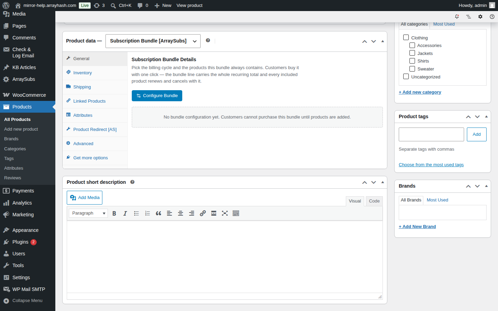

The pricing fields are hidden on purpose — a bundle is priced from its contents, so there is nothing to type.

### The Subscription Bundle Details Panel

Once configured, the General tab shows a read-only summary of the whole bundle:

- **Edit Bundle Configuration** — opens the setup wizard.
- A one-line recap: how many products, and how often the bundle is billed.
- Three fact cards: **Billing**, **Discount**, and **Flexible Renewal Sync**.
- A table of every included product with its quantity, unit price and line total, followed by **Subtotal**, **Discount**, and **Total per payment**.

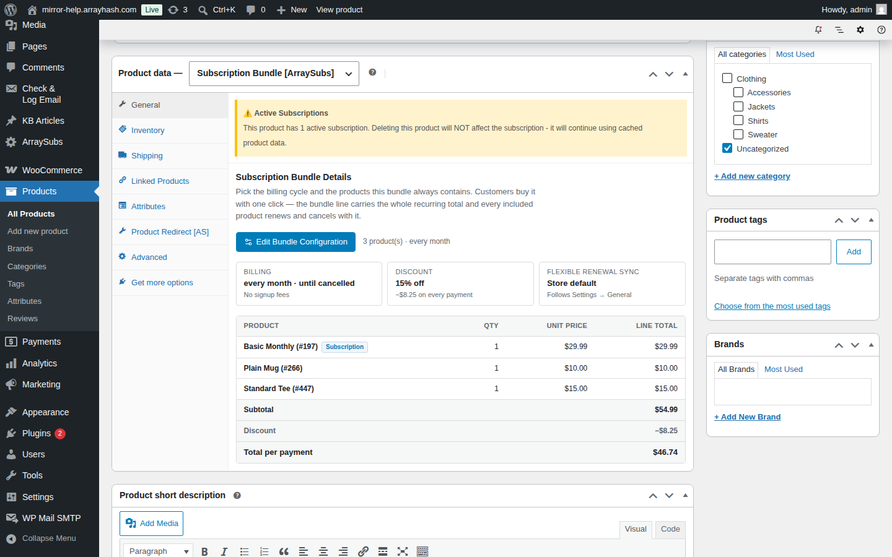

This panel is the fastest way to check what a live bundle actually charges without opening the wizard.

## The Bundle Configuration Wizard

**Edit Bundle Configuration** opens a full-width modal with three steps:

1. **Bundle Products**
2. **Discount**
3. **Flexible Renewal Sync**

You can click the numbered pills to jump between steps, but the wizard checks each step before it lets you move on, so an unusable bundle can never be saved.

### Bundle Schedule and Billing

The top of step 1 sets how the whole bundle is billed:

| Field | What it does |
| --- | --- |
| **Billing Period** | Day, Week, Month, or Year. |
| **Billing Interval** | Charge every X periods. "2" with Month means every two months. |
| **Subscription Length** | Number of cycles. **0** means it runs until cancelled. |

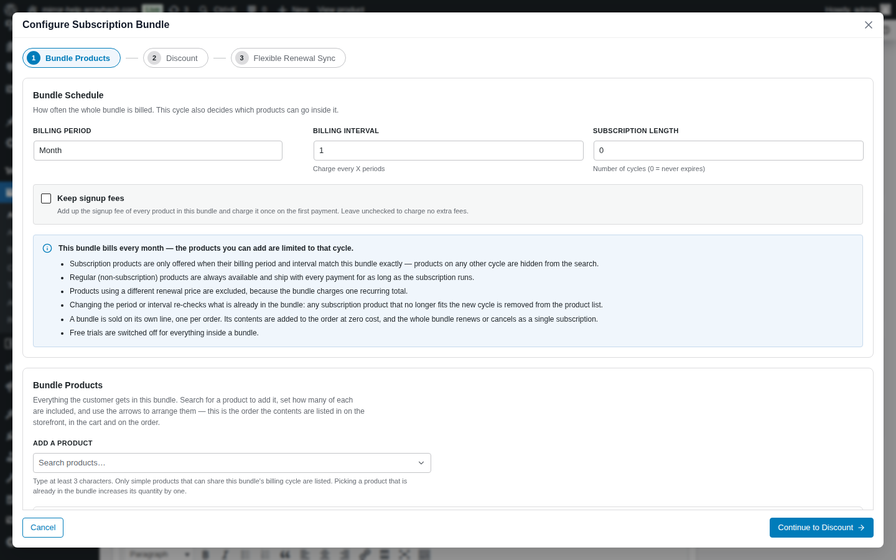

### Keep Signup Fees

**Keep signup fees** adds up the signup fee of every product in the bundle and charges the total **once**, on the first payment, as a single **Bundle Signup Fee**. Leave it unchecked and no extra fee is charged.

Free trials are always switched off for everything inside a bundle.

### Which Products Can Go Inside a Bundle

The billing cycle you choose decides what the picker will offer:

- **Regular (non-subscription) products** are always available, and ship with every payment for as long as the subscription runs.
- **Subscription products** are offered only when their billing period **and** interval match the bundle exactly. A weekly product will not appear in a monthly bundle.
- **Products using a different renewal price** are excluded, because the bundle charges one frozen recurring total.
- Only **simple** products can go in a bundle. Variable products, other bundles, and subscription boxes are never eligible.

Changing the period or interval re-checks what is already in the bundle and offers to remove any subscription product that no longer fits.

### Step 1: Bundle Products

Search for a product to add it, set how many of each are included, and use the arrows to arrange them. The order here is the order the contents are listed in on the storefront, in the cart, and on the order.

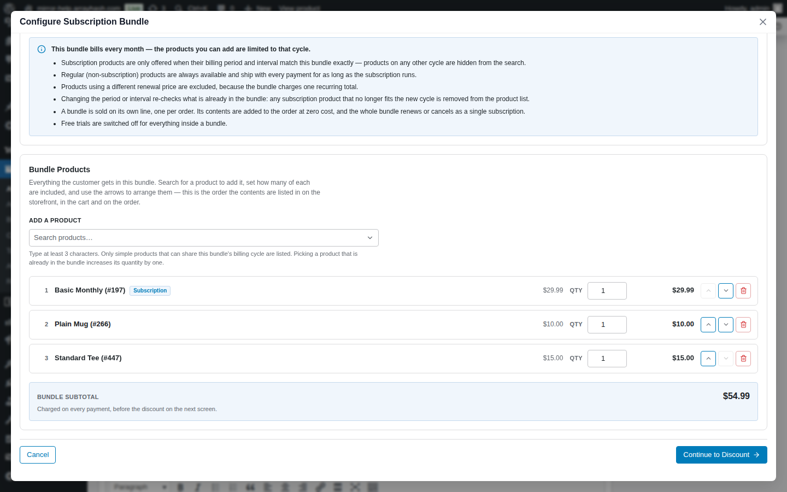

Each row shows the product name and ID, a **Subscription** badge when the product is itself a subscription, its unit price, a quantity box, and the resulting line total. **Bundle Subtotal** underneath is what the contents come to *before* the discount.

Adding a product that is already in the bundle increases its quantity by one instead of creating a duplicate row.

### The Product Picker

The picker searches after **three characters** and only ever offers what this bundle can actually contain. Each result shows the product's price and a **Subscription** badge where relevant, so you can tell at a glance what you are adding.

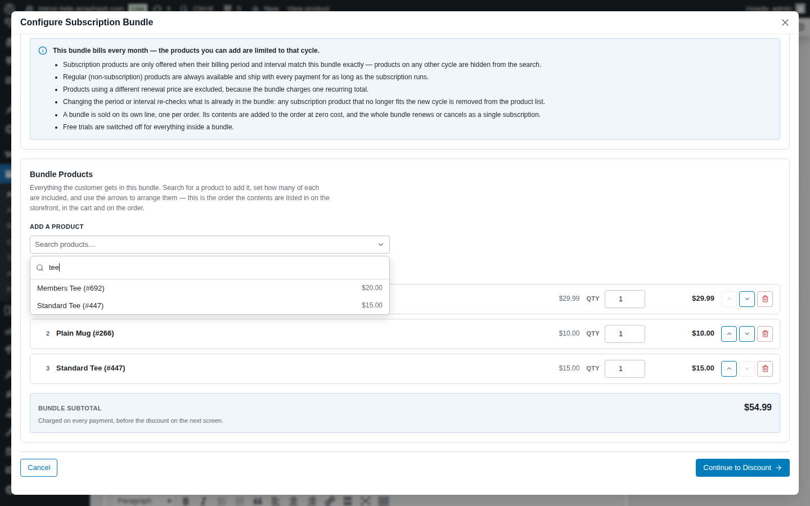

If the search cannot reach the server — an expired login, for example — the picker says so rather than showing "No results found".

### Removing a Product

The bin icon asks for confirmation before it removes a row.

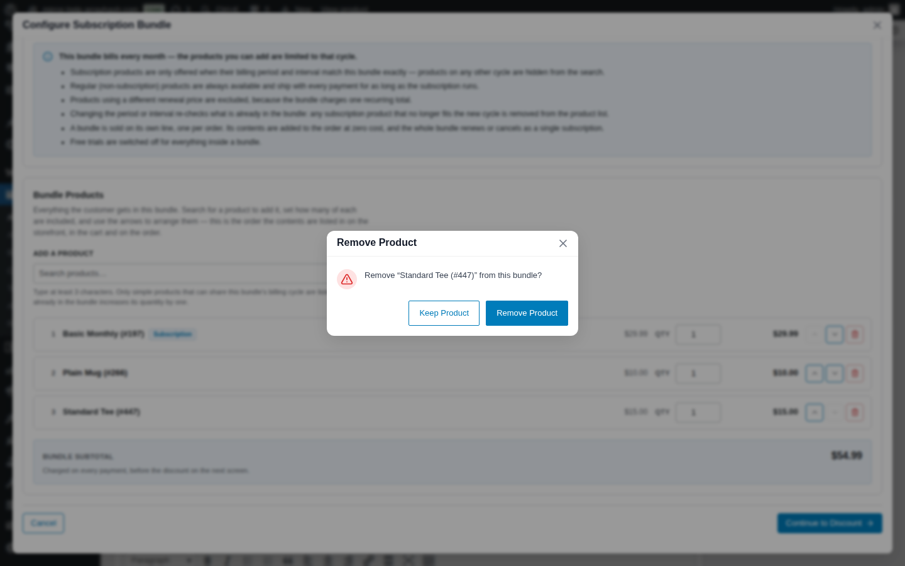

### An Empty Bundle Cannot Be Saved

A bundle with no products is not purchasable. The list shows an empty-state notice, and trying to move to the next step raises an error banner at the top of the wizard.

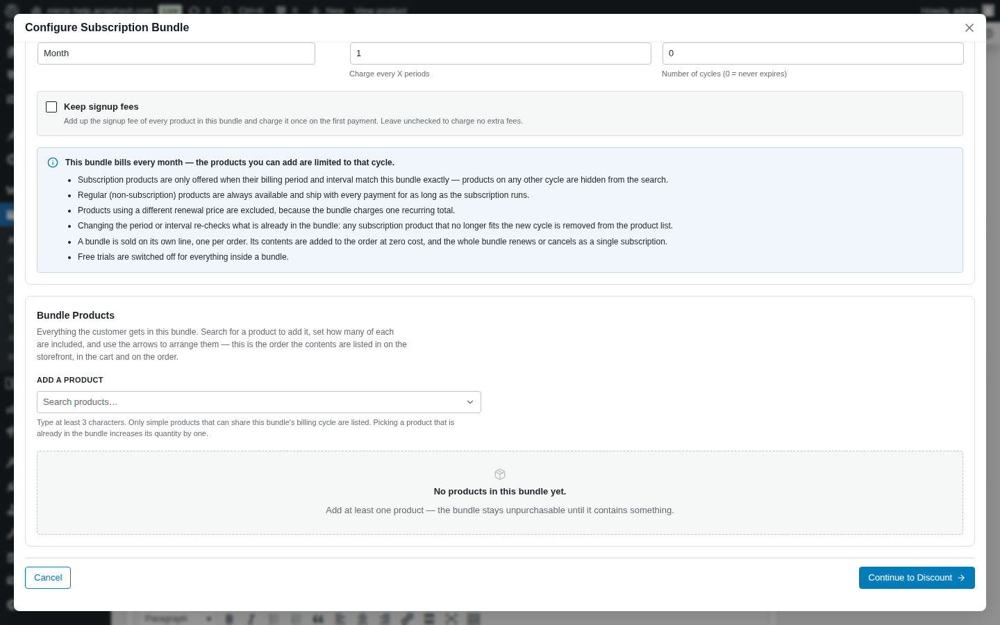

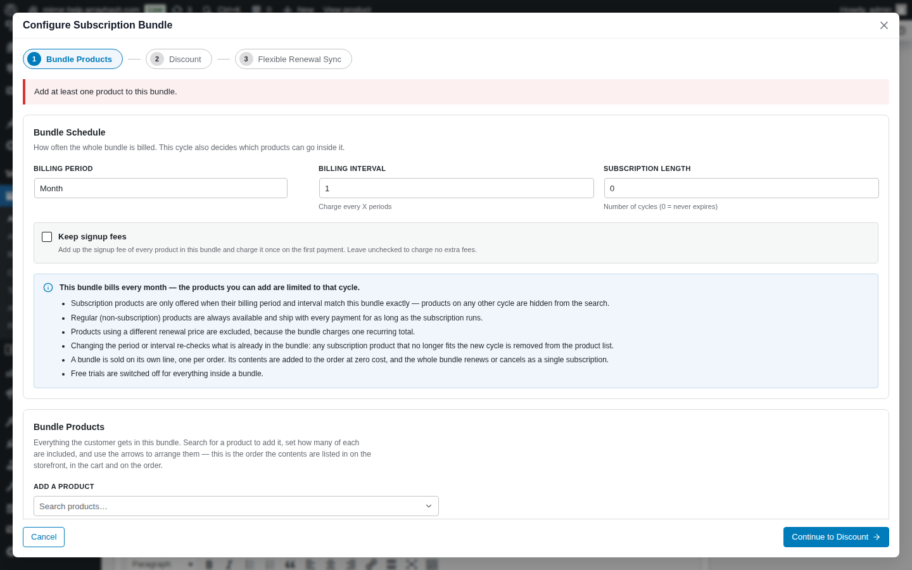

### Step 2: Discount

A bundle has exactly one discount, applied to the subtotal of everything inside it:

| Option | What it does |
| --- | --- |
| **No discount** | Charge the full bundle subtotal. |
| **Fixed amount** | Take a set amount off the subtotal. Capped at the subtotal. |
| **Percentage** | Take a share of the subtotal off. Capped at 100%. |


The **Bundle Price Preview** underneath shows the subtotal, the discount, and the resulting bundle total — the amount the customer is charged on the first payment and on every renewal.

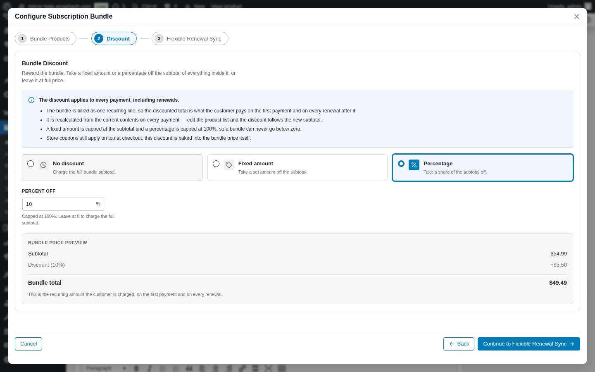

The discount is recalculated from the current contents on every payment: edit the product list and the discount follows the new subtotal. Store coupons still apply on top at checkout; this discount is baked into the bundle price itself.

### Step 3: Flexible Renewal Sync

This step aligns every bundle renewal to the same calendar boundary and chooses how the first payment is charged, based on which day of the cycle the customer subscribes.

Leaving **Give this bundle its own segment plan** unchecked does **not** turn syncing off. The bundle then follows your store-wide setting under **Settings → General → Sync Renewals to Next Billing Cycle**, exactly like any other subscription product.

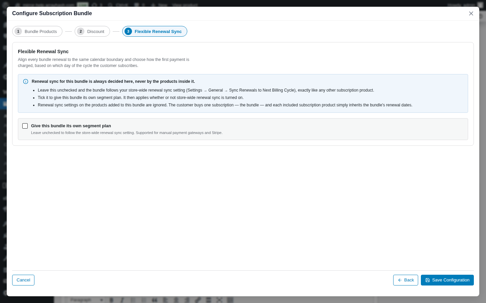

Tick the box to give this bundle its own segment plan. It then applies whether or not store-wide renewal sync is turned on. Drag the two handles to split the cycle into three segments and use the toggles to switch a segment on or off:

| Segment | Default behaviour |
| --- | --- |
| First | **Full amount** |
| Middle | **Prorate amount** |
| Last | **Charge full for next billing cycle** |

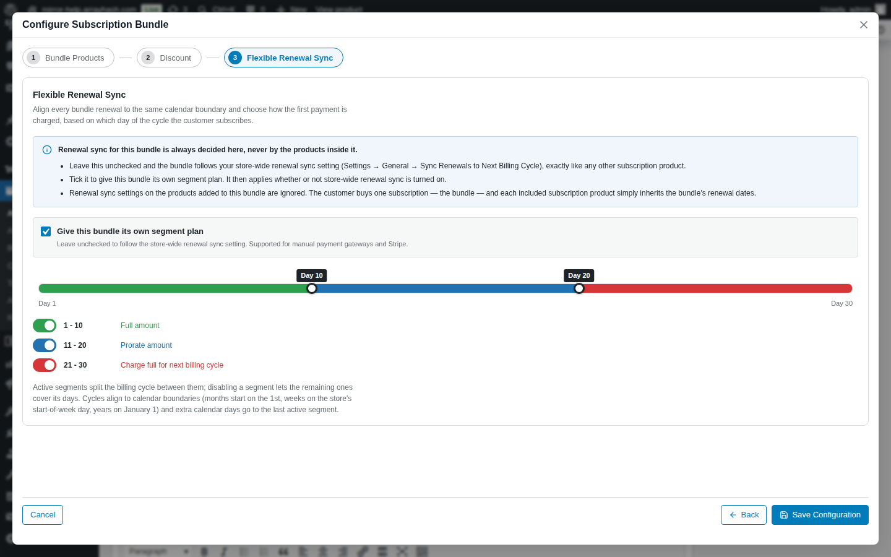

Renewal sync settings on the products *inside* the bundle are always ignored — the customer buys one subscription, and every included subscription inherits the bundle's renewal dates.

### Saving the Configuration

**Save Configuration** closes the wizard and writes the JSON into the product form. Nothing is stored until you then **Publish** or **Update** the product. **Cancel** discards every change made in the wizard since it was opened.

## Finding Bundles in the Products List

Filter the Products list by **Subscription Bundle [ArraySubs]** to see every bundle. Configured bundles show the struck-through subtotal beside the discounted total; unconfigured ones show **Not available yet**.

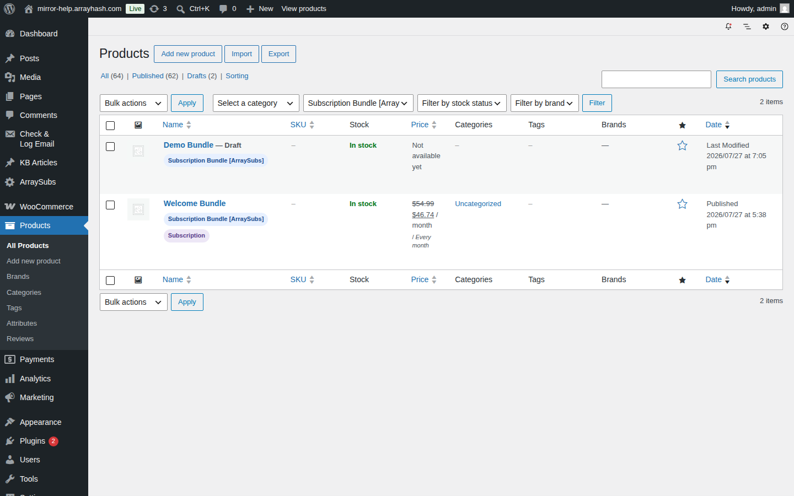

## Settings Reference

| Setting | Where | Notes |
| --- | --- | --- |
| Billing Period | Wizard step 1 | Day / Week / Month / Year. No lifetime. |
| Billing Interval | Wizard step 1 | 1–24. |
| Subscription Length | Wizard step 1 | 0 = never expires. |
| Keep signup fees | Wizard step 1 | Sums the contents' signup fees, charged once. |
| Products | Wizard step 1 | Ordered list, each with a quantity of 1–99. |
| Discount type | Wizard step 2 | None / Fixed amount / Percentage. |
| Discount amount | Wizard step 2 | Percent capped at 100; fixed capped at the subtotal. |
| Give this bundle its own segment plan | Wizard step 3 | Unchecked = follow the store-wide setting. |
| Segment boundaries and toggles | Wizard step 3 | Only shown when the segment plan is enabled. |

## What Happens After Saving

- The product becomes purchasable as soon as it contains at least one available product.
- The bundle's schedule is mirrored onto the standard subscription fields, so the rest of ArraySubs treats it like any other subscription product.
- The computed total and subtotal are written to the product's price fields so shop sorting and filtering work.
- The renewal-sync segment plan is written to the same fields the Flexible Renewal Sync feature reads.

## Edge Cases and Important Notes

- **Editing a live bundle reprices carts immediately.** Anyone with the bundle in their cart sees the new total on the next cart or checkout load. Existing *subscriptions* keep their frozen price.
- **A bundle that comes to nothing cannot be bought.** A 100% discount, or contents that are all free, makes the total zero and blocks checkout — a zero-value subscription would never bill.
- **An unavailable product blocks the whole bundle.** If something inside it is out of stock, deleted, or no longer purchasable, the bundle cannot be added to the cart and cannot be checked out. Bundles are all-or-nothing.
- **Changing the cycle can drop products.** Subscription products that no longer match the new period or interval are offered for removal.
- **Included subscriptions appear in the subscription lists.** Each zero-value child shows in the admin list and in the customer's account area, marked as part of the bundle.
- **Deleting a bundle subscription deletes its included subscriptions too**, and switching a subscription off a bundle plan cancels and unlinks them.

## Troubleshooting

| Symptom | Likely cause | Fix |
| --- | --- | --- |
| The bundle shows "Not available yet" | No products configured | Open the wizard and add at least one product. |
| A subscription product is missing from the picker | Its billing period or interval does not match the bundle, or it uses a different renewal price | Change the bundle cycle to match, or use a product that fits. |
| A variable product is missing from the picker | Only simple products are eligible | Use a simple product. |
| The picker says results could not be loaded | The admin session or permissions lapsed | Reload the product edit screen and try again. |
| Customers cannot add the bundle to the cart | Something inside it is unavailable | Check the notice on the product page; restock or swap the product out. |
| The cart total differs from the sum of the contents | The bundle discount is applied | Check the Discount card in the Bundle Details panel. |
| The wizard will not let me continue | The current step is incomplete | Read the red banner at the top of the wizard. |

## Related Guides

- [Subscription Bundle Customer Experience](./subscription-bundle-customer-experience.md) — what shoppers see, and how bundles behave through checkout and renewals.
- [Subscription Boxes](./subscription-box.md) — the customer-assembled alternative.
- [Create and Configure Subscription Products](./create-and-configure.md)
- [Flexible Renewal Sync](../billing-and-renewals/README.md)
- [Feature Manager](../feature-manager/README.md)
- [Member Access](../member-access/README.md)

## FAQ

### Is the subscription bundle available in the free plugin?

No. The **Subscription Bundle [ArraySubs]** product type ships in ArraySubs Pro.

### How is a bundle different from a subscription box?

You curate a bundle; the customer curates a box. A bundle has fixed contents and a single Add to Cart button. A box has a multi-step builder the customer walks through on the product page.

### Can a bundle contain variable products?

No. Only simple products are eligible.

### Can I mix subscription and regular products in one bundle?

Yes. Regular products ship with every payment; subscription products must match the bundle's billing cycle exactly.

### Why is my weekly product missing from a monthly bundle?

Subscription products are only offered when their period and interval match the bundle. Change the bundle cycle, or pick a product on the same cycle.

### Where do I set the bundle's price?

You don't. The price is the sum of the contents minus the bundle discount, recalculated on every cart and checkout load.

### Does the discount apply to renewals?

Yes. The discounted total is what the customer pays on the first payment and on every renewal after it.

### Can I use a store coupon as well?

Yes. Coupons apply on top at checkout. The bundle discount is baked into the bundle price itself.

### Does a bundle charge signup fees?

Only when **Keep signup fees** is ticked, and then only once on the first payment.

### Can I offer a free trial on a bundle?

No. Trials are switched off for bundles and everything inside them.

### What happens to live subscriptions if I edit the bundle later?

Nothing. Existing subscriptions keep the price and contents frozen at purchase. Only new purchases use the new configuration.

### Should I test a bundle before going live?

Yes. Place one test order and confirm the cart total, the order line items, and the subscriptions it creates.
