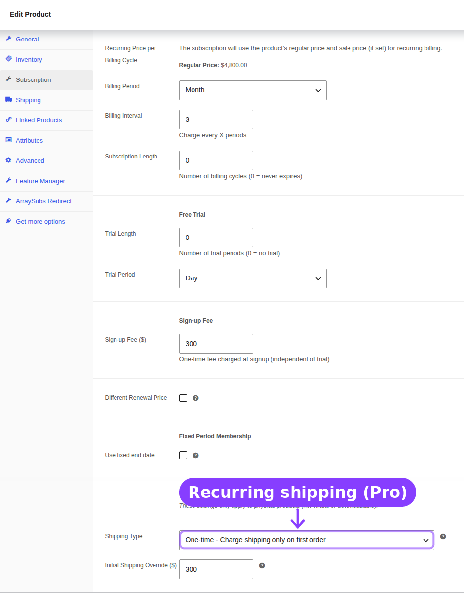
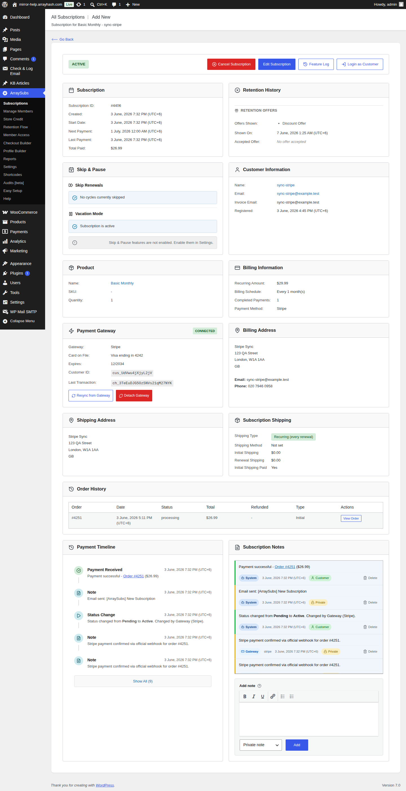

# Info
- Module: Subscription Shipping
- Availability: Pro
- Last updated: 2026-06-08

# Subscription Shipping

> Decide whether physical subscription products charge shipping once at checkout or again on each renewal.

**Availability:** Pro

## Page Navigation

- **Current guide:** Subscription Shipping
- **Where to open it:** WordPress Admin -> Products -> Edit Product -> Product data -> Subscription
- **Section overview:** [Open overview](../README.md)
- **Previous guide:** [Redirect Product Page](../redirect-product-page/README.md)
- **Next guide:** [Subscription Detail Cards](../manage-subscriptions/subscription-detail-cards.md)
- **Troubleshooting:** [Payment Method and Shipping Update Issues](../audits-and-logs/payment-and-shipping-issues.md)

## Visual Guide

## Overview

Subscription Shipping is a Pro module for physical subscription products. It tells ArraySubs how shipping should behave after the first checkout order.

This matters because physical subscription stores often have different fulfillment models:

| Business Type | Typical Shipping Model |
|---|---|
| Monthly boxes | Shipping charged every renewal |
| Annual memberships with a starter kit | Shipping charged once at signup |
| Refill products | Shipping charged every shipment |
| Digital membership plus welcome package | Shipping charged once |

## Product Settings

The settings appear in the product editor when the product is a subscription and is not virtual/downloadable.

| Field | Options | What It Controls |
|---|---|---|
| Shipping Type | Recurring / One-time | Whether renewals include shipping |
| Initial Shipping Override | Currency amount | Optional custom shipping amount for checkout |
| Renewal Shipping Override | Currency amount | Optional custom shipping amount for renewals |

## Shipping Behavior

| Shipping Type | Initial Order | Renewal Orders |
|---|---|---|
| Recurring | Shipping is charged | Shipping is charged again |
| One-time | Shipping is charged | Shipping is not charged |

If an override is blank, WooCommerce shipping calculation is used. If an override is set, ArraySubs stores that amount with the subscription and uses it during renewal order creation.

## Subscription Detail Card

When a subscription requires shipping, the subscription detail screen can show:

- Shipping type
- Stored shipping method
- Initial shipping paid state
- Renewal shipping amount
- Shipping address
- Whether the subscription needs shipping on renewals

This gives support teams a quick answer when a customer asks why a renewal did or did not include shipping.

## Customer Portal

When shipping updates are enabled, customers can update the shipping address from their subscription detail page. Renewal orders use the current subscription shipping address, not an old address copied from the original checkout order.

## Real-Life Use Cases

### Monthly Product Box

A coffee club sends a box every month. Set Shipping Type to Recurring so every renewal includes shipping.

### Welcome Kit Only

A digital membership includes a one-time welcome package. Set Shipping Type to One-time so the signup order includes shipping but renewals do not.

### Renewal Shipping Override

A store uses live carrier rates at checkout but wants a fixed $5.99 renewal shipping charge. Set the renewal override to `5.99`.

## Related Guides

- [Product Experience and Display](../subscription-products/product-experience.md) — Product-page subscription display.
- [Subscription Detail Cards](../manage-subscriptions/subscription-detail-cards.md) — The admin card that displays shipping state.
- [Payment and Shipping Actions](../customer-portal/payment-and-shipping.md) — Customer-facing shipping updates.
- [Payment Method and Shipping Update Issues](../audits-and-logs/payment-and-shipping-issues.md) — Troubleshooting shipping update failures.

## FAQ

### Why do I not see the Subscription Shipping fields?
The product must be a subscription and must require shipping. Virtual or downloadable products do not show these controls.

### Does this support variations?
Yes. Each variation can have its own shipping behavior and override amounts.

### Does one-time shipping remove the shipping address?
No. The subscription can still store a shipping address. One-time shipping only controls whether renewal orders include shipping charges.
