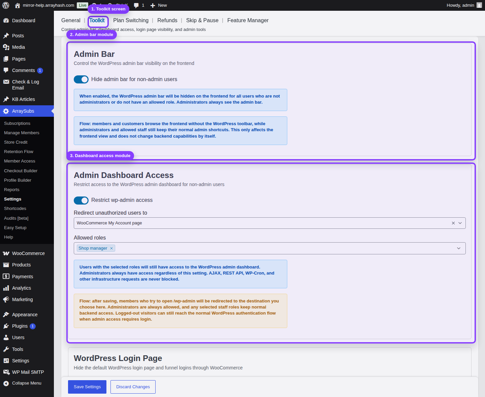
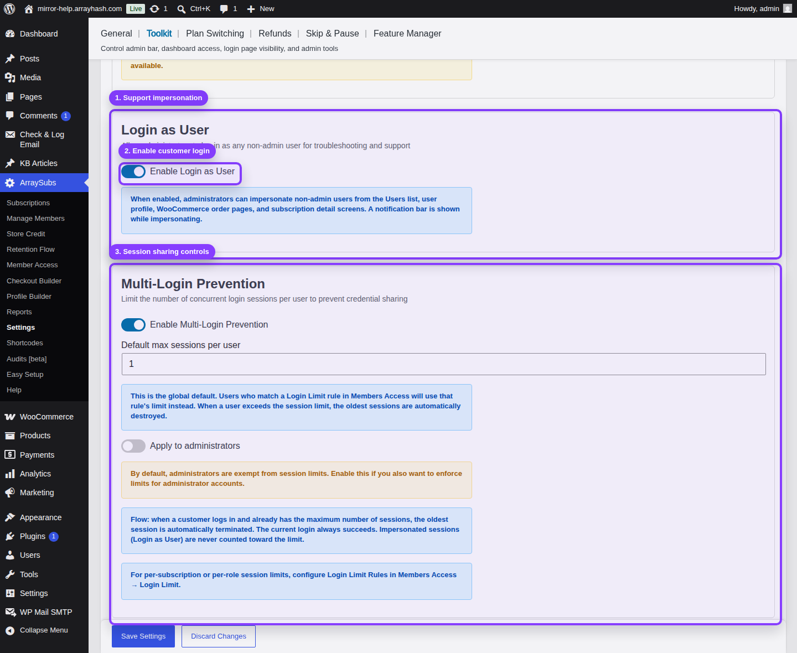

# Info
- Module: Toolkit
- Availability: Shared
- Last updated: 2026-06-07

# Toolkit

> Dedicated administration tools for making a subscription site feel like a clean customer portal instead of a generic WordPress backend.

**Availability:** Free (Multi-Login Prevention requires **Pro**)

## Page Navigation

- **Current guide:** Toolkit
- **Where to open it:** WordPress Admin -> ArraySubs -> Settings -> Toolkit
- **Direct route:** `/wp-admin/admin.php?page=arraysubs-mainadmin#/settings/toolkit`
- **Settings reference:** [Toolkit Settings](../settings/toolkit-settings.md)
- **Previous guide:** [Toolkit Settings](../settings/toolkit-settings.md)
- **Next guide:** [Admin Bar Visibility](admin-bar.md)
- **Troubleshooting:** [Audits, Logs, and Troubleshooting](../audits-and-logs/README.md)

## Visual Guide

The Toolkit screen is longer than a single viewport. Use these screenshots together: the first covers the top controls, and the second shows the support and session tools near the bottom of the page.

## Overview

Toolkit is a group of small but high-value operational modules. These tools do not create subscription products or renewal invoices directly; they protect the customer experience around those subscriptions. Use them to hide backend clutter, control dashboard access, route login flows through your storefront, support customers by impersonating their account, and limit shared credentials.

## Toolkit Modules

| Module | Use It For | Availability |
|---|---|---|
| [Admin Bar Visibility](admin-bar.md) | Hide the WordPress toolbar from customers on the frontend | Free |
| [Admin Dashboard Access](admin-dashboard-access.md) | Redirect non-authorized users away from `/wp-admin` while keeping staff access | Free |
| [WordPress Login Page](wordpress-login-page.md) | Send customer login and registration traffic to WooCommerce My Account instead of `wp-login.php` | Free |
| [Login as User](login-as-user.md) | Let administrators impersonate non-admin customers for support and verification | Free |
| [Multi-Login Prevention](multi-login-prevention.md) | Limit concurrent sessions per account to reduce credential sharing | Pro |

## Recommended Setup Order

1. Configure [Admin Bar Visibility](admin-bar.md) so customer-facing pages do not show the WordPress toolbar.
2. Configure [Admin Dashboard Access](admin-dashboard-access.md) and add any staff roles that should keep backend access.
3. Configure [WordPress Login Page](wordpress-login-page.md) only after your WooCommerce My Account page is published and tested.
4. Enable [Login as User](login-as-user.md) if your support team needs to verify customer portal issues directly.
5. Enable [Multi-Login Prevention](multi-login-prevention.md) if you sell per-person memberships, courses, communities, or digital products where account sharing matters.

## What Toolkit Does Not Replace

- It does not replace WordPress roles and capabilities.
- It does not replace Member Access rules for content, product, discount, or download restrictions.
- It does not replace WooCommerce account settings.
- It does not replace security plugins that handle firewalls, malware scanning, or two-factor authentication.

Use Toolkit as the ArraySubs-native layer for subscription-site access behavior, login routing, support impersonation, and session control.

## Related Guides

- [Settings — Toolkit Settings](../settings/toolkit-settings.md) — Full field-by-field settings reference.
- [Manage Members — Member Lookup and Profiles](../manage-members/member-lookup-and-profiles.md) — Where support teams use Login as Customer most often *(Pro)*.
- [Member Access — Session and Frontend Controls](../member-access/session-and-frontend-controls.md) — Login Limit rules and frontend visibility controls.

