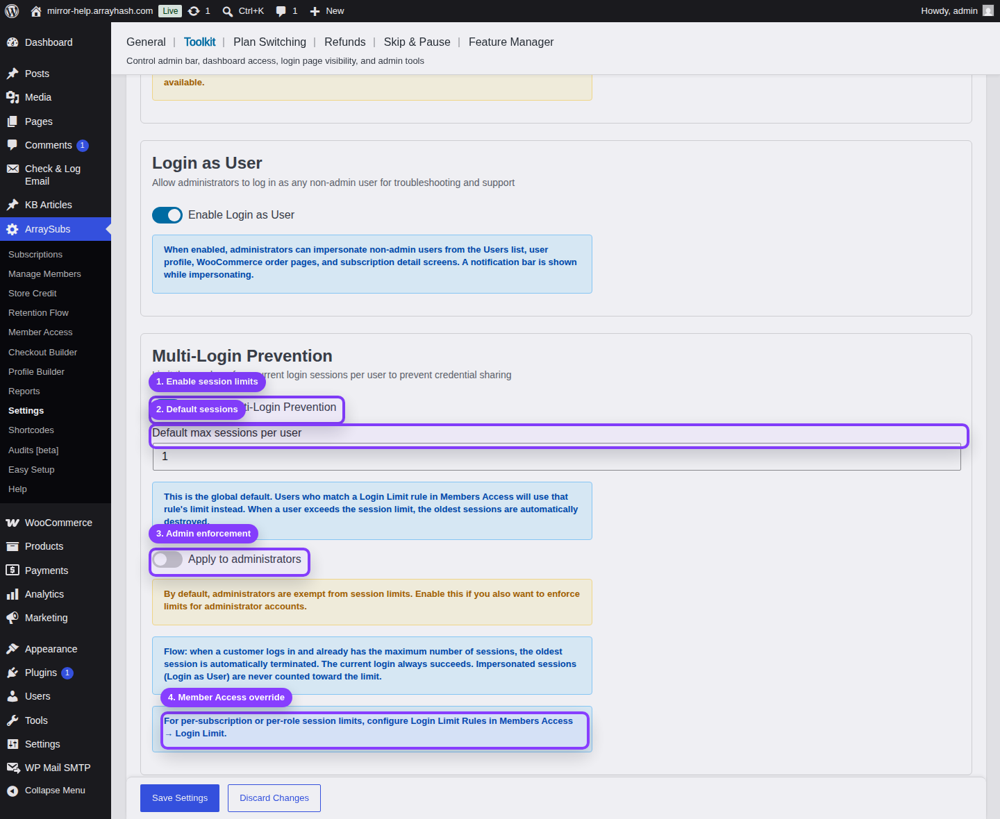

# Info
- Module: Toolkit
- Availability: Pro
- Last updated: 2026-06-07

# Multi-Login Prevention

> Limit concurrent sessions per user account so subscriptions cannot be casually shared across unlimited devices.

**Availability:** ArraySubs Pro

## Page Navigation

- **Current guide:** Multi-Login Prevention
- **Where to open it:** WordPress Admin -> ArraySubs -> Settings -> Toolkit
- **Direct route:** `/wp-admin/admin.php?page=arraysubs-mainadmin#/settings/toolkit`
- **Section overview:** [Toolkit](README.md)
- **Previous guide:** [Login as User](login-as-user.md)
- **Next guide:** [Create and Configure Subscription Products](../subscription-products/create-and-configure.md)
- **Troubleshooting:** [Audits, Logs, and Troubleshooting](../audits-and-logs/README.md)

## Visual Guide

## What This Tool Does

**Multi-Login Prevention** enforces a maximum number of concurrent sessions per user. When a user logs in and the account already has the maximum allowed sessions, ArraySubs destroys the oldest session. The new login succeeds.

This discourages credential sharing without blocking legitimate login attempts.

## When to Use This

- You sell per-user memberships.
- You sell courses, communities, paid content, or software access.
- You want one account to represent one person or a fixed number of people.
- You need a global default session cap, with optional plan-specific overrides through Member Access.

## How to Configure It

1. Go to **ArraySubs -> Settings -> Toolkit**.
2. Turn on **Enable Multi-Login Prevention**.
3. Set **Default max sessions per user**.
4. Leave **Apply to administrators** off unless you intentionally want admin accounts to follow the same session limit.
5. Click **Save Settings**.
6. Test with the same customer account in multiple browser sessions.

## Settings Reference

| Setting | Default | Type | Notes |
|---|---|---|---|
| Enable Multi-Login Prevention | Off | Toggle | Enables global concurrent-session enforcement |
| Default max sessions per user | 1 | Number | Appears when the feature is enabled; minimum value is `1` |
| Apply to administrators | Off | Toggle | Appears when the feature is enabled; use carefully |

## Global Default vs Login Limit Rules

The Toolkit setting is the global fallback. If a user matches a **Login Limit** rule in **Members Access -> Login Limit**, the rule's session limit overrides the global Toolkit value.

Use this pattern:

| Need | Configure |
|---|---|
| Same limit for everyone | Toolkit global default only |
| Different limits by plan, role, product, or subscription condition | Member Access -> Login Limit rules |
| A higher team or enterprise limit | A Login Limit rule for the qualifying plan |

## Important Notes

- The oldest session is terminated, not the newest.
- The current login always succeeds.
- Administrators are exempt unless **Apply to administrators** is enabled.
- Login as User impersonation sessions are never counted.
- Session termination is visible on the older browser session the next time it loads a page or checks login state.

## Testing Checklist

1. Enable the feature and set the default max sessions to `1`.
2. Log in as the same customer in Browser A.
3. Log in as the same customer in Browser B.
4. Return to Browser A and refresh.
5. Confirm Browser A is logged out.
6. Disable the feature or restore your intended session limit after testing.

## Related Guides

- [Member Access — Session and Frontend Controls](../member-access/session-and-frontend-controls.md) — Login Limit rules for plan-specific limits.
- [Login as User](login-as-user.md) — Impersonation sessions are excluded from session limits.

